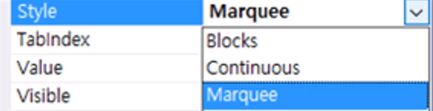
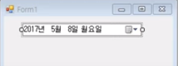
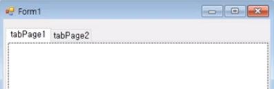
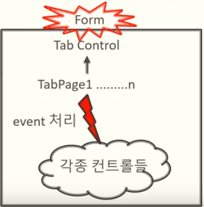

# INDEX

1. [프로그래스 바](#프로그래스-바)
2. [날짜와 시간 컨트롤](#날짜와-시간-컨트롤)
3. [이미지 리스트](#이미지-리스트)
4. [탭 컨트롤](#탭-컨트롤)
5. [리스트 뷰](#리스트-뷰)


## 프로그래스 바

#### 역할

- 진행되는 정도를 막대로 표시

- 기본적인 범위

- 0 ~ 100 을 상대적인 값으로 막대 표시

#### Style 속을 통해 바 모양 설정

> 

#### ProgressBar.Value 속성

- 막대바의 위치 지정

## 날짜와 시간 컨트롤

#### DateTimePicker

- 날짜와 시간을 선택하고 출력

- 형식 설정

- - DateTimePicker.Format에 DateTimePickerFormat 열거형 설정

  - - (Long, Short, Time, Custom)
    - 

- Format

- - Long : 년/월/일 형식, yyyy년 mm월 dd일 x요일
  - Short : 년/월/일의 간단한 형식,      yyyy-mm-dd
  - Time : 시간 형식, 오후 4:11:30
  - Custom : 사용자가 임의로 지정한 형식
  - 더욱 다양한 형식은 MSDN을 찾아볼 것


## 이미지 리스트

#### 용도

- 여러개의 이미지를 배열과 같이 사용

#### 이미지 등록

- Images 속성에 컬렉션을 통해 등록

- - 이미지 컬렉션 편집기 사용

- Add(), Clear(), Remove(), RemoveAt() 사용

#### 이미지 크기 설정

- ImageSize     속성에서 크기 설정

#### 이미지 출력 메서드

- Draw(Graphics g, int x, int y, int index()

 

#### 사용법

1. 이미지 리스트 등록
2. 이미지 리스트에 이미지 등록
3. iamagelist.Draw()를 이용하여 그리기

 

#### Imagelist 예제 코드

> ```c#
> private void Form1_Paint(object sender, PaintEventArgs e)
> {
> 
>   imageList1.Draw(e.Graphics, 0, 0, 0);
> 
>   imageList1.Draw(e.Graphics, 70, 0, 1);
> 
> }
> ```


 

#### 버튼에 이미지 리스트 입히는 법

1. 이미지 리스트에 이미지 등록
2. 버튼 속성 -> ImageList     설정 ->     ImageIndex 설정

 

## 탭 컨트롤

#### 용도

* 한 개의 폼 안에서 여러 개의 입력 형식 사용
* 

#### 페이지 추가, 삭제

* TagPages 속성 -> 컬렉션 편집기 -> 페이지 추가


#### 탭 페이지 관리

* 탭 컨트롤 속성 -> 컬렉션에서 설정


#### 탭 컨트롤과 페이지 구조

> 


## 리스트 뷰

#### 용도

* 데이터를 항목별로 구분하여 관리

#### 기본 개념

> 


#### Item 생성 되어야만 SubItem 입력 가능

 

#### 기능

- 행별로 추가, 삭제, 삽입, 수정이 가능
- 링크드 리스트의 역할

 

#### 리스트의 형태

- Icon, List, Tile 형태 등

 

#### 리스트 뷰 스타일

- Detail, FullRowSelect, GridLine

 

#### 리스트 뷰 관리 객체

- 컬럼 : `ListView.ColumnHeaderCollection`
- 아이템 : `ListView.ListViewItemCollection`
- 서브아이템 : `ListView.ListViewSubItem`

 

#### ListView.ColumnHeaderCollection

- 고정적 (편집기로 처리)
- 그 외에는 유동적이어서 코드로 처리

 

#### Item & SubItem

- `ListView.ListViewItemCollection Items{ get; }`

- 추가

- - `Items.Add(ListViewItem)`

  - - 오버로드된 메서드. ListViewItem 생성

- 삽입

- - `ListView.Items.Insert( index, ListViewItem )`

  - - `ListView.SelectedIndices[0]` : 현재 선택된 인덱스

- 수정 

- - `ListView.SelectItems[0]` : 선택된 Item
  - `ListView.SelectItems[0].SubItems[n]` : 선택된 Item의 n번째 SubItem

- 삭제

- - `ListView.Items.RemoveAt( n )` : n번째 Item 삭제
  - `ListView.SelectedItems[0].Remove()` : 선택된 Item 삭제
  - `ListView.Items.Clear()` : 전체 Item 삭제

- 추가 예시

- - `listView1.Items.Add(new ListViewItems( new String[] { … }))`

- 삽입 예시

- - `listView1.Items.Insert(listView1.SelectedIndices[0], new ListViewItem(new String[] { ... }));`

- 수정 예시 

- - `listView1.SelectedItems[0].SubItems[2].Text = "Hello World!";`

- 삭제 예시

- - `listView1.SelectedItems[0].Remove();`
  - `listView1.RemoveAt(0);`
  - `listView1.Items.Clear();`

 

#### 자주 쓰는 속성 & 메서드

- `listView1.Items.Add(new ListViewItems( new String[] { … }))` : 아이템 리스트 추가
- `listView1.SelectedIndices[0]` : 선택된 아이템 index
- `listView1.Items.Insert(listView1.SelectedIndices[0], new ListViewItem(new String[] { … }))` : 선택된 위치에 삽입
- `listView1.SelectedItmes[0]` : 현재 선택된 아이템 리스트
- `listView1.SelectedItems[0].Remove()` : 현재 선택된 아이템 리스트 삭제
- `listView1.SelectedItems[0].SubItems[0].Text` : 선택된 서브아이템 텍스트 속성
