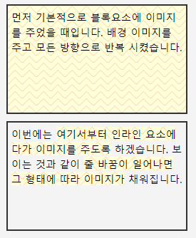

## 요점

- background-color - 배경 색상
- background-image - 배경 이미지
- background-repeat - 배경 이미지의 반복. 세로, 가로 또는 전체 반복
- background-position - 배경 이미지의 위치 지정.
- background-attachment - 요소의 스크롤시 배경이 어떻게 동작하는지 지정.

 

## background-color

- 배경의 색상을 넣는 속성
- rgb(), HEX등으로 표현 가능

> ```CSS
> div {
>     background-color: #eee;
> }
> ```

# background-image

- 배경의 이미지를 넣는 속성
- 이미지의 URL주소가 들어감
- CSS 2.1까지는 배경으로 들어가는 이미지의 크기를 변경할 수 없고, 이미지도 한 개만 가능

> ```CSS
> div {
>     background-image: url('../img/bg.png');
> }
> ```


## background-repeat

- 이미지를 반복시킬 것인지 아닌지 , 가로나 세로만을 반복시킬지를 결정

- 사용 가능 속성

- - **repeat**

  - - 이미지가 가로 세로 바둑판 식으로 반복되어 보여줍니다.

  - **repeat-x**

  - - 이미지가 x 축(가로)로만 반복됩니다.

  - **repeat-y**

  - - 이미지가 y 축(세로)로만 반복됩니다.

  - **no-repeat**

  - - 이미지를 한 번만 보여주고 반복하지 않습니다.

  - **inherit**

  - - 부모 속성을 상속받습니다.

 

## background-position

- background-image로 넣은 이미지의 좌표 값을 정하는 속성

- px, %등의 속성이 들어올 수 있음

- - 단위를 %로 줄 경우 이미지 사이즈를 기준으로 변환됨.

- 값은 x축, y축으로 두 개를 띄어쓰기로 구분하여 넣음

> ```CSS
> div {
>     background-position: 100% 16px; /* x y */
>     /* 또는 */
>     background-position: right bottom;
> }
> ```

- 사용 가능 속성

- - **px**

  - - 맨 위, 왼쪽을 기준으로 px의 절대 값으로 이미지를 이동합니다.

  - **%**

  - - 이미지의 사이즈를 기준으로 상대 값으로 이미지를 이동합니다.

  - **left, right**

  - - x 축에서 쓸 수 있는 값으로 가장 왼쪽으로 보여줄지, 가장 오른쪽으로 보여줄 지를 나타낼 수 있습니다. 각각 0%, 100%와 동일합니다.

  - **top, bottom**

  - - y 축에서 쓸 수 있는 속성 값입니다. 가장 위에서 보여줄지, 아래에서 보여줄 지를 나타냅니다. 이 또한 각각 0%와 100%에 동일합니다.

  - **center**

  - - x 축 y 축 둘 다 사용할 수 있습니다. 가운데 정렬이며, 50%와 동일합니다.

  - **inherit**

  - - 부모 속성을 상속받습니다.

 

## background-attachment

- 배경이미지를 어떻게 고정할지를 정하는 속성
- 스크롤이 있을 경우 스크롤 하여 내용 볼 때 배경 이미지가 내용과 같이 움직일지, 또는 배경 이미지는 고정되어 있을지 결정할 수 있음
- background-position의 기준 점을 뷰포트(웹 페이지 화면)로 변경할 수 있음

> ```CSS
> div {
>     background-attachment : local;
> }
> ```

- 사용 가능 속성

- - **scroll**

  - - 기본 값입니다. 요소에 고정되어있습니다.

  - **local**

  - - 요소 안 내용에 고정됩니다. 요소 안을 스크롤을 할 때, 이미지가 내부의 내용과 같이 움직입니다.

  - **fixed**

  - - background-position의 좌표를 뷰포트(웹 페이지 화면)를 기준으로 합니다.

  - **inherit**

  - - 부모의 속성을 상속받습니다.

 

## background

- 'background-'로 시작하는 속성 등을 줄여서 지정할 수 있음

> ```CSS
> div{
>     background: url('../img/bg.png') no-repeat scoll right 50% #eee;
> }
> ```

- 선언하지 않은 속성은 기본값
- 속성의 순서는 상관없음


## 인라인 요소와 블록 요소의 background

