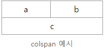
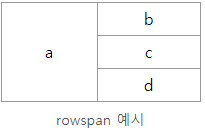

# INDEX

1. 요점
2. 테이블
3. colsapn과 rowspan


## 요점

- 테이블 요소들은 레이아웃이 아닌 도표의 의미가     필요할 때에만 사용.
- 테이블 요소들은 table 요소안에 포함.
- tr은 행, td는 셀.
- tr이 먼저 만들어지고, 그 안에 td가     들어가는 방식.
- 헤더, 제목이 되는 셀은 th 사용.
- colspan 속성은 열 병합, rowspan     속성은 행 병합.
- 셀 병합을 할 경우, 병합된 개수 만큼의 셀은     뺄 것.


## 테이블

- 테이블은 정말 의미적인 도표로일 때 사용해야 함
- 레이아웃을 위해 사용할 경우 접근성에 문제가 생길 수 있음

> ```HTML
> <table>
>   <tr>
>     <th>이름</th>
>     <th>나이</th>
>     <th>점수</th>
>   </tr>
>   <tr>
>     <td>철수</td>
>     <td>23세</td>
>     <td>70점</td>
>   </tr>
>   <tr>
>     <td>영희</td>
>     <td>21세</td>
>     <td>89점</td>
>   </tr>
> </table>
> ```
>
> | **이름** | **나이** | **점수** |
> | -------- | -------- | -------- |
> | 철수     | 23세     | 70점     |
> | 영희     | 21세     | 89점     |

- 먼저 행(tr)을 만들고 안에 셀(td)를 만들어 사용
- 해당 테이블의 헤더 셀(제목 셀)은 (th)요소를 사용

## colsapn과 rowspan

- calspan : 가로 병합

- rowspan 세로 병합

  > `<td colspan="2">참가자</td>`

  > ```HTML
  > <table>
  >   <tr>
  >     <td>a</td>
  >     <td>b</td>
  >   </tr>
  >   <tr>
  >     <td colspan="2">c</td>
  >   </tr>
  > </table>
  > ```
  >
  > 
  >
  > 병합된 셀 수만큼 같은 행(tr) 안에 셀을 덜 적어주는게 핵심

  > ```HTML
  > <table>
  >   <tr>
  >     <td rowspan="3">a</td>
  >     <td>b</td>
  >   </tr>
  >   <tr>
  >     <td>c</td>
  >   </tr>
  >   <tr>
  >     <td>d</td>
  >   </tr>
  > </table>
  > 
  > ```
  >
  > 
  >
  > 병합된 셀의 수 만큼 행(tr)의 셀 개수가 하나씩 줄어듦


