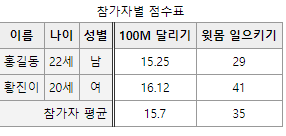
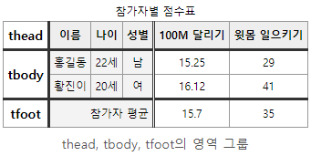
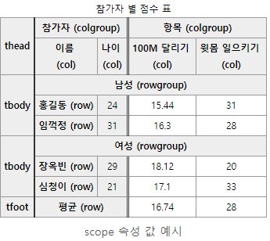

# INDEX

1. 요소
2. caption요소
3. colgroup요소
4. thead, tbody, tfoot요소
5. thead
6. tbody
7. tfoot
8. scope속성


## 요소

- caption는 표의 제목을 나타내며, 무조건     table의 첫번째 자식으로 와야함.
- summary 속성은 시각 장애인, 스크린     리더로 접근하는 분들에게 테이블을 어떻게 접근해야하는 지 안내.
- colgroup 요소는 열(수직방향)들을     그룹화.
- thead, tbody, tfoot 요소는     행(가로방향)들을 그룹화.
- thead 요소는 테이블의 제목 그룹화. 한     번만 선언 가능하며, tbody나 tfoot 보다 먼저 위치.
- tbody 요소는 테이블 본문을 그룹화.     여러번 선언 가능함.
- tfoot 요소는 테이블의 하단 요약부분을     그룹화. 한 번만 선언 가능.
- scope 속성은 th가 어느 영역의     제목인지를 명시.
- 테이블 요소는 접근성이 어려울 수 밖에 없음.     작성 전 꼭 테이블로 작성해야하는지 고민해보고, 작성하더라도 복잡하지 않도록 구성.

## caption요소

- 표의 제목을 나타냄

- table요소의 가장 첫 번째 자식으로 나와야 함

  > ```HTML
  > <table>
  >     <caption>2014년 8월 지출 내역</caption>
  >     <!-- 이하 생략 -->
  > </table>
  > ```

  

## colgroup요소

- 하나이상의 열(col)을 그룹짓는데 사용

- cation다음으로 올 수 있음

- table에서 cation처럼 반드시 있어야 하는 요소는 아님

- colgroup자식으로 col요소를 가질 수 있으며, 만약 col요소가 없으면 span속성에 col의 개수를 지정한 정수 값이 들어가야 함

- colgroup은 여러 번 작성될 수 있음

  > ```HTML
  > <table>
  >     <caption>참가자별 점수표</caption>
  >     <colgroup>
  >         <col />
  >         <col />
  >         <col />
  >     </colgroup>
  >     <!-- 또는 -->
  >     <colgroup span="3"> </colgroup>
  > </table>
  > ```
  >
  > 

  

## thead, tbody, tfoot요소

- 열을 그룹화 하는 역할
- table의 자식으로 올 수 있으며, caption과 colgroup다음으로 올 수 있음
- 다 있어야 할 필요는 없음

## thead

- 열의 제목으로 구성된 행의 집합
- table요소에서 한 번만 쓸 수 있음
- tbody,     tfoot보다 먼저 선언되어야 함

> ```HTML
> <table>
>     <!-- caption과 colgroup 생략 -->
>     <thead>
>         <tr>
>             <th>이름</th>
>             <th>나이</th>
>             <th>성별</th>
>             <th>100M 달리기</th>
>             <th>윗몸 일으키기</th>
>         </tr>
>     </thead>
>     <!-- 이하 생략 -->
> </table>
> ```


## tbody

- 본문에 해당하는 영역을 나타냄
- thead, tfoot과 달리 여러 번 선언되어 행을 그룹화 할 수 있음

> ```HTML
> <table>
>     <!-- caption, colgroup, thead 생략 -->
>     <tbody> <!-- 남/여를 tbody로 구분하여 그룹핑 -->
>         <tr>
>             <td>홍길동</td>
>             <td>22세</td>
>             <td>남</td>
>             <td>15.25</td>
>             <td>29</td>
>         </tr>
>     </tbody>
>     <tbody>
>         <tr>
>             <td>황진이</td>
>             <td>20세</td>
>             <td>여</td>
>             <td>16.12</td>
>             <td>41</td>
>         </tr>
>     </tbody>
> </table>
> ```


## tfoot

- 도표 하단에 나오는 열의 요약으로 구성된 행의 집합
- thead와 같이 table내에 한번만 사용
-  tbody보다 먼저 작성하더라도 표의 맨 마지막에 위치

> ```HTML
> <table>
>     <!-- tbody까지 생략 -->
>     <tfoot>
>         <tr>
>             <td colspan="3">참가자 평균</td>
>             <td>15.7</td>
>             <td>35</td>
>         </tr>
>     </tfoot>
> </table>
> ```
>
> 


## scope속성

- th요소에서 사용할 수 있는 속성
- th요소가 어느 셀에 영향을 미치는가를 지정 해줌
- th요소가 어느 영역의 제목을 뜻하는 지를 정의

> ```HTML
> <tr>
>     <th scope="row">이름</th>
>     <td>홍길동</td>
> </tr>
> ```


- 사용 가능 속성

- - **row**

  - - 같은 행에 있는 셀들에 적용됩니다.

  - **col**

  - - 같은 열에 있는 셀들에 적용됩니다.

  - **rowgroup**

  - - 동일한 행 집합에 있는 다른 모든 셀에       적용됩니다. 요소가 행 집합을 가리킬 때에만 사용합니다.

  - **colgroup**

  - - 동일한 열 집합이 있는 다른 모든 셀에       적용됩니다. 요소가 열 집합을 가리킬 때에만 사용합니다.

-  rowgroup과 colgroup은 각 셀이 속한 그룹핑 요소에(thead, tbody, tfoot과 colgroup) 관련이 있음

- rowgroup을 쓴 th가 만약 tbody에 속해 있다면, 그 th는 tbody의 헤더가 되는 것.

- colgroup을 넣었다면, colgroup의 헤더가 되는 것

