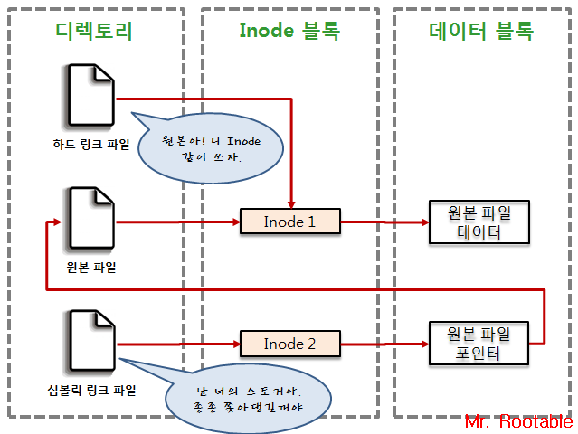

## 링크파일

### 심볼릭 링크 (Symbolic Link)

- 단순히 원본파일을 카리키도록 링크만 시켜둔 것. MS윈도우에서 "바로가기"와 유사
- 새로운 Inode를 만들어 원본파일을 가리키는 포인터와 연결되며, 원본파일의 Inode를 통해 원본파일에 데이터에 접근한다.

### 하드 링크 (Hard Link)

- 원본 파일과 다른 이름으로 존재하는 동일한 파일. 원본 파일 데이터

