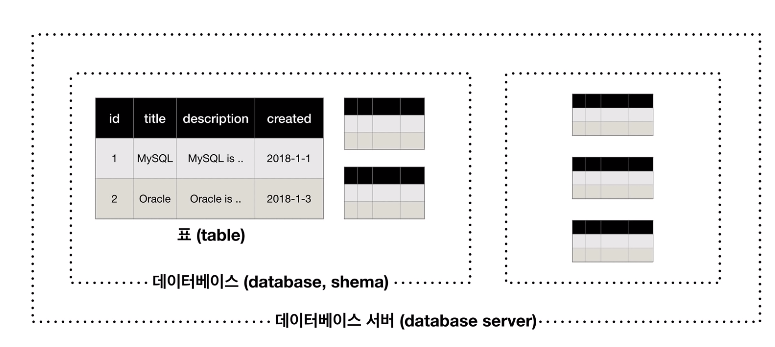

## MySQL의 구조




## 서버 접속

### -uroot

- 루트 사용자
- -uroot -p : 루트사용자의 비밀번호로 접


## 스키마의 사용

#### 데이터베이스(스키마) 생성

- CREATE DATABASE '데이터베이스 이름';

 

#### 데이터베이스(스키마) 삭제

- DROP DATABSE '데이터베이스 이름';

 

#### 데이터베이스 확인

- SHOW DATABASES;

 

#### 데이터베이스 사용

- USE '데이터베이스 이름';


## 기본 문법

#### 기본 문법

- 서버와의 연결을 끊는 구문인 QUIT와 같은 경우를 제외하고 일반적으로 구문 뒤에는 세미콜론(;)을 붙임.

- - 세미콜론은 구문을 구분하는 기준이 됨

- 키워드와 구문에서 대소문자를 구분하지 않음

- - 하지만 테이블 명과 필드의 이름은 대소문자를 구분

 

#### 주석

> ```mysql
> # 한 줄 주석
> 
> -- 한 줄 주석
> 
> /* 두 줄
> 이상의
> 주석 */
> ```


## 테이블의 생성

#### 테이블 생성

> ```mysql
> CREATE TABLE '테이블이름'(
> 	'테이블 이름' '자료형(길이)' '속성값
>  );
> ```

- 예제

  > ```mysql
  > CREATE TABLE topic(
  >     id INT(11) NOT NULL AUTO_INCREMENT,
  >     title VARCHAR(100) NOT NULL,
  >     description TEXT NULL,
  >     created DATETIME NOT NULL,
  >     Author VARCHAR(30) NULL,
  >     profile VARCHAR(100) NULL,
  >     PRIMARY KEY(id)
  > );
  > ```

- 속성 설명

- - NOT NULL : 공백 허용 X
  - NULL : 공백 허용
  - AUTO_INCREMENT : 따로 지정하지 않으면 자동으로 1씩 더해줌
  - PRIMARY KEY : 메인키(중복방지)

 

#### 테이블 확인

- `SHOW TABLES;`

 

#### 테이블 구조 확인

- `DESC '테이블 이름';`