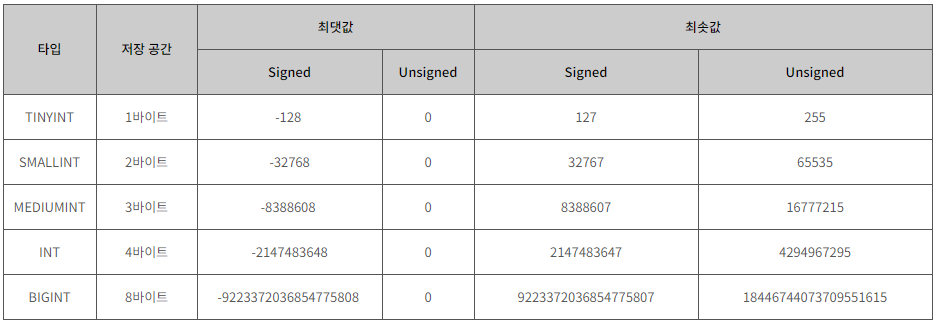

# 숫자 타입

- 정수 타입
- 고정 소수점 타입
- 부동 소수점 타입
- 비트값 타입




## 고정 소수점 타입

- NUMERIC을 구현하여 만들어졌음

> 문법
>
> ```mysql
> DECIMAL(M,D)
> ```

> 예시
>
> ```mysql
> ALTER TABLE Reservation
> MODIFY COLUMN RoomNum DECIMAL(7,2);
> ```

- M은 소수부분을 포함한 실수의 총 자릿수, 최대값은 65
- D는 소수 뿐의 자릿수, D가 0이면 소수 부분을 가지지 않음


## 부동 소수점 타입

- 실수의 값을 대략적으로 표현하기 위해 사용됨
- FLOAT은 4바이트를 사용하며, DOUBLE은 8바이트를 사용함

> 문법
>
> ```mysql
> FLOAT(M,D)
> DOUBLE(M,D)
> ```
>
> - M은 소수 부분을 포함한 실수의 총 자릿수
> - D는 소수 부분의 자릿수

> 예시
>
> ```mysql
> ALTER TABLE Reservation
> MODIFY COLUMN RoomNum FLOAT(7,2);
> ```


## 비트값 타입

- 0과 1로 구성되는 바이터리 값 저장가능

> 문법
>
> ```mysql
> BIT(M)
> ```
>
> M의 범위는 1부터 64까지 설정할 수 있으며,명시한 M 비트의 값을 저장할 수 있음. 만약 M비트보다 짧은 길이의 비트 값을 입력하면 입력한 값 앞에 0을 추가하여 자동으로 길이를 맞춤

> 예시
>
> ```mysql
> ALTER TABLE Reservation
> ADD Code BIT(7);
> ```