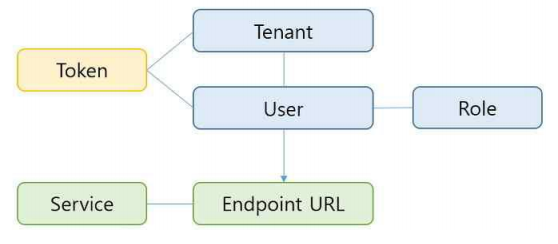
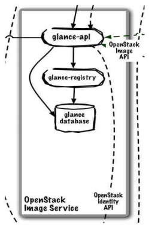

## Table of Contents

- [인라인 함수](https://github.com/KangMoo/TIL/blob/master/C%2B%2B/09_인라인 함수%2Cstatic 키워드%2C 예외.md#toc1)
- [static 키워드](https://github.com/KangMoo/TIL/blob/master/C%2B%2B/09_인라인 함수%2Cstatic 키워드%2C 예외.md#toc2)
- [정적 멤버 함수](https://github.com/KangMoo/TIL/blob/master/C%2B%2B/09_인라인 함수%2Cstatic 키워드%2C 예외.md#toc3)
- [예외](https://github.com/KangMoo/TIL/blob/master/C%2B%2B/09_인라인 함수%2Cstatic 키워드%2C 예외.md#toc4)
- [예외 - 범위 이탈, 0으로 나누기](https://github.com/KangMoo/TIL/blob/master/C%2B%2B/09_인라인 함수%2Cstatic 키워드%2C 예외.md#toc5)
- [예외 생성자](https://github.com/KangMoo/TIL/blob/master/C%2B%2B/09_인라인 함수%2Cstatic 키워드%2C 예외.md#toc6)
- [예외 - C의 에러코드](https://github.com/KangMoo/TIL/blob/master/C%2B%2B/09_인라인 함수%2Cstatic 키워드%2C 예외.md#toc7)
- [예외 에러 코드보다 예외가 더 낫다](https://github.com/KangMoo/TIL/blob/master/C%2B%2B/09_인라인 함수%2Cstatic 키워드%2C 예외.md#toc8)
- [적절한 예외처리](https://github.com/KangMoo/TIL/blob/master/C%2B%2B/09_인라인 함수%2Cstatic 키워드%2C 예외.md#toc9)

## 오픈스택 소개

**오픈 스택 개요**

> OpenStack은 2010년 7월 클라우드 서비스 업체인 Rockspace Inc. 와 미항공우주국(NASA)가 처음 시작한 모든 타입의 클라우드 환경을 지원하는 오픈소스 클라우드 컴퓨팅 플랫폼 프로젝트이다. 이 프로젝트는 서비스의 간단한 구현, 대규모 확장성, 다양한 기능 구현 등을 목표로 여러 프로젝트로  또 세분화 되어 구성된다. 전체적으로 OpenStack은 클라우드 컴퓨팅의 한분야인 IaaS(Infrastructure-as-a-Service)를 제공하며 이를 구성하는 세부 프로젝트들은 사용자에게 API(Application Program Interface2로 제공된다.

 * 2010년 NASA(Nova)와 Rackspace(Swift)가 하던 프로젝트를 오픈소스화함
* 오픈소스를 기반으로 클라우드를 구축하고 운영하고자 하는 오픈소스 개발자, 회사, 이용자들로 이루어진 커뮤니티
 * 컴퓨터 하드웨어 위에 인프라를 서비스로 제공하게 해주는 IaaS를 구축하게 해주는 오픈소스 플랫폼
 * **public, pirvate클라우드를 구축하기 위한 오픈소스**
 * 컴퓨팅, 스토리지, 네트워크와 같은 자원들을 모으고 이들을 제어하고 운영하즌 **클라우드 운영체제**

## 오픈스택 구성도

|                |                                                              |
| :------------: | ------------------------------------------------------------ |
|    **Core**    | Nova(compute) Glance(image service) Swift(storage) |
| **Incubation** | Keystone(common authentication Dashboard(web UI) Quantum (virtual network service) |
|  **Related**   | More...(DB,queue,...)                                        |

## 오픈스택 구성

|   서비스 분류   | 서비스 이름      | 프로젝트 이름 | 프로젝트 내용                                                |
| :-------------: | ---------------- | ------------- | ------------------------------------------------------------ |
|  Basic Service  | Dashboard        | Horizon       | 전체 OpenStack 서비스들과 상호작용하며 웹UI기반 통합 제어 서비스 제공 |
|        "        | Compute          | Nova          | OpenStack에서 인스턴스의 생성/삭제/메모리 관리 등의 인스턴스4 주기 관리 |
|        "        | Networking       | Neutron       | OpenStack의 외부(PNI5),내부 네트워크 연결(VNI6) 제공하는 서비스 |
| Storage Service | Object Storage   | Swift         | OpenStack에 사용되는 모든 임의의 데이터 객체들을 저장하는 서비스 |
|        "        | BlockStorage     | Cinder        | Nova에서 생성한 인스턴스의 물리적인 데이터공간을 제공하는 서비스 |
| Shared Service  | Identity Service | Keystone      | 다른 OpenStack 서비스들의 사용 인증, 인가 서비스를 제공      |
|        "        | Image Service    | Glance        | Nova프로젝트로 생성한 인스턴스에 설치할 OS 이미지들을 저장하는 서비스 |
|        "        | Telemetry        | Ceilometer    | OpenStack내 모든 서비스들의 자원 정보를 측정, 관리하는 서비스 |
| Support Service | Orchestration    | Heat          | OpenStack의 일련의 과정(인스턴스 생성, 네트워크 설정 등) 자동화 지원서비스 |
|        "        | Database Service | Trove         | OpenStack내에서 사용되는 모든 데이터베이스 정보 관리         |

## 오픈스택 주요 서비스

#### 오픈스택 주요 서비스 간략 소개

>**Nova**
>
>- 컴퓨트 서비스
>
>**Neutron**
>
>- 네트워크 서비스
>
>**Cinder**
>
>- 블록 스토리지 서비스
>
>**Keystone**
>
>- 인증 서비스
>
>**Glance**
>
>- 이미지 서비스
>
>**Swift**
>
>- 오브젝트 스토리지 서비스
>
>**Horizon**
>
>- 대시보드 서비스
>
>**Heat**
>
>- 오케스트레이션 서비스
>
>**Ceilometer**
>
>- 데이터 미터링 서비스
>
>**Trove**
>
>- 데이터베이스 서비스
>
>**Sahara**
>
>- 데이터 프로세싱 서비스
>
>**Ironic**
>
>- 베어메탈 서비스 
>
>**Zaqar**
>
>- 메시징 서비스
>
>**Manila**
>
>- 파일 시스템 공유 서비스
>
>**Designate**
>
>- DNS 서비스
>
>**Searchlight**
>
>- 검색 서비스

#### Nova

* **컴퓨트 서비스**
* IaaS시스템의 핵심 서비스
* 클라우드 컴퓨팅 운영체제에서 리눅스 커널과 같은 역할 담당
* 자원 풀을 관리하고 자동화하기 위해 설계됨
* 파이썬 언어로 작성되었고 많은 외부 라이브러리를 사용함
* 특정 하드웨어나 소프트웨어에 얽메이지 않고 표준 하드웨어 환경에서 언제든지 규모를 수평적으로 확장할 수 있어야 해서  레거시 시스템과 서드파티 기술과도 통합이 가능하도록 설계됨

#### Neutron

* **네트워크 서비스**
* 네트워크와 IP주소를 관리하기 위해 사용됨
* 클라우드 시스템 설치 시 네트워크가 자애물이나 제약 요소가 더 이상 아니라는 사실을 보장해줌
* 사용자들이 네트워크 설정을 스스로 할 수 있도록 도와주는 역할
* 

#### Cinder

* **블록 스토리지 서비스**

#### Keystone

* **인증 서비스**
* 사용자 관리 : 사용자와 그들의 권한을 추적한다
* 서비스 카탈로그 : 자신의 API 엔드포인트로 사용가능한 서비스의 카탈로그를 제공
* Identity Service 개념

   * 사용자
     * 오픈스택 클라우드 서비스를 사용하는 사람이나 시스템 혹은 서비스의 디지털 표현
   * Credentails
     * 누구인지 증명된 사용자 데이터 (ex: ID & PW)
   * 인증
     * 사용자 신원을 확인하는 행위
   * 토큰
     * 자원에 접근하는데 사용되는 임의의 텍스트 bit
     * 접근할 수 있는 범위를 가지고 있음
     * 언제든지 해제할 수 있고, 한정된 기간동안 유효
   * Tenant
     * 그룹 혹은 격리된 자원, identity개체에 사용되는 컨테이너
     * 요새는 Project라고 부른다
   * 서비스
     * 사용자가 자원에 접근하고 작업을 수행할 수 있는 하나 혹은 그 이상의 엔드포인트를 제공
     * Compute, Object Storage 혹은 Image 서비스 같은 오픈스택 서비스
   * 엔드포인트
     * 서비스로 접근하려고 하는(보통 URL로 기술되는) 네트워크로 접근가능한 주소
   * 역할
     * 사용자가 특별한 작업을 수행할 수 있도록 책임을 맡은 고유한 성격
     * 역할은 권한과 권리의 설정을 포함하고, 그 역할을 담당하는 사용자는 그 권리와 권한을 상속받는다
* Keystone의 user, tanant, role
   * Keystone은 사용자 인증 부분과 서비스 인증 부분을 관리
   * 사용자일 경우 사용자 그룹인 Tanant, 계정정보인 User ID와 PW,사용자 권한인 Role을 가짐
   * 서비스일 경우에는 서비스를 등록하고 해당 서비스의 Endpoint URL을 등록
   * 

#### Glance

* **이미지 서비스**

* 다양한 하이퍼바이저에서 사용할 수 있는 가상머신 이미지를 관리하고, 가상머신에 설치된 운영체제를 보관 및 관리

* 구조

  * Glance사용자들은 glance-api를 통해 이미지를 등록, 삭제 및 관리를 할 수 있다
  * glance-api는 glance-registry와 glance-database에서 이미지가 관리된다
  * 이미지를 등록할 때는 glance-registry를 통해 glance-database에 저장이 된다
  * 등록된 이미지를 사용할 때는 glance-database에 바로 사용요청을 한다
  * 

* 구성요소

  * glance-api : 이미지 발견, 검색, 저장을 위한 API
  * glance-registry : 저장, 처리 및 이미지에 대한 메타데이터 검색
  * [보안참고] 레지스트리는 Image서비스 스스로를 사용하기 위한 의미로 비공개 내부 서비스다. 사용자에게 노출 시키지 마시오!
  * Database : 이미지 메타데이터를 저장. 선호에 따라 데이터베이스를 선택할 수 있다. 대부분 MySQL 혹은 SQlite를 사용한다
  * Storage repository for image files : Image서비스는 일반 파일 시스템, Object Storage, RADOS 블록장치 HTTP, Amaxon S3등 다양한 저장소를 지원한다. 저장소의 일부 타입은 읽기전용만 지원함

  

#### Swift

* **오브젝트 스토리지 서비스**

#### Horizon

* **대시보드 서비스**

#### Heat

* **오케스트레이션 서비스**

#### Ceilometer

* **데이터 미터링 서비스**

#### Trove

* **데이터베이스 서비스**

#### Sahara

* **데이터 프로세싱 서비스**

#### Ironic

* **베어메탈 서비스 **

#### Zaqar

* **메시징 서비스**

#### Manila

* **파일 시스템 공유 서비스**

#### Designate

* **DNS 서비스**

#### Searchlight

* **검색 서비스**

## 스토리지 유형

* Object 기반
  * Swift/S3
  * Restful Api로 사용
* Block 기반
  * Cinder / EBS
  * 장치 file을 할당 받아와서 사용
* File 기반
  * Manila/NFS/EFS
  * mount하여 사용
* Databse 기반

​	**Identity Service Keystone(Cont.)**

>* 사용자 및 API에 대한 인증 및 권한 설정 서비스 제공
>* 사용자 인증을 통해 물리 서버 내의 자원을 사용할 수 있도록 한다.
>* OpenStack 서비스들을 위한 통합 인증 시스템.
>* API에 요청을 보내기 전의 인증 처리
>  * 최종 사용자/컴포넌트는 API에 요청을 보내기 전에 Keystone으로부터 API동작에 대한 토큰을 구한다.
>  * 토큰을 획득하면 대상 API에 대한 URL이 Keystone에 검색된다.
>* 인증 토큰 메커니즘
>  * 오픈스택 클라이언트는 다양한 컴포넌트들에 많은 API 호출을 하기 때문에 이러한 호출에 대해 ID/PW를 이용한 인증은 보안 및 성능 면에서 좋지 않다.
>  * 클라이언트는 API호출 전 토큰을 획득하고 사용한 컴포넌트에 토큰 ID를 보낸다.
>* OpenStakc에서 Keystone의 위치
>  * Keystone은 모든 서비스를 관장하는 위치에 자리하고 있다.
>  * 사용자 인증에 관한 모든 관리를 Keystone이 수행하고 있다.

​	**Cloud Image Service Glance**

>* 다양한 하이퍼바이저에서 사용할 수 있는 가상 머신 이미지를 관리하고 가상머신에 설치 된 운영체제를 보관 및 관리
>* Swift 프로젝트의 오브젝트 저장장치를 포함한 가상 머신 이미지 저장소로부터 가상 머신 이미지를 탐색, 등록 및 추출하는 기능을 제공
>* Nova를 통해 생성되는 가상 머신은 Glance를 통해 가상 머신 이미지를 제공받고 관리
>* 가상 디스크 이미지들을 저장/등록/관리/전달 할 수 있게 하는 오픈 소스

​	**Network Service Neutron**

> * 소프트웨어 기반의 네트워킹 서비스 제공
> * Neutron은 Folsom배포판에서 Quantaum이라는 이름으로 시작.
> * Havana배포판으로 오면서 프로젝트 명이 Neutron으로 변경됨.
> * 다양한 네트워킹 관련 기술 및 장비를 지원하기 위해 플로그인 방식을 채택하고 있다.
> * 네트워킹 기능은 Neutron과 연결 된 네트워크 프로바이더에 의해 제공된다.

​	**Cloud Compute Service NOVA(Cont.)**

> * 가상머신 라이프사이클 관리자
> * 사용자의 요청에 따라 컴퓨팅 자원을 제공하고 관리
> * 오픈스태에서 가장 핵심적인 프로젝트. 가상머신의 생성, 갱신, 삭제, 생명주기 관리 기능을 제공한다.
> * 대규모의 가상 컴퓨트 인스턴스들을 자동적으로 제어하고 운영하기 위한 오픈소스
> * 클라우드 인프라 서비스 제공
> * Nova가 지원하는 하이퍼 바이저
>   * Qemu와 KVM
>   * Hyper-V와 Vmware, XenServer6.2
>   * Baremetal과 docker, Xen via libvirt, LXC via libvirt

​	**Blocked Storage Service Cinder**

> * 범용의 저장장치를 기반으로 디스크 볼륨을 제공한다.
> * Cinder에 의해 생성된 가상 디스크 볼륨은 가상머신에 마운트 되어 가상머신 사용자의 데이터를 저장하는데 사용될 수 있다.
> * Nova에서 생성된 인스턴스에 확장하여 사용할 수 있는 저장 공간을 생성 및 삭제하고 인스턴스에 연결할 수 있는 기능을 제공한다.

​	**Cloud Storage Service Swift**

> * Rackspace CloudFiles를 기반으로 하는 오픈스택의 Object 저장소
> * 대용량 데이터를 저장할 수 있는 높은 확장성을 가지는 오브젝트 저장 장치를 제공하는 서비스다
> * 표준 범용 하드웨어를 사용하여 Petabyte급의 저장용량을 다룰 수 있도록 설계되었고 대규모 확장서오가 중복 없는 객체 저장을 제공한다.
> * 가상머신 이미지 파일의 저장장치로 사용되기도 한다.

​	**Dashboard Service Horizon**

>* 시스템 관리자 및 서비스 사용자를 위해 권한 별로 오픈스택 서비스를 이용할 수 있는 웹 기반의 사용자 인터페이스 환경을 제공한다.
>* 사용자가 웹 UI를 이용해 인스턴스를 생성, 삭제 및 관리 등의 작업을 쉽고 빠르게 처리할 수 있도록 해주는 웹 서비스.
>* Hrozon은 아파치 웹 서버를 사용하며, 대시보드는 파이썬 장고 프레임워크로 구현되어 있다.

## 용어 정의

* 프로젝트- cloud 사용자 group에 Quota 적용
* Tenant - cloud 사용자 그룹(project)
* Flavor- VM profile
* Image - Instance에 연결 될 OS 설치 이미지
* Instance - VM
* Key pair- DER/PEM/X.509로 인코딩된 넷스케이프 인증서
  * 사용자가 VM instance에 접속시 사용

## 가상화 유형

* Hypervisor

  * Full-Virtualization(전가상화)

    > CPU의 가상모드를 Enable해줘야 사용할 수 있음 (필수조건)

  * Para-Virtualization(반가상화)

* Container

#### Manual 설치

> 서비스가 가능한 사내 클라우드 시스템 구축할 경우
>
> 다양항 버전의 리눅스에 설치 제공
>
> 오픈스택의 컴포넌트를 하나하나 단계별로 설치해야함
>
> 서버가 재부팅되어도 서비스를 계속할 수 있음

#### 자동화 툴을 이용한 설치

> IDC센터처럼 많은 서버에 설치할 경우
>
> 오픈소스 기반 Chef와 Puppet을 많이 사용함
>
> * RedHat Solutions
>   * Packstack
>   * Foreman / Openstack Platform Director
> * Canonical Solutions
>   * Juju/Maas/Charms
> * Mirantis Solutions
>   * Fuel
> * Ubuntu
>   * Devstack
>   * openstack installer
> * openstack-ansibla (lxc+ansible)
> * Kolla (docker+ansible)
> * openstack-helm (openstack on k8s)

## 오픈스택 실습 시나리오

 CentOS 기반 오픈스택 설치

1. packstack으로 All-in-one 설치
2. Manual로 Compute node 추가
3. Dashboard로 서비스 사용하기
4. CLI로 관리하기
5. packstack을 이용한 reconfiguragtion

SELinux

> 레드햇 기반 보안
>
> 포트를 막는 것으로는 부족하다 생각하여 나옴

## Openstack 서비스 사용하기

#### Horizon으로 사용 및 관리하기

1. 프로젝트 생성
2. 사용자 생성
3. Flavor 생성
4. Network 생성
5. Router생성
6. Security Group 생성
7. Key pair 생성
8. Floating IP 생성
   * 공인 IP vs 사설 IP(Fixed IP)
9. Image 생성
10. Instance 생성 (compute service)
11. Volume/snapshot 생성
12. Object storage 사용

#### FixedIP 구조

* eth0 - 192.168.0.1~253
* int1(pirvate) - subint1 - 192.168.0.0./24
* Gateway(router) - 192.168.0.254
* DNS - 10.0.0.2
* DHCP 가능

Floating IP 구조

* ext1(subext1) - 10.0.0.0/24
* Gateway(router) - 10.0.0.2
* DNS - 10.0.0.2
* DHCP 불가능 -> pool사용