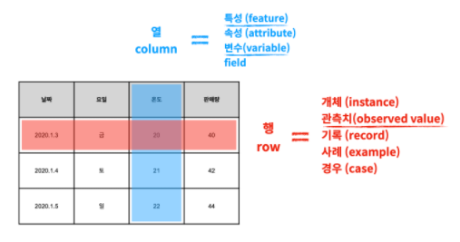

# Data Set - 표

- 데이터 셋 (data set)
  - 표 ( = table)

- 데이터 산업에서 행과 열을 표현하는 방법

  - ##### 행(row)

    - 개체(instance)
    - **관측치(observed  value)**
    - **기록(record)**
    - 사례(example)
    - 경우(case)

  - ##### 열(column)

    - **특성(feature)**
    - 속성(attribute)
    - **변수(variable)**

