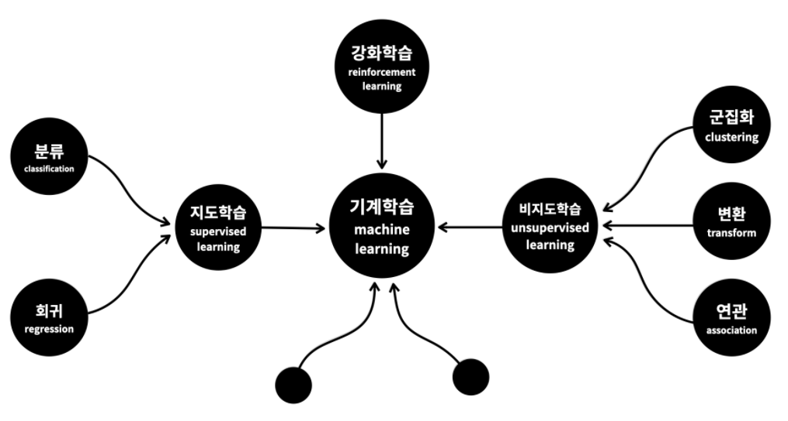

## 머신러닝의 분류

- **기계학습(ML)**
  - 지도학습
    - 분류
    - 회귀
  - 비지도학습
    - 군집화
    - 변환
    - 연관
  - 강화학습

## 1. 지도학습 (Supervised Learning)

- 분류
- 회귀

기계를 가르친다. 문제집을 푸는것과 비슷하다. 
문제와 정답을 비교하고, 맞추다보면 점점 문제를 푸는것에 익숙해진다. ( **분류, 회귀** ) 
비슷한 문제를 만나면 오답을 할 확률이 낮아진다. 
문제집으로 학생을 가르치듯이 데이터로 컴퓨터를 학습시켜서 모델을 만드는 방식을 '**지도학습**'이라 합니다.

## 2. 비지도학습 (Unsupervised Learning)

- 군집화
- 변환
- 연관

지도학습에 속하지 않는방법 
기계에게 데이터에 대한 통찰력을 부여하는 것 

즉, 누가 정답을 알렺주지 않았는데도 
무언가에 대한 관찰을 통해 새로운 의미나 관계를 
밝혀내는 것이라고 할 수 있습니다.

데이터의 성격을 파악하거나 데이터를  
잘 정리정돈 하는 것에 주로 사용됩니다.

## 3. 강화학습 (Reinforcement Learning)

학습을 통해서 능력을 향상시킨다는 점에서는 '**지도학습**'과 비슷합니다.

차이점은 지도학습이 정답을 알려주는 문제집이 있는 것이라면, 
**강화학습은 어떻게 하는 것이 더 좋은 결과를 낼 수 있는지**를 
**스스로 느끼면서 실력 향상**을 위해서 
노력하는 수련과 비슷합니다.

경험을 통해 '더 좋은 답'을 찾아가는 것입니다. 
마치 게임 실력을 키우는 것처럼요.

게임에는 룰이 있고, 룰에 따라 어떤 행동을 하면, 
그 결과에 따라서 상이나 벌을 받습니다. 
더 큰 상을 받기 위한 과정을 끝없이 반복하다 보면 
그 게임의 고수가 됩니다.

이런 과정을 기계에게 시켜서 
기계 스스로 고수로 성장하도록 
고안된 방법이 **강화학습**이라고 할 수 있습니다.

## 4. 정리

- 정답이 있는 문제를 해결하는 것
  - **지도학습**
- 무언가에 대한 관찰을 통해 새로운 의미나 관계를 밝혀내는 것
  - **비지도 학습**
- 더 좋은 보상을 받기 위해서 수련하는 것은 무엇인가요?
  - **강화학습**

