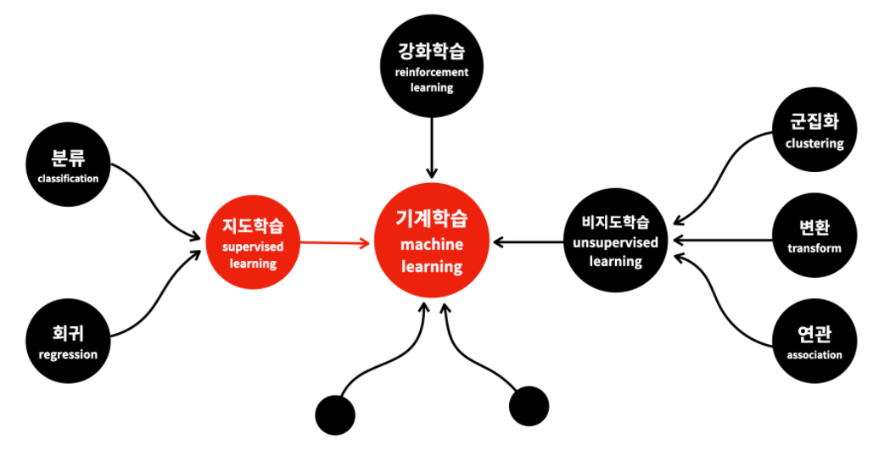
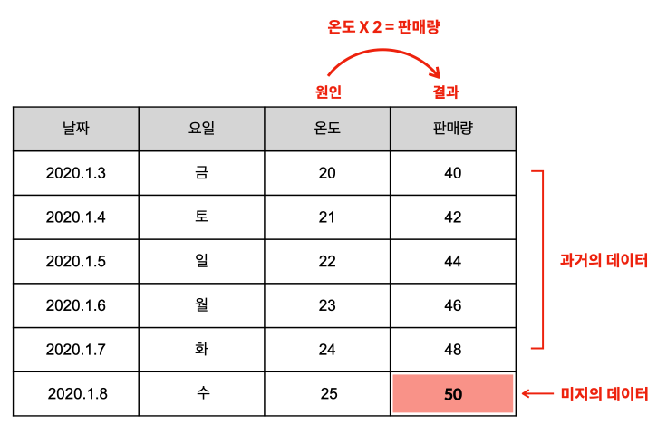
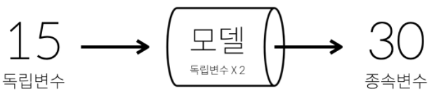

## 지도학습




## 1. 지도학습이란?

지도학습 = 역사

`원인 => 결과`


- 목적
  - 지도학습은 **과거에 데이터로부터 학습해서 결과를 예측**하는데 주로 사용


- 조건
  - 충분히 많은 데이터셋 필요
  - 독립변수와 종속변수가 존재해야 함




```python
## 모델 (공식)
판매량(y) = 온도(x) * 2
```

데이터가 정확하고, 많을수록 좋은 모델을 만들 수 있다.


## 2. 지도학습의 목적

지도학습을 하기 위해서는<br>
우선 과거의 데이터가 있어야 합니다.<br>
그리고 그 데이터를 독립변수(원인)와 종속변수(결과)로<br>
분리해야 합니다.


과거 데이터셋을 머신러닝을 통해 학습하여 모델을 만들어 내고,



##### 모델을 활용하여 미래의 결과값을 <u>예측</u> 하는것이 지도학습의 핵심이다!


## 3. 지도학습의 종류

- 회귀
- 분류


