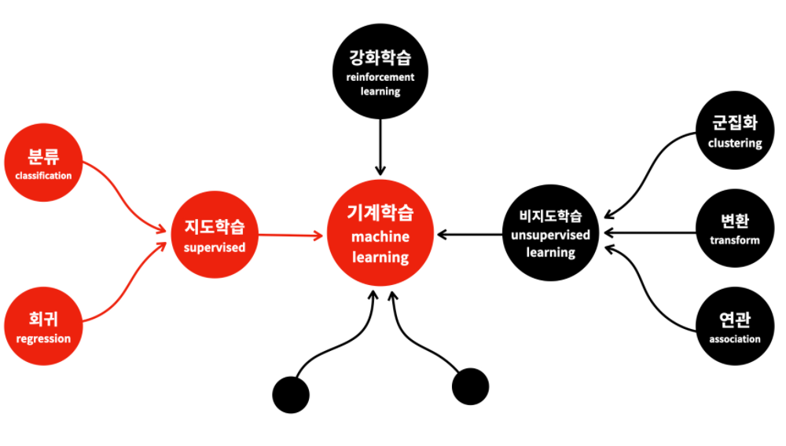
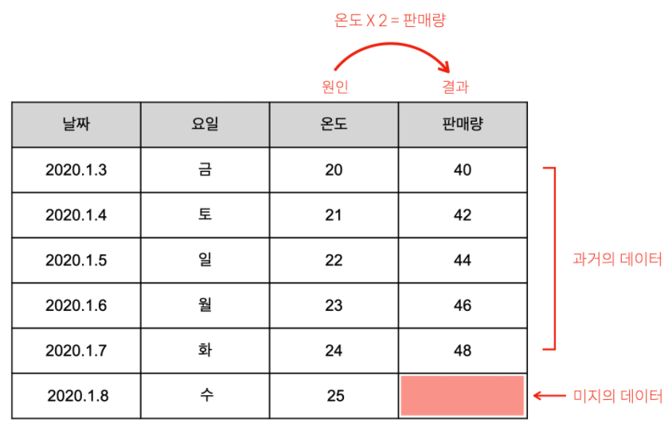
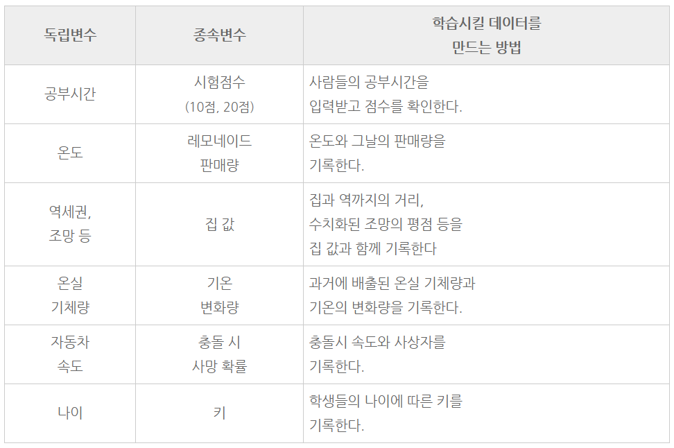
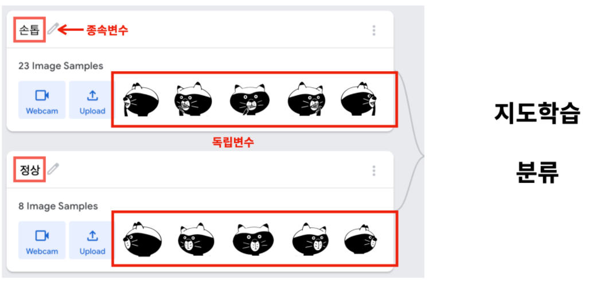
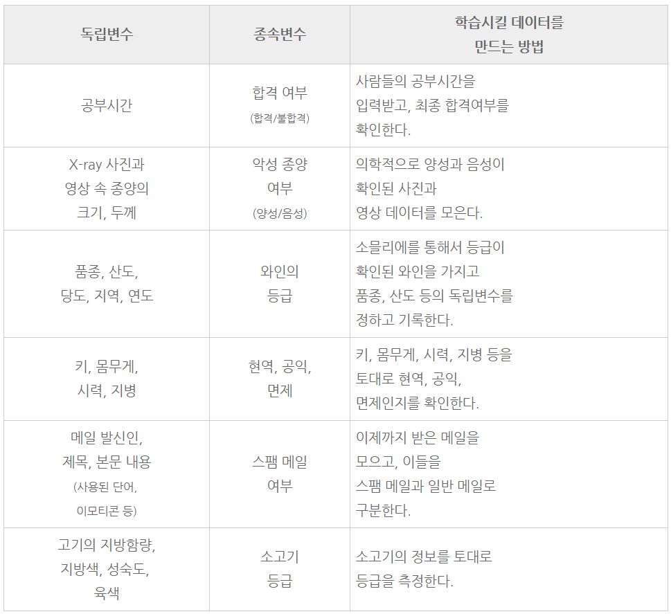
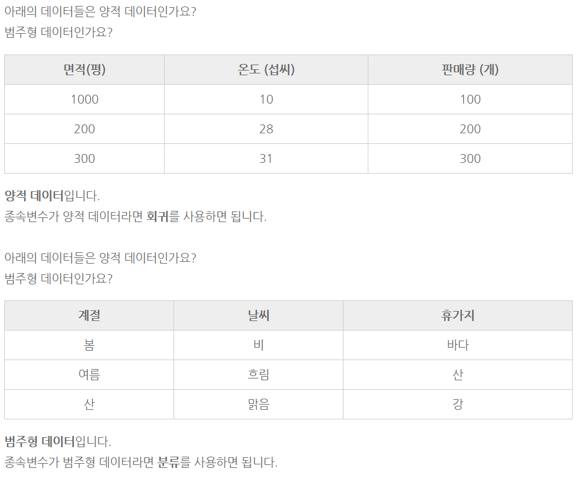
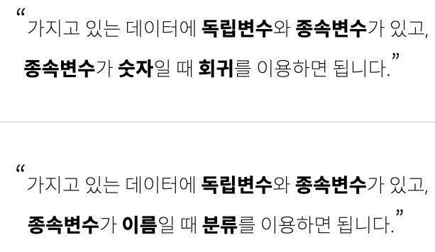

## 회귀 & 분류

- 기계학습
  - 지도학습
    - 회귀
    - 분류

## 1. 회귀(Regression)

예측하고 싶은 종속변수가 숫자일 때, 
보통 **회귀**라는 머신러닝의 방법을 사용합니다. 
레모네이드 예제가 바로 회귀를 이용한 것입니다.

그림을 다시 가져와봤습니다.

우리가 예측하고 싶은 1월 8일의 판매량은 
어떤 형태의 데이터 인가요?

**숫자**입니다.

#### 숫자를 예측하고 싶다면 **회귀(regression)**을 사용하면 됩니다.

[지도학습- 회귀 예시]

## 2. 분류 (Classification)

이전 예제에서 손톱을 깨무는 이미지들을 손톱이라는 **이름**으로 분류했던 것

그렇게 했더니 새로운 이미지가 나타났을 때 
그것이 손톱인지, 정상인지를 분류할 수 있었습니다.

이것은 과거의 데이터를 통해서 배운다는 점에서 **지도학습**입니다.

그런데 결과가 숫자가 아니라 
손톱, 정상과 같은 이름입니다.

이럴 때는 회귀를 사용하지 않습니다. 
**분류**라는 방법을 이용해야 합니다.

#### 이름, 혹은 문자를 예측하고 싶다면 분류(Classification)을 사용하면 됩니다!

[지도학습 - 분류 예시]

## 3. 양적데이터 & 범주형 데이터

- **양적 데이터**
  - **숫자**
  - 얼마나 큰지, 얼마나 많은지

- **범주형 데이터**
  - **이름, 문자**

## 4. 정리

- 지도학습
- 회귀, 분류
- 양적, 범주형
- 숫자, 문자