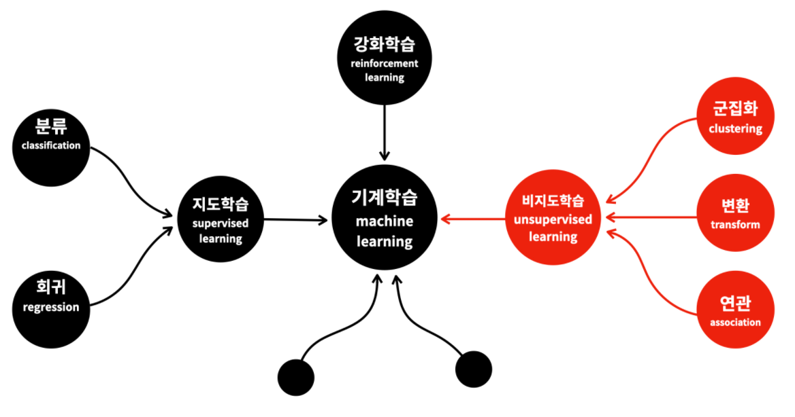
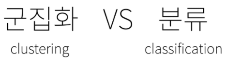
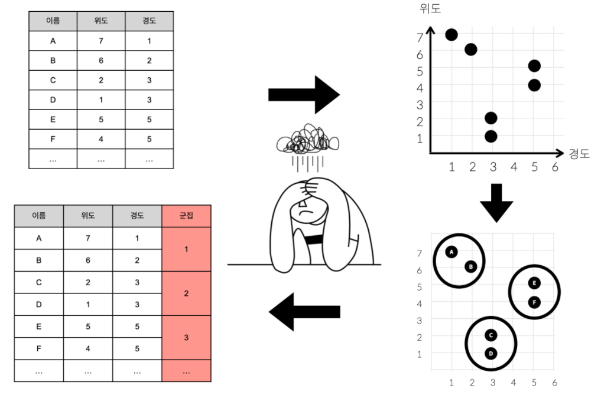
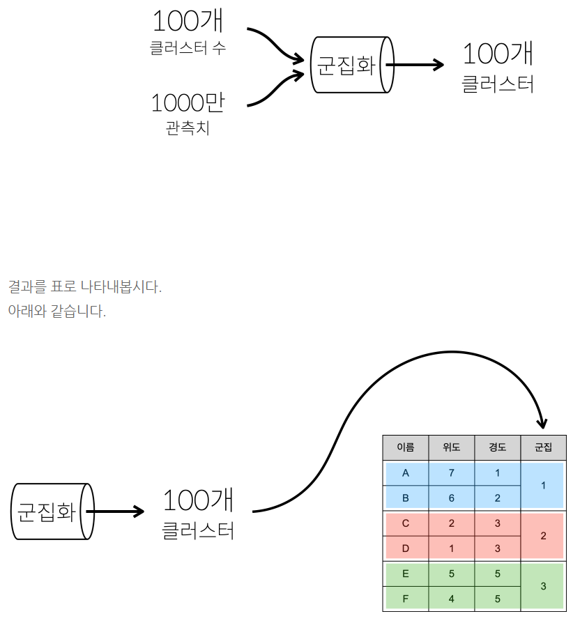
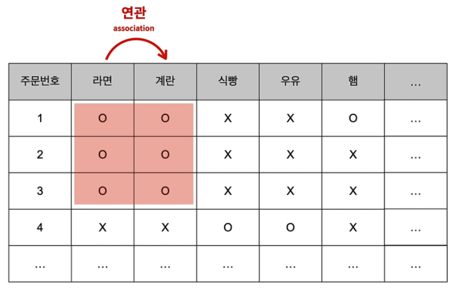
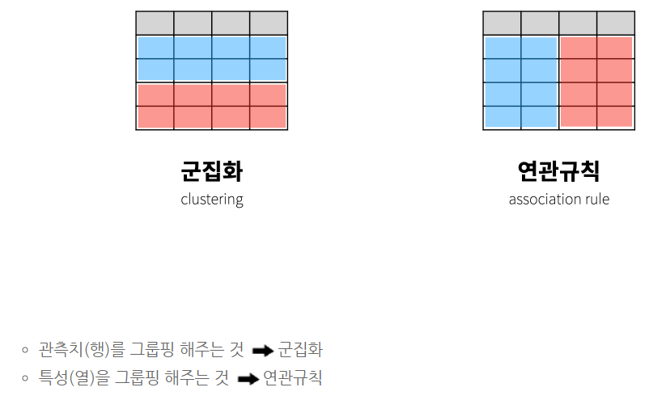

# [비지도 학습](https://opentutorials.org/course/4548/28945)

- 군집화 (Clustering)
- 연관 (Association)
- 변환 (transform)

- **목적**
  - **데이터를 정리 정돈해서 그 표에 담긴 데이터의 성격을 파악하는 것**

## 1. 군집화 (Clustering)

> 군집화는 비슷한 것들을 찾아서 **그룹을 만드는 것**입니다.
>
> 분류와 혼동되죠?

- 군집화
  - 비슷한 것들끼리 모아서 적당한 그룹을 만드는 것
- 분류
  - 각각의 데이터들을 만들어진 그룹에 각각 위치시키는 것

[**정리**]

**어떤 대상들을 구분해서 그룹을 만드는것이 군집화**라면, 
**분류는 어떤 대상이 어떤 그룹에 속하는지**를 
판단하는 것이라고 할 수 있습니다.

잘 생각해보면 군집화는 서로 가까운 관측치들을 찾아주는 머신러닝의 기법

좌표상에서 가깝다는 것은 데이터가 서로 비슷하다는 의미와 같습니다.

**비슷한 행을 그룹핑하는 것 => 군집화**

## 2. 연관규칙학습 (Association rule learning)

> 연관규칙학습은 서로 연관된 특징을 찾아내는 것입니다.
>
> 일명 **장바구니 분석**이라고 불립니다.
>
> **추천시스템**을 이용할 때 많이 쓰이는 머신러닝 기법

[표]

라면을 구입한 사람은 계란을 구입할 확률이 높습니다.

즉, 라면과 계란은 서로 **연관성(Association)**이 높다는 것을 알 수 있습니다.

**연관성을 파악할 수 있다면** 고객이 미처 구입하지 못했지만, 
**구입할 가능성이 매우 높은 상품을 추천**해줄 수 있습니다.

이 정도 양의 데이터라면 라면과 계란의 상관관계를 사람이 직접 찾을 수도 있습니다.

그런데 판매되는 제품의 종류가 1만개이고, 
하루에 1000만 명이 여러분의 쇼핑몰을 이용한다고 상상하면,

제품들 간의 연관성을 사람이 찾아내는 것은 
정말 어려운 일입니다.

이것을 기계가 대신해 줄 수 있다면 얼마나 좋을까요? 
이때 우리를 구원해줄 수 있는 도구가 바로 **연관규칙**입니다.

쇼핑 추천, 음악 추천, 영화 추천, 검색어 추천, 동영상 추천....

추천이 이름 뒤에 붙은 것들은 거의 다 연관규칙을 적용한 것이라고 보면 됩니다.

[**기억**]

**연관규칙은 서로 관련이 있는 특성(열)을 찾아주는 머신러닝 기법**

