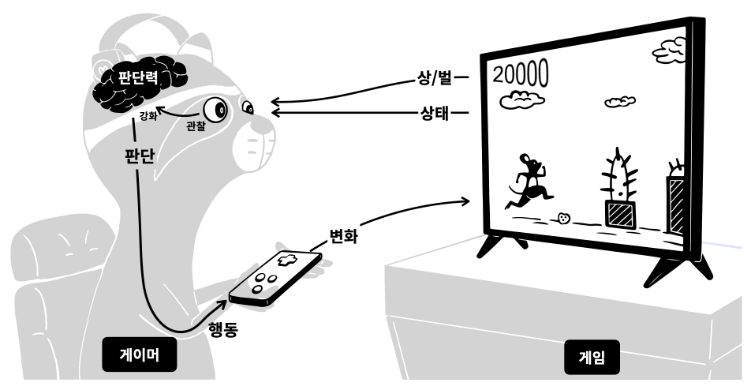
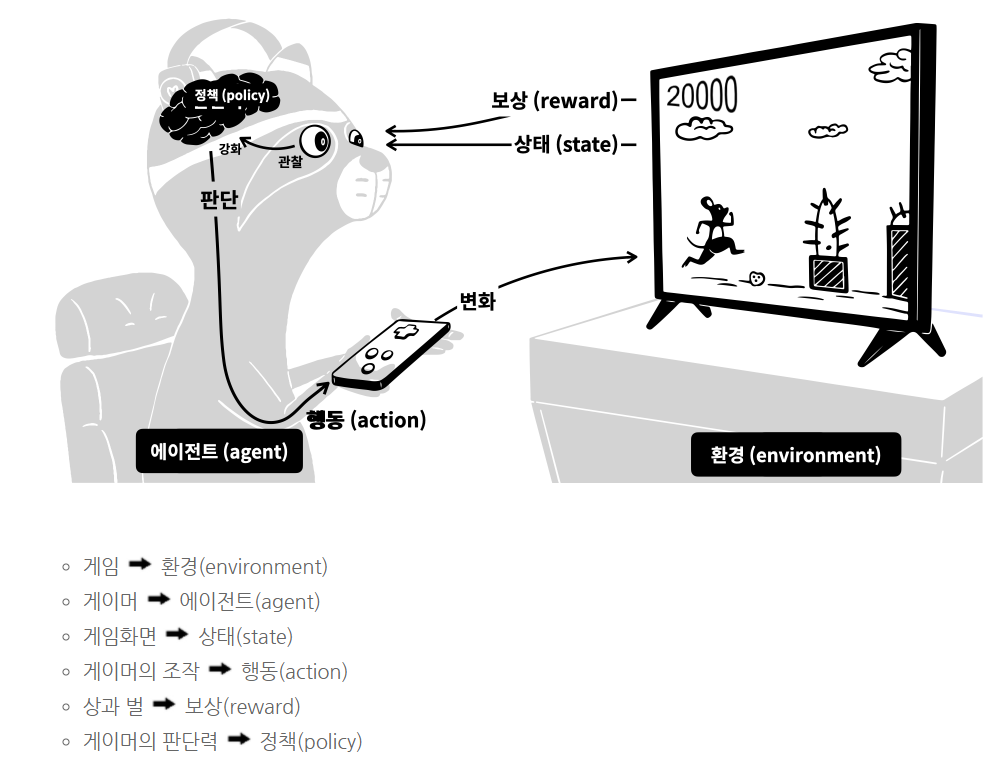

## 강화학습 (reinforcement learning)

> Reinforcement - 강화, 증강
>
> 강화학습의 핵심은 일단 해보는 것!!


| 지도학습 | 강화학습 |
| :------: | :------: |
|   배움   |   경험   |


- **지도학습**
  - 배움을 통해서 실력을 키우는 것
- **강화학습**
  - 일단 해보면서 경험을 통해 실력을 키워가는 것
  - 그 행동의 결과가 유리하면 상을받고, 불리한 것이라면 벌을 받는다.
  - 이 과정을 반복하면, 더 많은 보상을 받을 수 있는 더 좋은 답을 찾을 수 있다라는것이 기본 아이디어


## 1. 강화학습의 과정

[그림]



- 게임의 실력을 키워가는 과정
  1. 게임은 게이머에게 현재상태를 보여준다. 케릭터는 어디있고, 장애물은 어디있는지 알려준다.
  2. 동시에 현재 점수도 알려준다. 게이머는 이 점수가 높아지는 것이 상이고, 장애물에 부딪히는것이 벌이다.
  3. 관찰결과에 따라 어떤 행동해야 점수가 오르고, 더 적게 장애물에 부딪히는지 알게 된다.
  4. 판단력이 강화된 것이다.
  5. 판단에 따라서 행동을 한다.
  6. 그 행동은 게임에 변화를 주게 된다.


이런 과정을 반복하면 판단력이 점점 강화됩니다.<br>
이것이 현실에서 게임의 실력자가 되는 과정입니다.

생각해보면 배우지 않고도 결국에 잘하게 되는<br>
많은 일들이 이런 과정을 통해서 이루어집니다.

강화학습은 이러한 과정을 모방해서<br>
기계를 학습시키는 것입니다.

이 과정을 강화학습에서 사용하는 용어로만 바꾸면<br>
여러분은 강화학습이 무엇인지 아는 사람이 되는것입니다.


[**강화학습 용어**]




강화학습에서는 **더 많은 보상을 받을 수 있는 정책**을 만드는 것이 핵심


이렇게 만들어진 정책은 게임의 인공지능 플레이어를 만드는데 사용될 수 있다.<br>
바둑으로 인간을 이긴 **알파고가 바로 강화학습을 통해서 구현된 소프트웨어**입니다.

자동차의 자율주행 기능도 강화학습을 이용해서 만들어집니다.

```
스스로 수련을 통해서 더 좋은 선택을 하는 기능이 필요하다면 강화학습을 연구해보세요.
```

경험할수록 알아서 똑똑해지는 기계를 만들 수 있습니다.