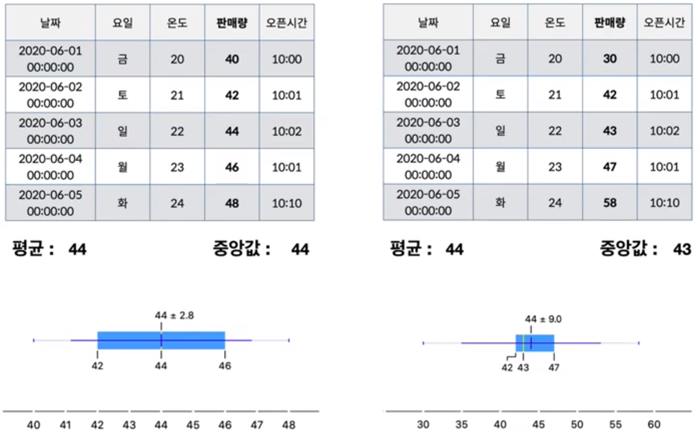
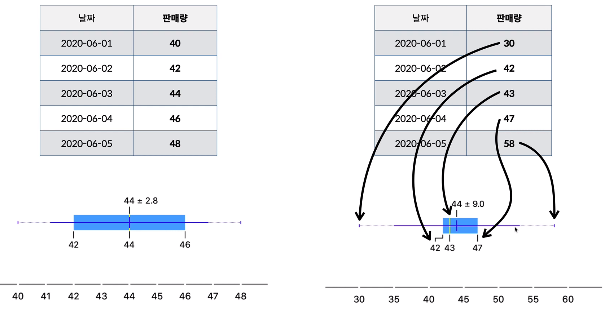
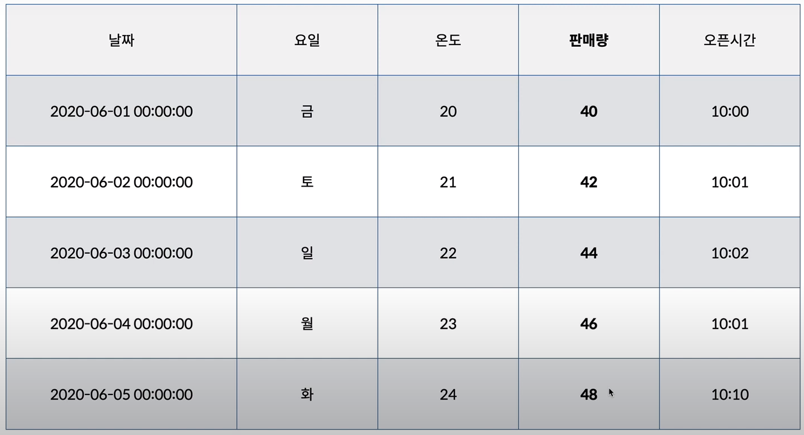
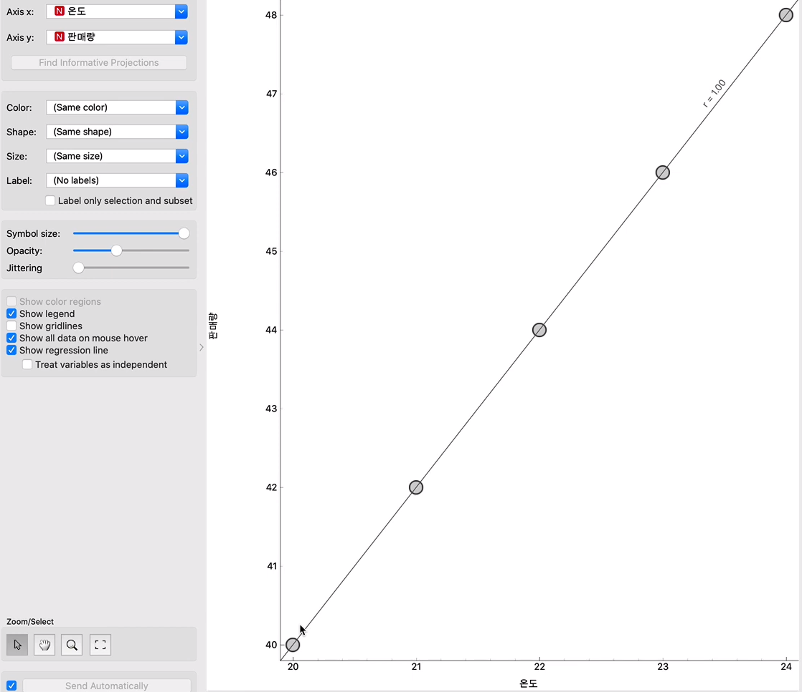
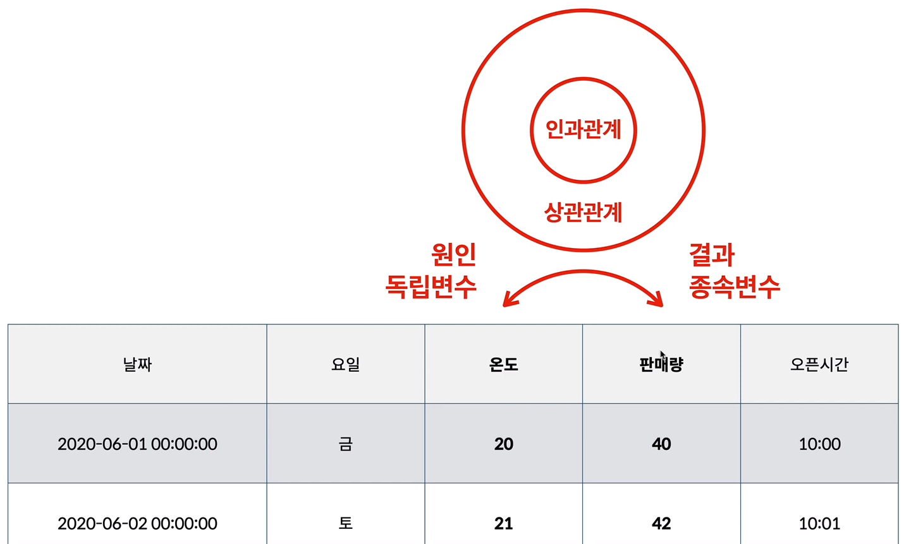

## 통계와 시각화

## 1. 통계

- 대표값
  - 평균(mean & average)
  - 중앙값(median)
  - 최빈값(mode)

- 사분위수(Quartile)

- 박스플롯 (boxplot)

## 2. 박스플롯(Boxplot)

 

## 3. 산점도 (Scatter Plot)

**판매량에 영향을 주는 다른 Column 을 찾고싶다.**

## 4. 상관관계와 인과관계

- 상관관계
  - 온도와 판매량은 서로 **상관관계** 가 있다.
  - 온도(원인) => 판매량(결과)
- 인과관계

