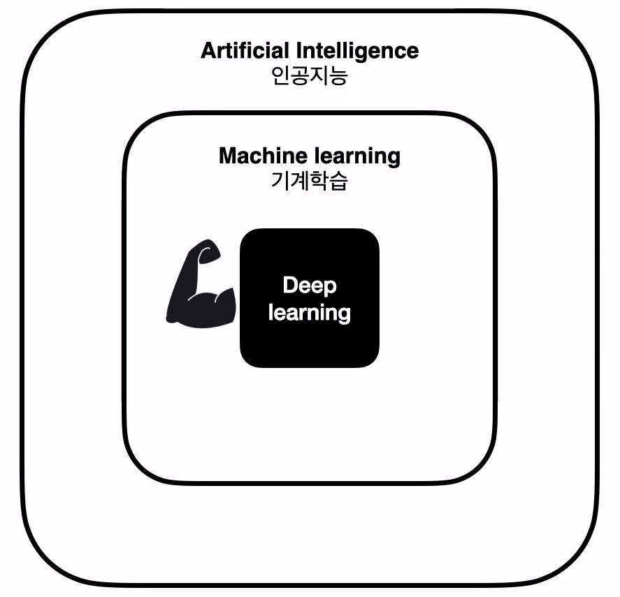
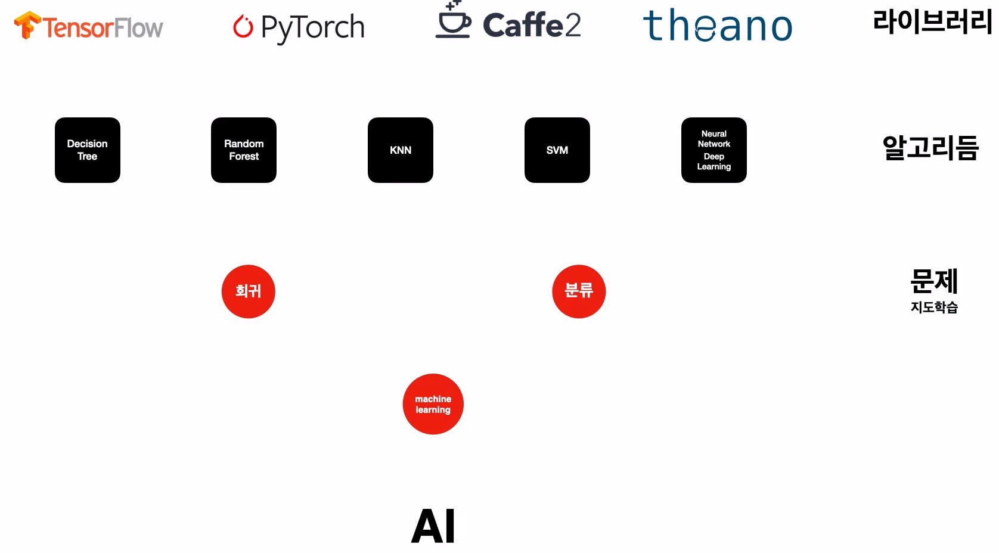

## 오리엔테이션

인간의 판단능력을 기계에게 위임하는 기술을 **머신러닝** 이라고 한다.

## 1. 텐서플로우

- 지도학습
  - 회귀
    - 숫자형 예측
  - 분류
    - 범주형 예측

- 분류와 회귀문제를 풀기위해 사용하는 방법
  - 머신러닝 알고리즘
    - 의사결정나무
    - 랜덤포레스트
    - KNN
    - SVM
    - **Neural Network (인공 신경망) **- 딥러닝

## 2. 인공신경망 (Neural Network) - Deep Learning

`딥러닝 = 인공신경망 = Neural Network`

- **딥러닝을 구현할 수 있게 도와주는 Library**
  - **TensorFlow**
  - PyTorch
  - Caffe2
  - theano

## 3. 딥러닝 라이브러리

- TensorFlow
- PyTorch
- Caffe2
- theano

- 알고리즘
  - 의사결정 나무
  - 랜덤포레스트
  - KNN
  - SVM
  - Deep Learning (인공신경망)

## 4. 정리

