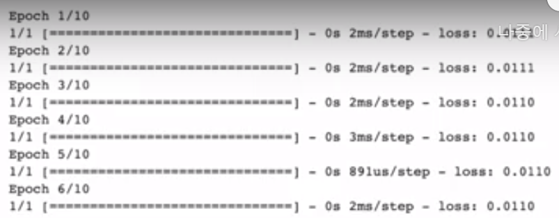

# 목표와 전략


## 1. 딥러닝 입문

- 파이썬 기초
- 데이터 입문
- 머신러닝 이해
- 딥러닝의 원리
- 딥러닝 구현


이러한 방법은 좋은방법이지만, 입문수업치고는 너무 진입장벽이 높다.<br>
스마트폰도 직접적인 사용을 통해 사용법을 익혀나가므로, 딥러닝도 이러한 방식으로 학습해볼예정


- 코드 작성 => 결과 보기
  - 코드의 동작과 학습과정을 구경해본다.

```python
import tensorflow as tf

# 모델 구조 생성
X = tf.keras.layers.Input(shape = [1])
Y = tf.keras.layers.Dense(1)(X)
model = tf.keras.models.Model(X, Y)
model.compile(loss='mse')

# 모델 학습
model.fit(x_train, y_train, epochs=1000, verbose=0)
model.fit(x_train, y_tarin, epochs=10)
```




코드와 알고리즘 동작에 익숙해지는 것이 목표!


**선수지식**

- 원리
- 수학
- 코딩
- 데이터

