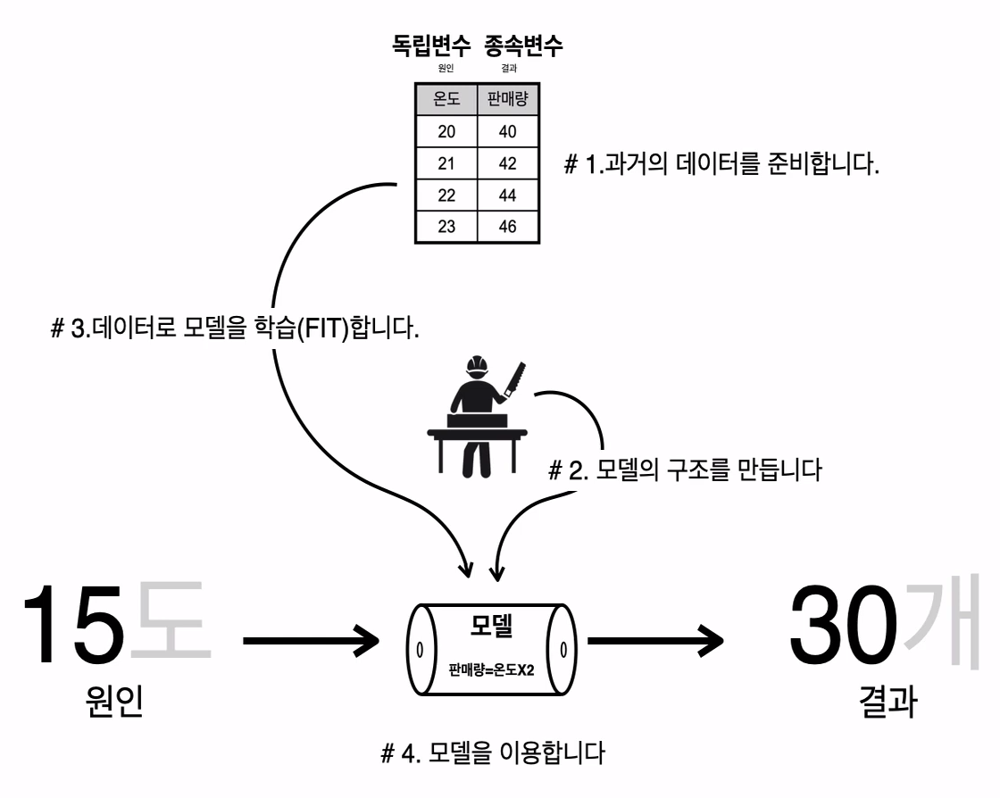
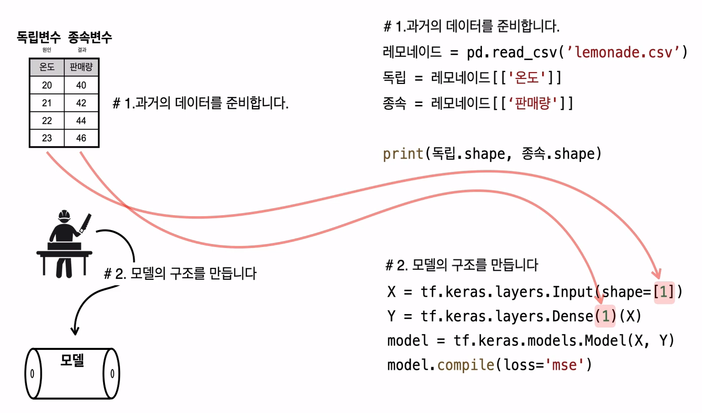
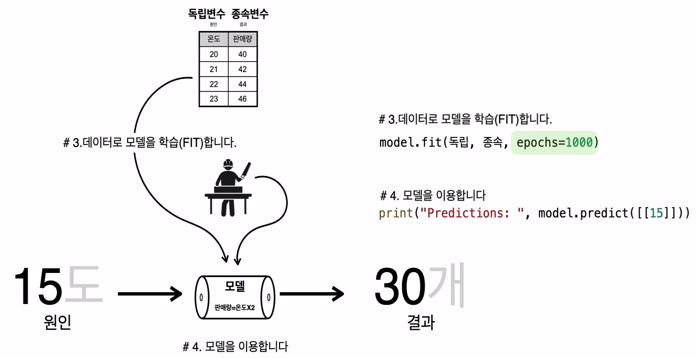
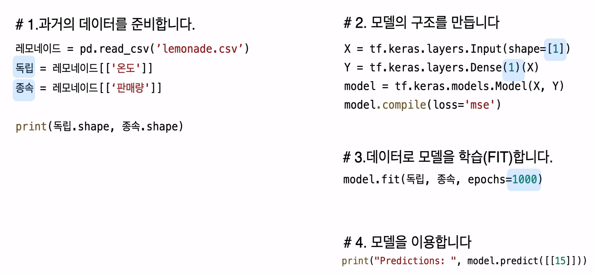

## 첫번째 딥러닝 - 레모네이드 판매예측



1. 과거의 데이터를 준비
2. 모델의 구조 만들기
3. 데이터로 모델 학습(fit)
4. 모델 이용


## 1. 회귀분석 순서

- 과거의 데이터 준비

```python
레모네이드 = pd.read_csv('lemonade.csv')
독립 = 레모네이드[['온도']]
종속 = 레모네이드[['판매량']]

print(독립.shape, 종속.shape)
```


- **모델의 구조 만들기** (딥러닝 학습의 핵심!!)

```python
## 가장 간단한 모델 만들었음
X = tf.keras.layers.Input(shape=[1]) # 숫자의 의미
Y = tf.keras.layers.Dense(1)(X)
model = tf.keras.models.Model(X, Y)
model.compile(loss='mse')
```


- 데이터로 모델을 학습(Fit)

```python
model.fit(독립, 종속, epochs=1000)
```


- 모델을 이용

```python
print('Predictions: ', model.predict([[15]])) # 30
```


## 2. 그림으로 이해하기

- 데이터준비하기
- 모델 구조만들기




- 데이터로 모델을 학습시키기 ( **epochs: 반복 학습횟수** )
- 모델 이용하기




## 3. 정리




## 4. 코드

```python
###########################
## 라이브러리 사용
import tensorflow as tf
import pandas as pd
 
###########################
## 데이터를 준비합니다.
파일경로 = 'https://raw.githubusercontent.com/blackdew/tensorflow1/master/csv/lemonade.csv'
레모네이드 = pd.read_csv(파일경로)
레모네이드.head()
## 종속변수, 독립변수
독립 = 레모네이드[['온도']]
종속 = 레모네이드[['판매량']]
print(독립.shape, 종속.shape)
 
###########################
## 모델을 만듭니다.
X = tf.keras.layers.Input(shape=[1])
Y = tf.keras.layers.Dense(1)(X)
model = tf.keras.models.Model(X, Y)
model.compile(loss='mse')
 
###########################
## 모델을 학습시킵니다. 
model.fit(독립, 종속, epochs=1000, verbose=0)
model.fit(독립, 종속, epochs=10)
 
###########################
## 모델을 이용합니다. 
print(model.predict(독립))
print(model.predict([[15]]))
```

