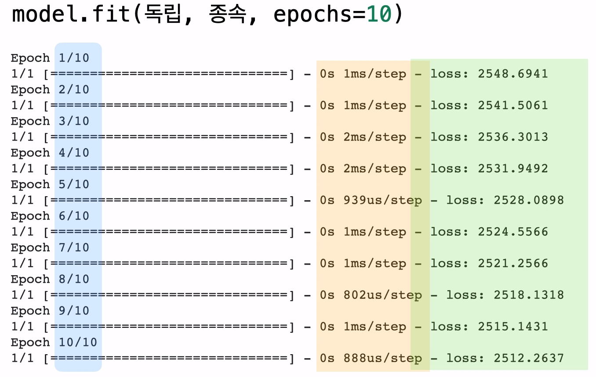
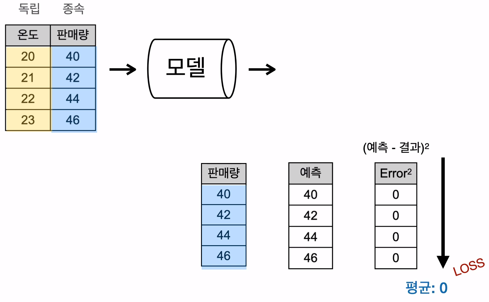
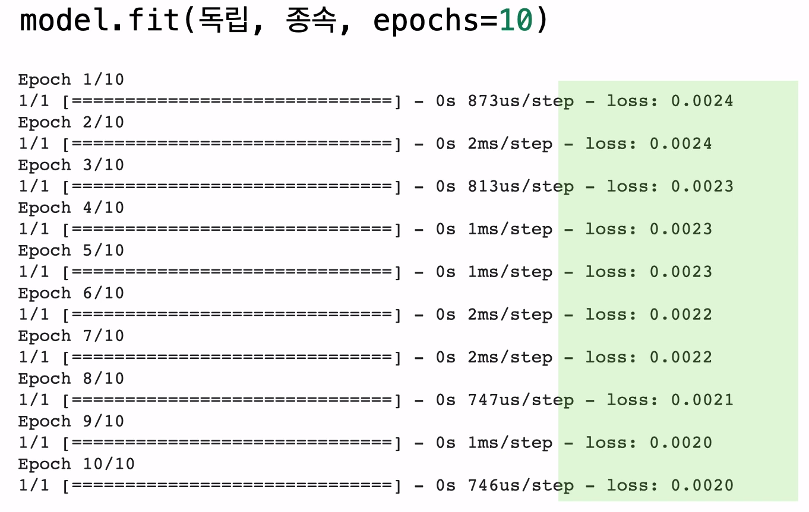

## 손실의 의미 (Loss)

```python
model.fit(독립, 종속, epochs=10)
```

  


- 파란 영역
  - 이번 학습이 몇번 째 학습인지 알려줌
- 주황 영역
  - 각 학습마다 시간이 얼만큼 걸렸는 지
- **연두 영역**
  - 학습이 얼마나 진행되었는 지
  - 모델은 매 학습마다 조금씩 학습하게 됨
  - 얼마나 정답에 가까이 맞추는 지를 평가하는 지표
  - 학습이 진행될수록 점점 더 정답을 맞추게 될것


## 손실 Loss


- 손실(Loss)
  - (예측 - 결과)^2^ 의 평균
  - (25 + 4 + 1 + 16) / 4 = 11.5


**예측이 정답을 모두 맞추고 있으면 그 차이가 0 이 되므로 Loss(손실) 은 0 이 될 것임**







## 결론

모델을 학습시킬 때,

```python
model.fit(독립, 종속, epochs=1000)
```

loss 값이 낮아질수록 내가 만든 모델이 정확히 예측하고 있다는 뜻!