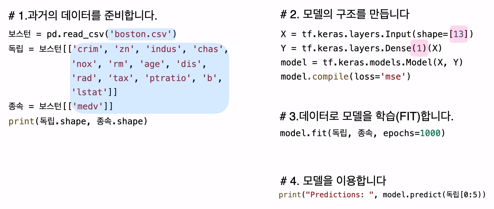
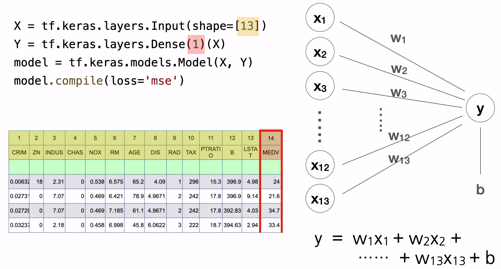
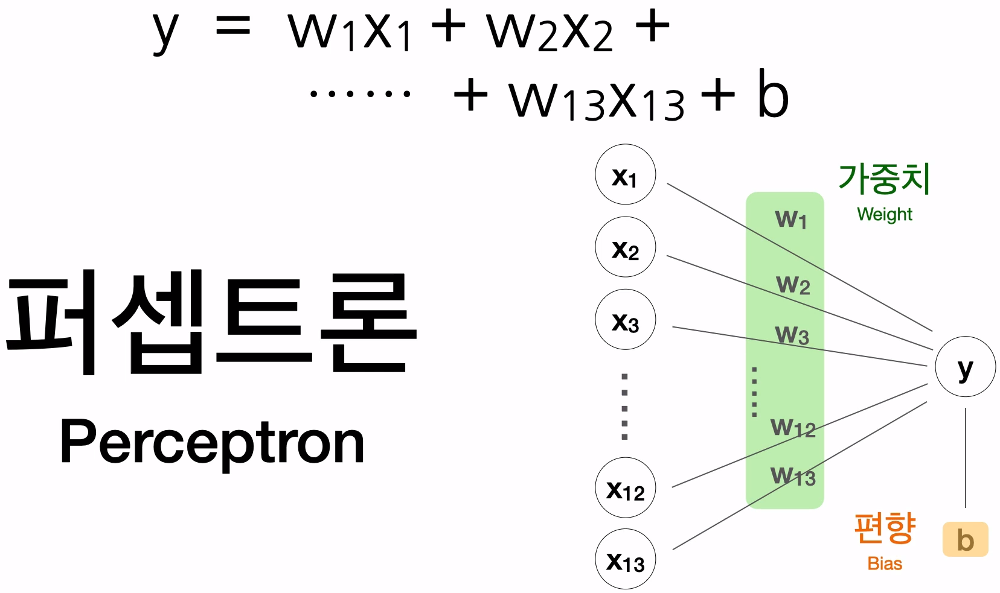

# 1. 보스턴 집값 예측

> 1978년도 보스턴시의 집값들의 대한 데이터셋


- 컬럼해석


머신러닝을 이용하면, 이러한 복잡한 수식을 기계가 대신 만들어주게 됩니다.


# 2. 수식과 퍼셉트론




```python
X = tf.keras.layer.Input(shape=[13])
Y = tf.keras.layer.Dense(1)(X)
model = tf.keras.models.Model(X, Y)
model.compile(loss='mse')
```




이러한 모형에는 **퍼셉트론**(Perceptron) 이라는 이름이 붙어있다.




---


### 다중 퍼셉트론


- 독립변수
  - 12개
- 종속변수
  - 2개


하나의 결과를 만들기 위해서는 수식이 1개가 필요.

- 지금은 수식이 2개가 필요함.
- 찾아야 하는 가중치의 수
  - w 12개, b 1개 (첫번째 수식)
  - w 12개, b 1개 (두번째 수식)


**퍼셉트론 2개가 병렬로 연결되어 있다.**


# 3. 실습 - 소스코드

```python
###########################
# 라이브러리 사용
import tensorflow as tf
import pandas as pd
 
###########################
# 1.과거의 데이터를 준비합니다.
파일경로 = 'https://raw.githubusercontent.com/blackdew/tensorflow1/master/csv/boston.csv'
보스턴 = pd.read_csv(파일경로)
print(보스턴.columns)
보스턴.head()
 
# 독립변수, 종속변수 분리 
독립 = 보스턴[['crim', 'zn', 'indus', 'chas', 'nox', 'rm', 'age', 'dis', 'rad', 'tax',
            'ptratio', 'b', 'lstat']]
종속 = 보스턴[['medv']]
print(독립.shape, 종속.shape)
 
###########################
# 2. 모델의 구조를 만듭니다
X = tf.keras.layers.Input(shape=[13])
Y = tf.keras.layers.Dense(1)(X)
model = tf.keras.models.Model(X, Y)
model.compile(loss='mse')
 
###########################
# 3.데이터로 모델을 학습(FIT)합니다.
model.fit(독립, 종속, epochs=1000, verbose=0)
model.fit(독립, 종속, epochs=10)
 
###########################
# 4. 모델을 이용합니다
print(model.predict(독립[5:10]))
# 종속변수 확인
print(종속[5:10])
 
###########################
# 모델의 수식 확인
print(model.get_weights())
```

