# 아이리스 품종 분류

> 아이리스 품종을 분류하는 딥러닝 모델을 텐서플로우를 이용하여 만들어 보고, 분류모델과 회귀모델의
>
> 차이점을 이해합니다. **범주형 변수**의 차이 방법인 **원핫인코딩**을 해야하는 이유와 활성화함수 **softmax**를
>
> 사용하는 이유를 학습합니다.
>
> - 분류모델 & 회귀모델 차이
> - 범주형 변수
> - 원핫인코딩
> - softmax() 사용이유


## 1. 아이리스(붓꽃) 

- [데이터 확인하기](https://github.com/blackdew/tensorflow1/blob/master/csv/iris.csv)

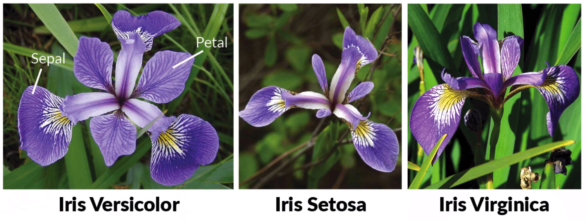


- 데이터

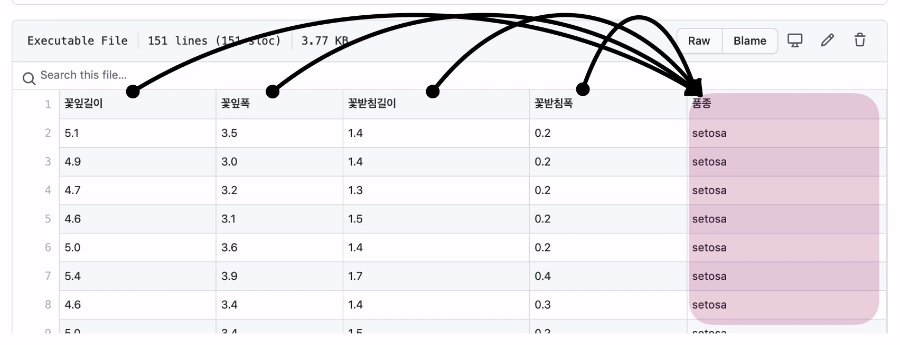


- 분류모델을 이용하여 만들기

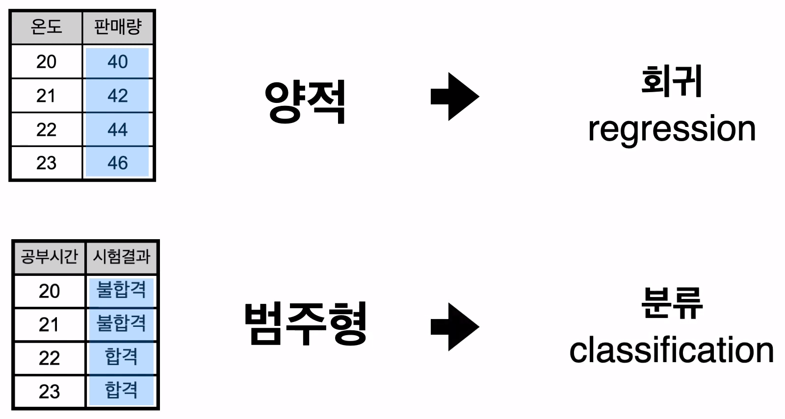


- 회귀모델을 만들때와 어떤 차이가 있는 지 살펴보기

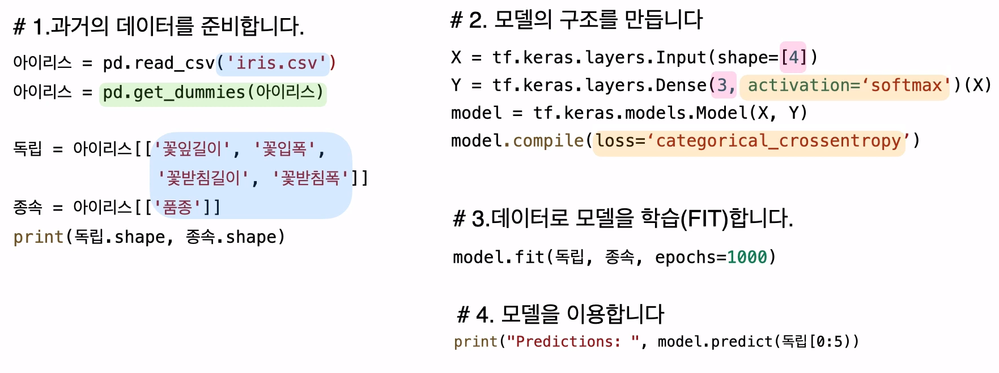


## 2. 원핫인코딩

> 범주형데이터를 0 또는 1 로 바꿔주는 작업을 **원핫인코딩** 이라고 한다.


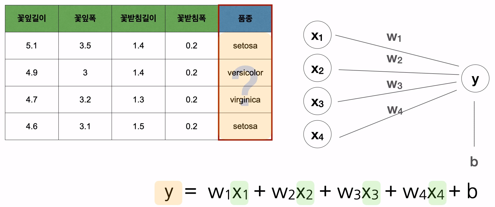


- 원핫인코딩

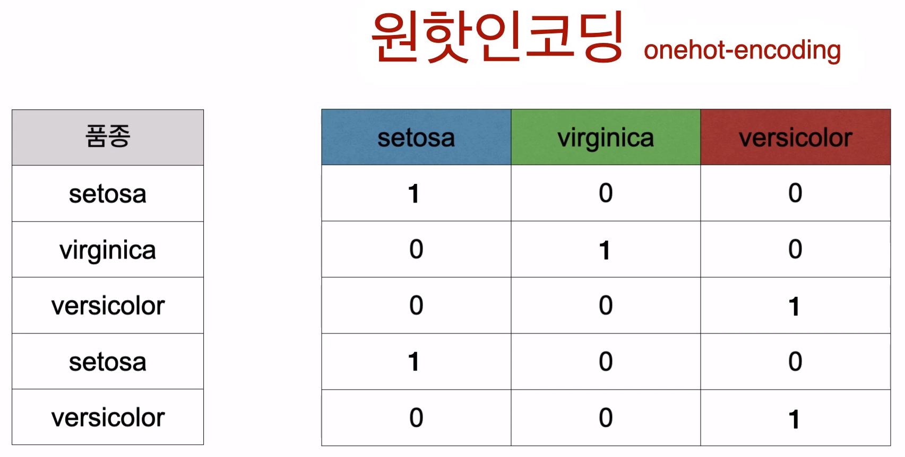

 

**판다스의 `pd.get_dummies(DataSet)` 을 이용하면 범주형 데이터를 원핫인코딩 해준다.**

```python
아이리스 = pd.get_dummies(아이리스)
```


[결과]

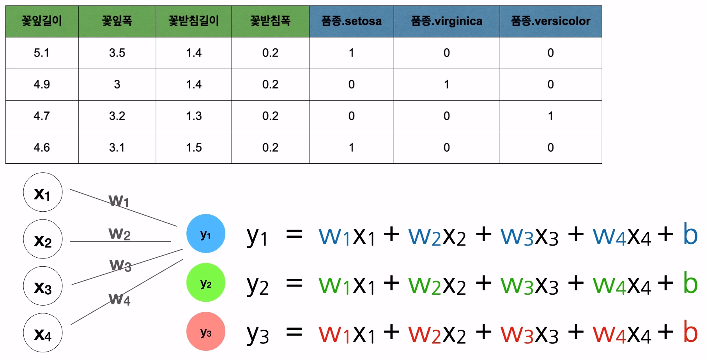


```python
# 모델의 구조를 만듭니다. (분류 | 원핫인코딩)

X = tf.keras.layers.Input(shape=[4])
Y = tf.keras.layers.Dense(3, activation='softmax')(X) # 원핫인코딩으로 종속변수가 3개가 됨
model = tf.keras.models.Model(X, Y)
model.compile(loss='categorical_crossentropy')
```


## 3. Softmax & CrossEntropy

- 분류 예측
  - 우리는 0 ~ 100% 사이로 확률값을 추측합니다.
  - 그렇게 하도록 만들어주는 도구
    - Sigmoid
    - Softmax


**비율로 예측하기 위해 Softmax 를 사용한다.**


원핫인코딩안의 숫자는 확률을 나타낸다.

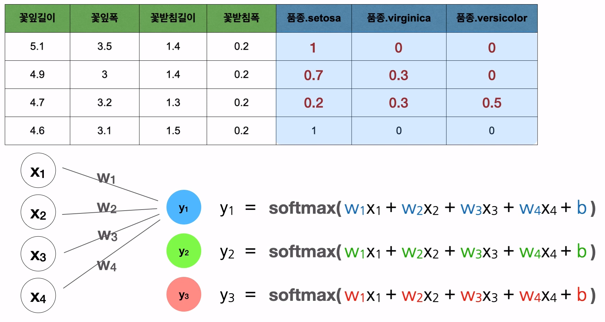


- **활성화 함수**

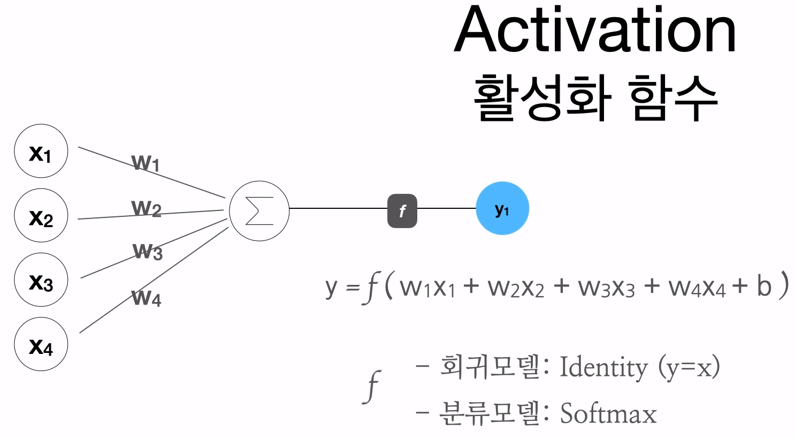


- **Loss**
  - 문제에 따라 Loss 를 다르게 해야한다.
  - **회귀&분류** 일때 loss값 다르게 준다.
    - 회귀 : MSE (Minimum Square Error) - 최소제곱오차
    - 분류 : categorical_crossentropy

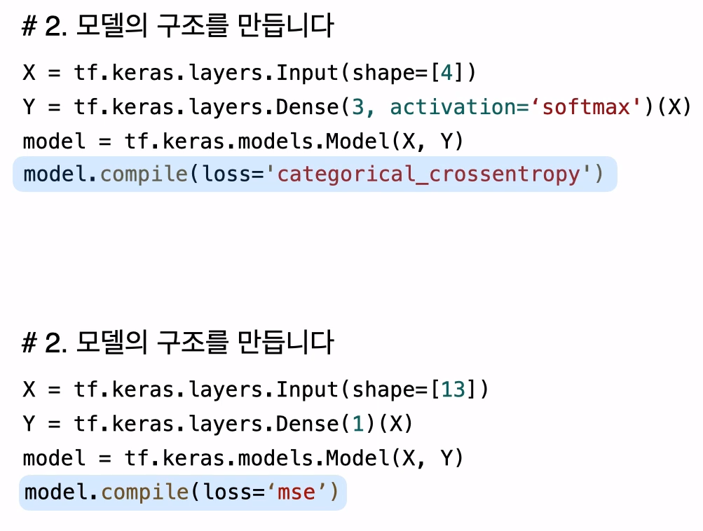


- 분류모델에선 **정확도(accuracy)**를 표시해주는게 좋다.

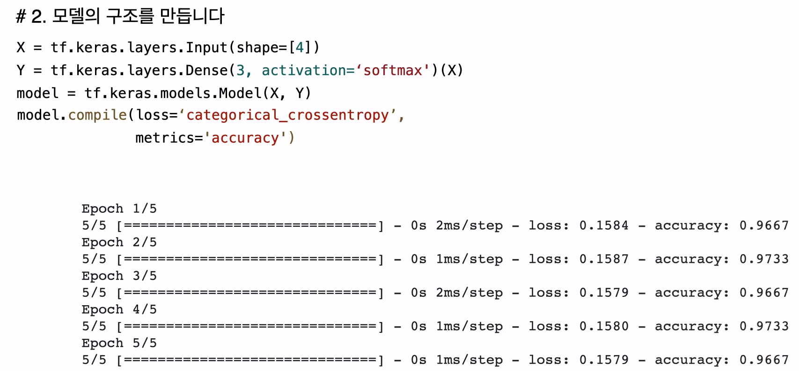


## 4. 코드 실습

```python
###########################
# 라이브러리 사용
import tensorflow as tf
import pandas as pd
 
###########################
# 1.과거의 데이터를 준비합니다.
파일경로 = 'https://raw.githubusercontent.com/blackdew/tensorflow1/master/csv/iris.csv'
아이리스 = pd.read_csv(파일경로)
아이리스.head()
 
# 원핫인코딩
아이리스 = pd.get_dummies(아이리스)
 
# 종속변수, 독립변수
독립 = 아이리스[['꽃잎길이', '꽃잎폭', '꽃받침길이', '꽃받침폭']]
종속 = 아이리스[['품종_setosa', '품종_versicolor', '품종_virginica']]
print(독립.shape, 종속.shape)
 
###########################
# 2. 모델의 구조를 만듭니다
X = tf.keras.layers.Input(shape=[4])
Y = tf.keras.layers.Dense(3, activation='softmax')(X)
model = tf.keras.models.Model(X, Y)
model.compile(loss='categorical_crossentropy',
              metrics='accuracy')
 
###########################
# 3.데이터로 모델을 학습(FIT)합니다.
model.fit(독립, 종속, epochs=1000, verbose=0)
model.fit(독립, 종속, epochs=10)
 
###########################
# 4. 모델을 이용합니다
# 맨 처음 데이터 5개
print(model.predict(독립[:5]))
print(종속[:5])
 
# 맨 마지막 데이터 5개
print(model.predict(독립[-5:]))
print(종속[-5:])
 
###########################
# weights & bias 출력
print(model.get_weights())
```

