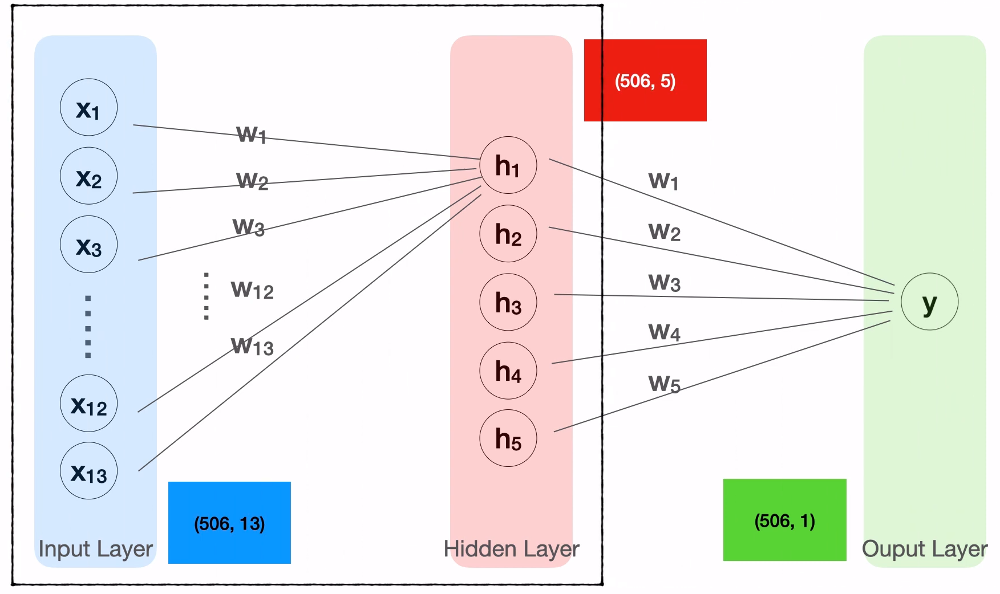

## 신경망의 완성: 히든레이어

> - 학습목표
>   - **히든레이어**와 **멀티레이어**의 구조의 이해
>   - **히든레이어**를 추가한 **멀티레이어 인공신경망 모델**을 완성


## 1. 히든레이어(hidden layer)

> 1개의 퍼셉트론을 말고 여러개의 퍼셉트론을 깊게 연결한 진짜 딥러닝 모델을 만들어보자.


 [보스턴 집값 예측 DataSet 예시]




- 입력부분
  - **Input Layer**


- 중간에 추가한 부분
  - **Hidden Layer**
  - 13개의 입력을 받고 5개의 출력을 만든다.


- 출력부분
  - **Output Layer**
  - 5개의 입력을 받고 1개의 출력을 만든다.


- Hidden Layer
  - 5개의 노드로 이루어져 있다.


```python
## Hidden Layer
## 2. 모델의 구조를 만듭니다.

X = tf.keras.layers.Input(shape=[13])
## 3개의 히든레이어 추가
H = tf.keras.layers.Dense(5, activation='swish')(X) # 히든레이어 추가
H = tf.keras.layers.Dense(3, activation='swish')(H) # 히든레이어 추가
H = tf.keras.layers.Dense(5, activation='swish')(H) # 히든레이어 추가
Y = tf.keras.layers.Dense(1)(H)
model = tf.keras.models.Model(X, Y)
model.compile(loss='mse')
```


## 2. 코드 실습

- 보스턴 집값 예측

```python
##########################
## 라이브러리 사용
import tensorflow as tf
import pandas as pd
 
###########################
## 1.과거의 데이터를 준비합니다.
파일경로 = 'https://raw.githubusercontent.com/blackdew/tensorflow1/master/csv/boston.csv'
보스턴 = pd.read_csv(파일경로)
 
## 종속변수, 독립변수
독립 = 보스턴[['crim', 'zn', 'indus', 'chas', 'nox', 
            'rm', 'age', 'dis', 'rad', 'tax',
            'ptratio', 'b', 'lstat']]
종속 = 보스턴[['medv']]
print(독립.shape, 종속.shape)
 
###########################
## 2. 모델의 구조를 만듭니다
X = tf.keras.layers.Input(shape=[13])
H = tf.keras.layers.Dense(10, activation='swish')(X)
Y = tf.keras.layers.Dense(1)(H)
model = tf.keras.models.Model(X, Y)
model.compile(loss='mse')
 
## 모델 구조 확인
model.summary()
 
###########################
## 3.데이터로 모델을 학습(FIT)합니다.
model.fit(독립, 종속, epochs=100)
 
###########################
## 4. 모델을 이용합니다
print(model.predict(독립[:5]))
print(종속[:5])
 
###########################
## 모델의 수식 확인
print(model.get_weights())
```


- 아이리스 품종 분류

```python
###########################
## 라이브러리 사용
import tensorflow as tf
import pandas as pd
 
###########################
## 1.과거의 데이터를 준비합니다.
파일경로 = 'https://raw.githubusercontent.com/blackdew/tensorflow1/master/csv/iris.csv'
아이리스 = pd.read_csv(파일경로)
 
## 원핫인코딩
아이리스 = pd.get_dummies(아이리스)
 
## 종속변수, 독립변수
독립 = 아이리스[['꽃잎길이', '꽃잎폭', '꽃받침길이', '꽃받침폭']]
종속 = 아이리스[['품종_setosa', '품종_versicolor', '품종_virginica']]
print(독립.shape, 종속.shape)
 
###########################
## 2. 모델의 구조를 만듭니다
X = tf.keras.layers.Input(shape=[4])
H = tf.keras.layers.Dense(8, activation="swish")(X)
H = tf.keras.layers.Dense(8, activation="swish")(H)
H = tf.keras.layers.Dense(8, activation="swish")(H)
Y = tf.keras.layers.Dense(3, activation='softmax')(H)
model = tf.keras.models.Model(X, Y)
model.compile(loss='categorical_crossentropy',
              metrics='accuracy')
 
## 모델 구조 확인
model.summary()
 
###########################
## 3.데이터로 모델을 학습(FIT)합니다.
model.fit(독립, 종속, epochs=100)
 
###########################
## 4. 모델을 이용합니다
print(model.predict(독립[:5]))
print(종속[:5])
```

