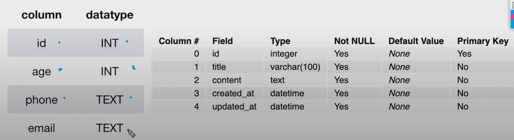
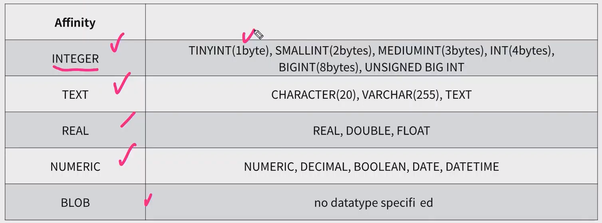
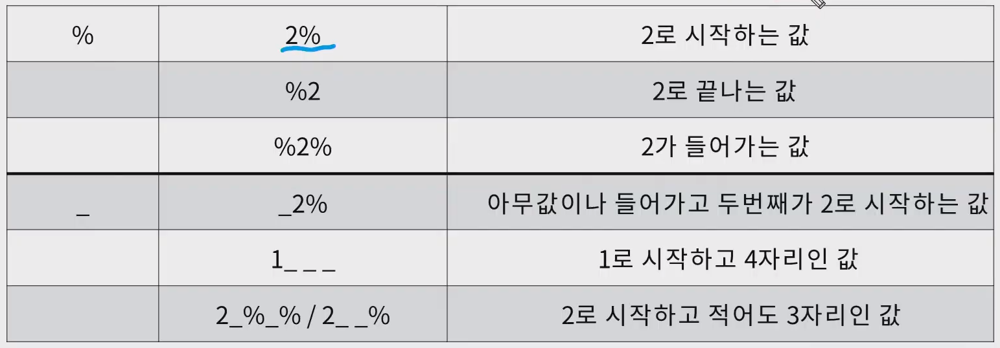

# DB

## 기본용어

1. 스키마

- 데이터베이스에서 자료의 구조와 제약 조건(구조, 표현방법, 관계 등)에 관한 전반적인 명세




2. 테이블(관계)


3. Column(열), 속성
   - 각 열에는 고유한 데이터 형식이 있다.


4. row(행), 레코드


5. PK (Primary Key / 기본키)
   - 각 행의 고유값으로 저장된 레코드를 고유하게 식별할 수 있는 값


## SQL

> Structured Query Language


1. DDL ( 데이터 정의 언어 )

   - 데이터 정의
   - `Create Drop Alter`

   

2. DML ( 데이터 조작 언어 )

   - 데이터 저장, 수정,삭제, 조회 등
   - `CRUD`

   

3. DCL ( 데이터 제어 언어 )

   - 데이터베이스 사용자의 권한 제어
   - `Grant` `Revoke` `commit` `rollback`


기본문법

```sql
SELECT *
FROM *
GROUP by *
ORDER by *
WHERE *
```


1. Select
   - Select문은 데이터를 읽어올 수 있으며, 특정한 테이블을 반환한다.

```sqlite
select *
from aritlces_article;
```


2. 테이블 생성

```sqlite
create table [테이블이름] (
	column1 datatype [constrains]
    column2 datatype [constrains]
)

## constrains : not null, primary key, unique

## 예시
create table classmates (
	id INTEGER PRIMARY KEY AutoIncrement
    name Text not null
    age Integer
)
```


3. Datatype(SQLite)




## CRUD

1. 추가
   - 특정 테이블에 새로운 행을 추가하여 데이터를 추가

```sqlite
insert into table (column1, ...)
	values (value1, ...);
	
## 예시
insert into classmates (name, age) values ('홍길동', 23);
```


2. 읽기
   - 특정 테이블에 특정 레코드를 조회

```sqlite
select * or column1, ...
from 테이블명
where 조건

# * 은 모든 컬럼조회를 뜻함
```


3. 삭제
   - 특정 테이블에 특정 레코드를 삭제

```sql
delete from 테이블명 
where id=4;

DELETE FROM 테이블명 WHERE 삭제할 레코드;
```


4. 수정
   - 특정 테이블에 특정 레코드를 수정

```sqlite
update 테이블
set column1=value1, ...
where 조건

UPDATE flights SET 수정할데이터칼럼 WHERE 수정할레코드

# 예시
update classmates
set name='홍길동', adress='제주' ### 수정할 데이터컬럼
where id=4; ### 수정할 레코드
```


___

- 중복 없이 가져오기
  - `distinct`

```sqlite
select distinct name from classmates;
```


- 표현식

```sqlite
select name, max(age), count(*), min(age)
from classmates;
```


## 조건식 where

```sqlite
select *
from classmates
where name='김' and age >= 18;

## 이름이 김인 사람중에 나이가 18세이상인살마 조회.
```


- Like 문 활용

  - 특정 단어 포함하는사람들 조회하기

  - `와일드카드`

    - % : 문자열이 있을 수도 있다.
    - _ : 반드시 한 개의 문자가 있다.

    


```sqlite
select *
from classmates
where phone like '010-%'

# 010- 으로 시작하는사람들 출력
```


- 정렬
  - 특정 column 기준으로 정렬

```sqlite
select *
from classmates
order by age ASC name DESC;

## 나이 오름차순, 이름 내림차순
```


- Limit 
  - 특정 table 에서 원하는 개수만큼 가져오기

```sqlite
select name
from classmates
limit 1 offset 2;

# 10명만 가져오기
select *
from users
limit 10;
```


- group by
  - 특정 컬럼을 기준으로 그룹화 하기

```sqlite
select sex, count(name)
from classmates
group by sex;

## 성별을 기준으로 그룹핑하기
```


- SQLite3 에서 이쁘게 출력하는법.

`.headers on`

`.mode column`


## 관계

1. 관계없음
2. `1:1 관계`
   - 일부일처제 사회(결혼관계), 사람(주민등록번호)
3. `1:N` 관계
   - 학급:학생, 게시글:댓글
4. `M:N` 다대다 관계
   - 게시글:좋아요, 팔로우, 수강신청, 예약
   - a : title, content(editor), image(편집)

___

- Javascript (Vanilla)
- Vue.js ( JS Framework )
- Django Rest Framework ( API Server )
  - CBV ( Class Based View )
  - RESTful API
- MSA ( Micro Service Architecture )


- Django Monolithic ( 장고만 가지고 만들기 )
- Django Server & Vue.js Frontend ( React )


- PaaS (Heroku)
  - service 코드만 짜라.
  - 시키는 대로만 해야함
  - 인원적은.. 서비스 사용자적을때 추천
  - SysOps (컴퓨터 서버 컴) - 옛날꺼
  - Dev - 최근
- IaaS (AWS)
  - 좀 어려움 서버세팅.. 등등
  - 우리 마음대로 최적화 가능
  - DevOps


# 연습문제

1.

```sql
CREATE TABLE flights (
    id INTEGER PRIMARY KEY AUTOINCREMENT,
    departure TEXT NOT NULL,
    flight_num TEXT NOT NULL,
    waypoint TEXT NOT NULL,
    arrival TEXT NOT NULL,
    price INTEGER NOT NULL,
);
```

2.

```sql
INSERT INTO flights (id, flight_num, departure, waypoint, arrival, price) VALUES (1, 'RT9122', 'Madrid', 'Beijing', 'Incheon', 200);

INSERT INTO flights VALUES ('2', 'XZ0352', 'LA', 'Moscow', 'Incheon', 800);

INSERT INTO flights (flight_num, departure, waypoint, arrival, price) VALUES ('SQ0972', 'London', 'Beijing', 'Sydney', 500);
```

3.

```sql
SELECT * FROM flights
```

4.

```sql
SELECT waypoint from flights
```

5.

```sql
SELECT id, flight_num FROM flights WHERE price < 600;
```

6.

```sql
SELECT departure FROM flights WHERE arrival = 'Incheon' AND price >= 500;
```

7.

```sql
SELECT id, flight_num FROM flights WHERE waypoint = 'Beijing' AND flight_num LIKE '__0__2';

SELECT id, flight_num FROM flights WHERE waypoint = 'Beijing' AND flight_num LIKE '%0%2';

## 와일드카드 사용법 숙지
```

8.

```sql
UPDATE flights SET waypoint = 'TOkyo' WHERE flight_num = 'SQ0972';
```

9.

```sql
DELETE FROM flights WHERE flight_num = 'RT9122';
```

10.

```sql
DROP TABLE flights
```

