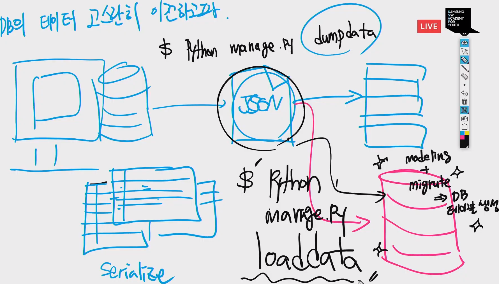
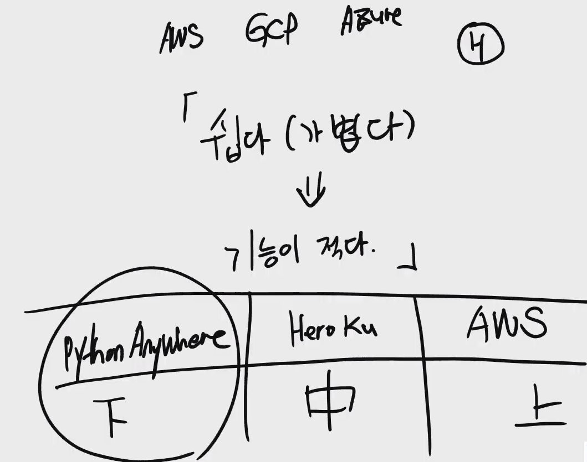

## DB 


## SQLite3 -> PostgreSQL

> DB를 갈아끼울때


```shell
## 장고 데이터 내보내기
$ python manage.py dumpdata > data.json
$ python manage.py dumpdata --indent 2 > data.json

## 장고 데이터 읽어들이기
## 새로운 DB에 json 파일의 데이터 보내기
## !! 새 DB에 테이블이 생성 되있어야 한다는 전제조건 !!
$ python manage.py loaddata data.json
```




## 배포



