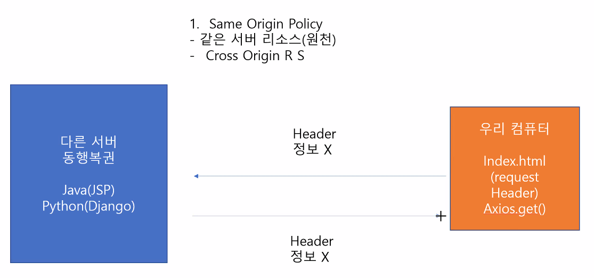
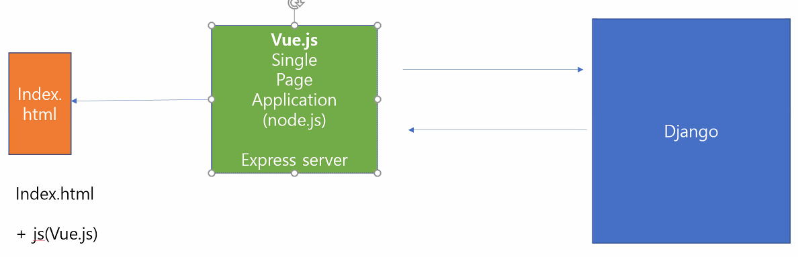

## Vue.js

**JS에서 수학 라이브러리 사용하기**

- [loadash 라이브러리](https://lodash.com/)
  - [CDN](https://cdnjs.com/libraries/lodash.js/)

## :one: CORS

> 원치않는 스크립트 (악성요청) 실행 방지시켜주는 것
>
> Cross Origin Resource Sharing

- 동행로또 API
  - Same Origin Policy

    - 같은 서버 리소스(원천)

  - Cross Origin

  - 서버가 배포하는게 아니라서 Request Headers 에 아무 정보가 없다.

    - Origin 이 없다.

    

- CORS 발생 오류 원인

  - Request Headers 에 아무런 정보가 없어서. (Origin 정보)

  

- 해결법
  
  - 직접 Headers  에 `Access-Control-Allow-Origin` 을 붙여서 보내기
  - 나중에 저 html 파일이 Server에서 보내지면 Origin이 생기기 때문에 해결가능
  
  

- 요약

  - 브라우저를 만지거나, JS 코드를 만져서 해결할 수 X
  - 코드를 통해서는 해결을 할 수 없다.

  

- JS 에 쓰지말아야 하는것인가?

  - 아니다. 특정 서버에서 보내면 Origin 이 생겨서 보낼 수 있다.
  - 현재는 localhos 에서 하는중이라 안됨

## 장고에서 CORS

> Django 랑 Vue.js 연결시킬때 해야된다.
>
> [참고 출처](https://github.com/adamchainz/django-cors-headers)

