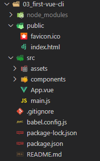
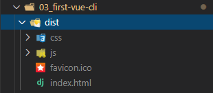

## Vue / Node

- 설치
  - -g 글로벌설치 : 함부로 하면안된다.

```shell
$ npm i -g @vue/cli
```


- 프로젝트 생성
  - **디폴트 설정**
  - 메뉴얼리 설정

```shell
$ vue create [프로젝트명] # 03_first-vue-cli
$ cd 03_first-vue-cli
$ npm run serve # 서버 실행
```


- 폴더구조
  - package.json 이 있는곳이 root 디렉토리 이다.




- App.vue

> - .vue 확장자의 구조
>   - template
>     - HTML 문법만 나와있음.
>   - script
>   - style


**main.js 에서 App.vue 를 부른다.**

```vue
<template>
  <div id="app">
    
    <HelloWorld msg="Happy Hacking"/>
  </div>
</template>

<script>
// conponent 들을 부르는 부분
import HelloWorld from './components/HelloWorld.vue'

export default {
  name: 'App',
  components: {
    HelloWorld
  }
}
</script>

<style>
#app {
  font-family: Avenir, Helvetica, Arial, sans-serif;
  -webkit-font-smoothing: antialiased;
  -moz-osx-font-smoothing: grayscale;
  text-align: center;
  color: #2c3e50;
  margin-top: 60px;
}
</style>

```


**export default {객체}**

Vue CLI 에서는 export 를 시켜야한다.

나가면 객체가 나가게 된다..


## :one: 컴포넌트

> [참고문서](https://kr.vuejs.org/v2/guide/components.html)


## :two: npm

- axios 설치

```shell
npm i axios
```


- 코드

```html
<!-- GreatComponent.vue -->
<!-- Vue 확장프로그램이 자동완성 시켜줌 -->
<template>
    <div>
        <h1>안녕하셈ㅎ</h1>
        <h2>{{ message }}</h2>
        <ul>
            <button @click="getPosts"> 가즈아 </button>
            <li v-for="post in posts" :key="post.id">
                {{ post.title }}
            </li>
        </ul>
    </div>
</template>

<script>
import axios from 'axios' // npm i axios 설치후 사용

export default {
    name: "GreatComponent",
    data: function () {
        return {
            message: 'hi',
            posts: [],
        }
    },
    methods: {
        getPosts: function() {
            axios.get('https://koreanjson.com/posts')
                .then(res => this.posts = res.data)
        }
    },
}
</script>

<style>

</style>
```


## :three: 빌드

> 각각의 컴포넌트들을 모두 조합(빌드)해서 하나의 HTML 파일을 반환한다.
>
> `/dist 폴더`를 heroku 와 같은 배포툴을 이용해서 배포하면 끝.


- **명령어**

  - 코드

    ```shell
    $ npm run build
    ```

  - 빌드를 하게되면 `dist/` 폴더에 배포가능한 형태로 나오게 된다.




## :four: Router 기능

- 설치
  - [참고문서](https://router.vuejs.org/kr/installation.html)

```shell
$ npm i vue-router --save
```


- **코드**
  - 커밋 / History => Yes 체크

```shell
$ vue add router
```

`URL -> Component`


`router/.index.js`

**Django에서 urls.py 와 비슷하다!!!**

```js
import Vue from 'vue'
import VueRouter from 'vue-router'

import Home from '../views/Home.vue'
import About from '../views/About.vue'

Vue.use(VueRouter)

  const routes = [
  {
    path: '/',
    name: 'Home',
    component: Home
  },
  {
    path: '/about',
    name: 'About',
    component: About
  }
]

const router = new VueRouter({
  mode: 'history',
  base: process.env.BASE_URL,
  routes
})

export default router

```


- Django

`urls.py => views.py => templates`


- Vue.js [Vue CLI]

`router => component 렌더 =>  component`


**views/ 안에 있는 컴포넌트(.vue) 파일들은 다 매핑되어진다**

- URL 에 선택받은 아이들만 넣어준다..


## :five: Node

> Node 는 환경이다.
>
> 브라우저가 이해할 수 있는 script 문법들 (ES5, ES6 등등) 을 컴퓨터가 이해할 수 있게끔 바꿔줌
>
> 컴퓨터 환경에서 실행할 수 있게끔 된다.


Node 에서 실행하는건 컴퓨터 환경


