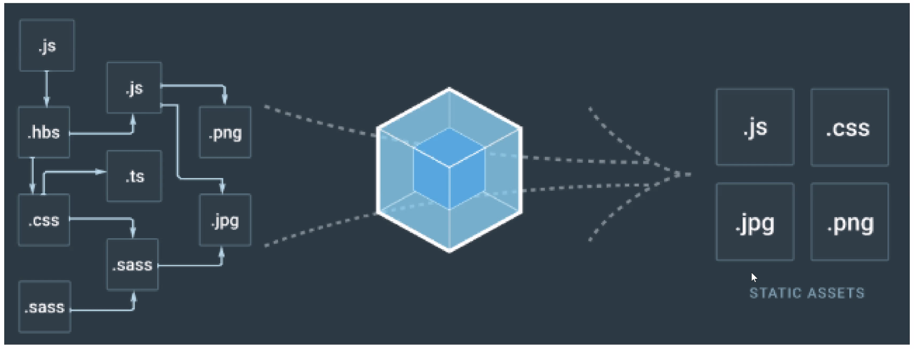
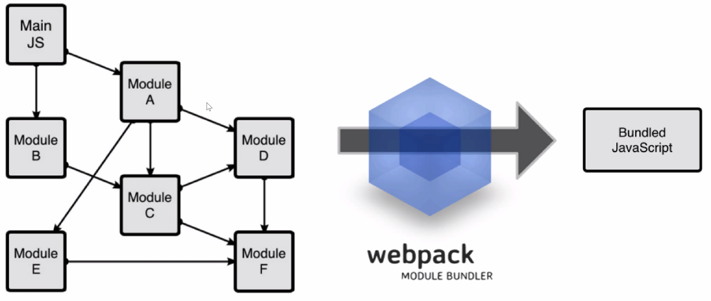
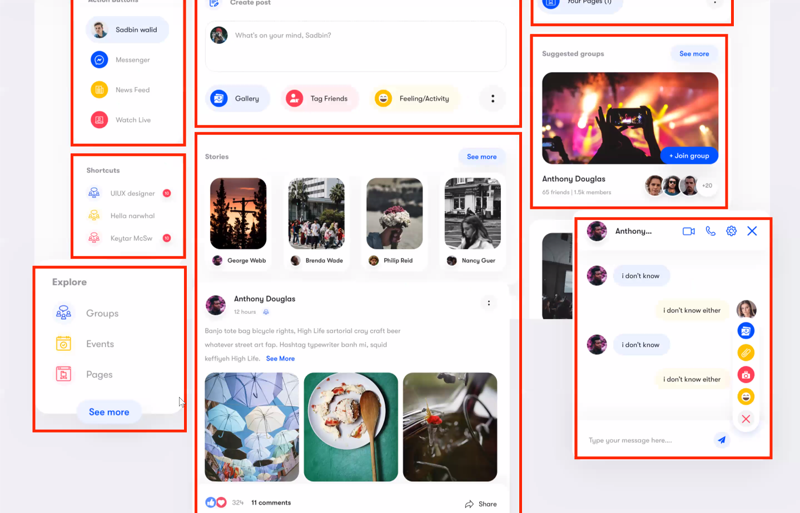

# JS


## :one: WebPack

> 번들러
>
> 모듈들을 다 하나로 묶어주는 것

내가 불러와야 하는 모든 assets 들..

static 파일들은 이렇게 하나로 묶여서 오는게 더 경제적이다.

**여러개의 파일로 분리해서 쓰더라도 모듈번들러(Webpack) 이 하나로 통합해준다.**








**:cupid: 정리**

- 모듈 단위 개발
  - 모듈이 너무 많아짐
  - 관리 불가
  - **Wenpack 이 모아서 관리해준다.**
- 다양한 브라우저 고려
- 개발에만 집중하고 싶다..
  - **Vue CLI**


## **:two: (UI) Components**

- 눈에 보이는 그 요소 ( 그 부분 )
  - 뉴스피드, 배너, 네브바, 친구목록, 등등..
- 코드의 재사용성 높아진다.




**:cupid: 프론트엔드 프레임워크 비교**

- Angular (MVC)

  - M : 데이터 ( models.py )
  - V : UI (html + JS)
  - C : 데이터 & UI 의 중재자 (views.py)

  

- React (Component Based Architecture)

  - 눈에 보이는 그대로
  - 압도적으로 개발이 쉬워짐
  - 팀을 Component 중심으로 나뉘어짐.
    - 토스 - 계좌조회만, 보험만, 
    - 페북 - 뉴스피드팀, 등등...
  - include, extends, block


**SFC**

Single File Component


**Vue CLI -> SFC Vue App**

- 순서

0. 컴포넌트 생성 ( xxx.vue )
1. 불러온다.
2. 등록한다.
3. 사용한다.


## :three: 패키지 설치

npm


- 수학 라이브러리

```shell
$ npm i lodash
```

