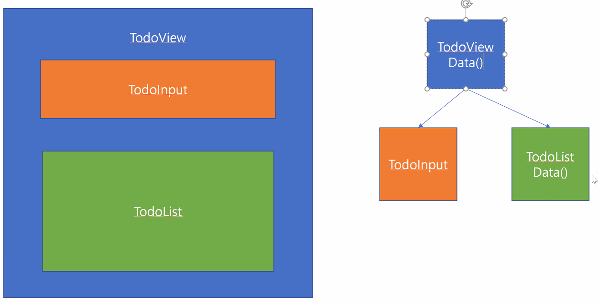

## Vue.js

## :one: `npm` VS `yarn`

> 패키지 매니저
>
> npm이 너무 속도가 느려서 yarn 을 만들게됨.
>
> 다만 현재는 거의속도 차이가 없어서 순정 npm 을 쓰는편 (개취)

## :two: Todo-List

**구조**

자식들간에 공유되는 데이터는 `부모`에게 넘겨주는것이 좋다. => `TodoView`

데이터의 소스는 되도록 한곳에 몰아주는편..

자식들간에 데이터 교류보다는. 부모에게 데이터를 저장하고 갖다쓰는..?

부분 컴포넌트보다는 상위(부모) 컴포넌트한테 몰아주자.

- [Props](https://kr.vuejs.org/v2/guide/components.html)
  - 부모의 데이터를 자식에게 내려줄 때,

- 데이터 단방향

  - `v-model` 쓰지말자... 단방향플로우를 해친다. 부모데이터까지 영향을 주게됨.
  - watch 와 v-model 은 잘 쓰지않는다.. 코드가 복잡해질수록 어려워짐
  - **Vue.js 에서는 양방향이 가능하지만 단방향을 지향합니다. (단방향 써라)**
    - 컴포넌트간에 데이터 교환가능 but, 쓰지않는다

  

1. vue.js 에서는 양방향 데이터 교류가 가능함. 하지만 쓰질않음. ( v-model 쓰지말자 )

- `emit('어떤이벤트', 어떤데이터)`
  - 이벤트방출
  - @어떤이벤트