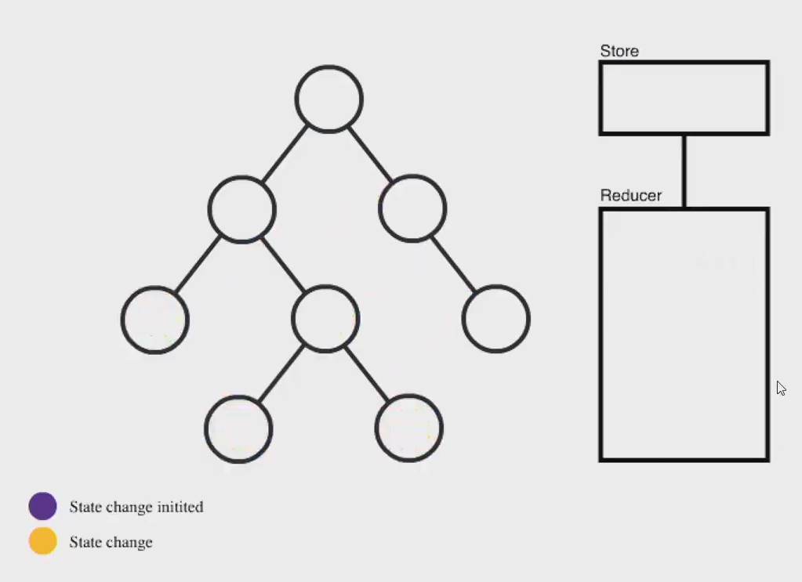
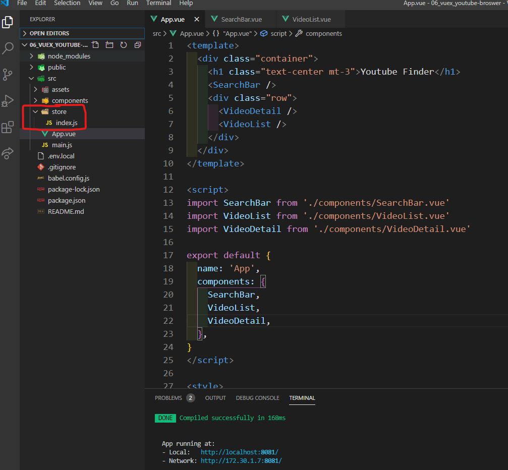

## Vuex

> [한국어 패치 공식 문서](https://vuex.vuejs.org/kr/)
>
> 서비스가 커질수록 vuex (Store) 가 필요해진다..




:cupid: **[Vuex](https://vuex.vuejs.org/kr/)**

> 상태 관리 패턴 + 라이브러리
>
> 애플리케이션의 **모든 컴포넌트에 대한 중앙 집중식 저장소 역할(Store)** 을 한다.


- 쓰는 이유
  - 여러 뷰는 같은 상태에 의존한다.
  - 서로 다른 뷰의 작업은 동일한 상태(data, state)를 반영해야 할 수 있습니다.
  - 최상위 부모 컴포넌트가 데이터를 관리하는게 단방향데이터 흐름에 적합하긴 하나
    서비스의 규모가 커지게되면 props & emit 이 빈번해지고 복잡해지므로 
    데이터(상태)를 중앙집중식으로 관리해서 그곳과 데이터를 소통하는게 편하다
  - 그것을 도와주는것이 Vuex 이며 Store 공간이다.


## :one: 준비

```shell
$vue add vuex
```




## :two: Vuex 핵심기능 (Store)

- Store / index.js
  - **vuex 핵심 기능.** *설명은 코드 주석에 있다.*
    - state
    - getters
    - mutations
    - actions

```js
import Vue from 'vue'
import Vuex from 'vuex'

import axios from 'axios'

Vue.use(Vuex)

const API_KEY = process.env.VUE_APP_YOUTUBE_API_KEY
const API_URL = 'https://www.googleapis.com/youtube/v3/search'

export default new Vuex.Store({
  // data 의 집합(중앙 관리할 모든 데이터===상태)
  state: {
    inputValue: '',
    videos: [],
    selectedVideo: null,
  },


  // state 를 (가공해서) 가져올 함수들. === computed
  getters: {
    videoUrl(state) {
      return `https://www.youtube.com/embed/${state.selectedVideo.id.videoId}`
    },
    videoTitle: state => state.selectedVideo.snippet.title,
    videoDescription: state => state.selectedVideo.snippet.description,
  },


  // state 를 변경하는 함수들(mutations에 작성되지 않은 state 변경 코드는 모두 동작하지 않음)
  // 모든 mutation 함수들은 동기적으로 동작하는 코드 .all
  // commit 을 통해 실행함.
  mutations: {
    setInputValue(state, inputValue) {
      state.inputValue = inputValue
    },
    setVideos(state, videos) {
      state.videos = videos
    },
    setSelectedVideo(state, video) {
      state.selectedVideo = video
    },
  },


  // 범용적인 함수들, mutations에 정의한 함수를 actions 에서 실행 가능.
  // 비동기 로직은 actions 에서 정의.
  // dispatch 를 통해 실행함
  actions: {
    fetchVideos({ commit, state }, event) {
      // 1. inputValue 를 바꾼다.
      commit('setInputValue', event.target.value)
      // 2. state.inputValue 로 요청보낸다.
      axios.get(API_URL, {
        params: {
          key: API_KEY,
          part: 'snippet',
          type: 'video',
          q: state.inputValue,
        }
      })
        .then(res => {
          res.data.items.forEach(item => {
            const parser = new DOMParser()
            const doc = parser.parseFromString(item.snippet.title, 'text/html')
            item.snippet.title = doc.body.innerText
          })
          // 3. state.video 를 응답으로 교체한다.
          commit('setVideos', res.data.items)
        })
        .catch(err => console.error(err))
    }
  },


  modules: {
  }
})

```


youtube-Broswer 프로젝트를 vuex 에다가 옮긴 코드.


