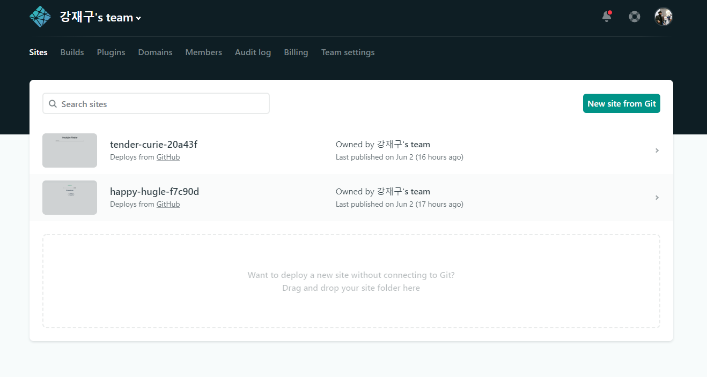
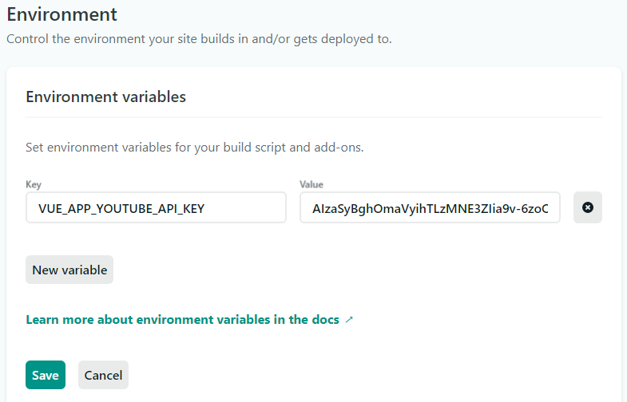

## Vue 배포

> - Netlify | Github Page | Heroku

## :one: Netlify

> 정적 웹 사이트를 배포해줌..
> 
> [공식홈페이지](https://www.netlify.com/)

1. 로그인

   - Github 로 로그인
   - 권한 설정

   

2. 배포 방법 (2가지)

   - **드래그 앤 드랍**

     - `dist/` 폴더 업로드하기

     

   - **git 저장소 연동**

     - 내가 올린 git repo 에는 `npm모듈 과 dist/` 가 아직 없어서 아래 명령어 기본세팅 추가
     - `npm run build`
     - `dist/`
     - **Auto publishing is on**. Deploys from *master* are published automatically.

**:cupid: git 설정**

`git config --global user.email`

`git config --global user.name`

- `git config --local user.name 'jaegu'`
- `git config --local user.email 'kjaegu9771@naver.com'`
  - 해당 레포에서만 서명이 위 정보로 바뀜

**:cupid: 환경변수 설정**

> 환경변수 설정안해주면 403 권한없다고 에러 뜬다.
>
> KEY 값이 올라가지 않았기 때문임..

`.env.local` 에 설정한 나의 구글API KEY 값을 설정해줘야 한다.

환경변수 세팅후에 다시한번 빌드를 진행해야 반영이 된다.

**but, Git repo 에 코드를 수정해서 커밋 푸쉬 반영을 하면 Netlify 가 자동으로 감지하고 반영해주기도 한다. master 브랜치 푸쉬하면 감지하고 반영해서 재빌드 => 배포 다시 해주게됨!!! 개꿀!**

**:cupid: 단점**

- 코드가 수정되었을 때, 수동으로 재빌드.

## :two: Github Page

> 해당하는 레포지토리에 index.html 이 있어야 한다.

## :three: heroku