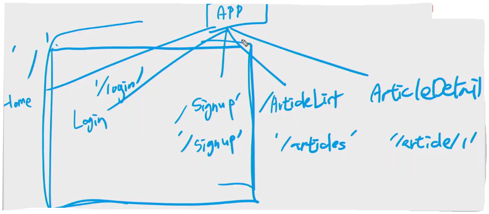

## Vue for Django

> Django 백앤드 서버 API 는 이미 만들어져있는 상태이다.
>
> `vue create vue_for_django` 
>
> `vue add router`
>
> Vue 에서 Django 랑 소통하여 로그인 / 로그아웃 기능을 Token 을 발급받아서 수행함이 목표


- 구성




- Vue-cookies
  - Vue에서 쿠키 쓸때 편리하게 쓰게 해주는 라이브러리

[공식문서](https://www.npmjs.com/package/vue-cookies) 에 사용법이 나와있음

```shell
$ npm install vue-cookies
```


- App.vue

```html
<template>
  <div id="app">
    <div id="nav">
      <router-link to="/">Home</router-link> |
      <router-link :to="{ name: 'Login' }">Login</router-link> |
      <!-- native 옵션을 줘야함 -->
      <router-link @click.native="logout" to="/accounts/logout">Logout</router-link>
    </div>
    <router-view @submit-login-data="login" />
  </div>
</template>

<script>
import axios from 'axios'
// axios.post(url, body, headers)

const SERVER_URL = 'http://localhost:8090'

export default {
  name: 'App',
  data() {
    return {
      isLoggedIn: false,
    }
  },
  methods: {
    setCookie(token) {
      this.$cookies.set('auth-token', token)
      this.isLoggedIn = true // Cookie
    },

    login(loginData) {
      axios.post(SERVER_URL + '/rest-auth/login/', loginData) // 2번째 인자 body
        .then(res => {
          this.setCookie(res.data.key) // npm i vue-cookies
          this.$router.push({ name: 'Home' }) // 로그인후 home 으로 보냄
        })
        .catch(err => console.log(err.response.data))
    },

    logout() {
      const requestHeaders = {
        header: {
          'Authorization': `Token ${this.$cookies.get('auth-token')}`
        }
      }

      axios.post(SERVER_URL + '/rest-auth/logout/', null, requestHeaders)
        .then(res => {
          console.log(res.data)
          this.$cookies.remove('auth-token')
          this.isLoggedIn = false
          this.$router.push({ name: 'Home' })
        })
        .catch(err => console.log(err.response))
    },
  }
}
</script>
```


- 로직 설명
  - Vue 에서 Django 한테 loginData 를 주면 django 는 Token 을 발급해준다.
  - vue-cookies 라이브러리를 활용하여 django 가 준 토큰을 브라우저 쿠키에 저장시켜놓는다.
  - 로그아웃을 하면 브라우저 쿠키에 저장되있던 auth-token 값을 remove 시킨다.

