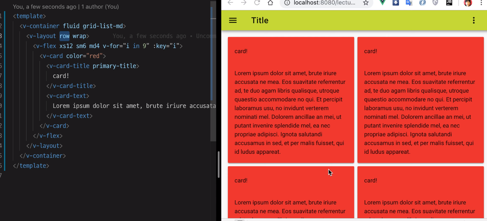

## vuetify UI

> 화면 구성하는 방법을 기록
>
> - ref
>   - [코마의 훈훈한 공간](https://code-machina.github.io/2019/02/17/Vuetify-Layout-Part-1.html)
>   - [v-app / v-content / v-container 차이](https://www.reddit.com/r/vuetifyjs/comments/but9mp/difference_between_vapp_vcontent_and_vcontainer/)
>   - [자주 쓰이는 컴포넌트](http://blog.weirdx.io/post/60376)
>   - [꽤 정리 잘되있음](https://chansbro.github.io/vue/vuetify_tutorial1)
>   - [CSS-Tricks 유명한 영문 가이드](https://css-tricks.com/snippets/css/a-guide-to-flexbox/#flexbox-background)


## UI & Layout 구성하는방법

**Grid 시스템 사용**

그리드 시스템을 사용하기 위해서는 아래의 세 가지 컴포넌트를 알 필요가 있습니다.

- v-container
  - v-layout
    - v-flex (여러 개 가능)

```vue
<template>
<v-app>
  <v-container>
    <v-layout>
        
      <v-flex>
      </v-flex>
      <v-flex>
      </v-flex>
        
    </v-layout>
  </v-container>
</v-app>
</template>
```


## 컨테이너 (v-container)

`v-container` 는 중앙 중심의 페이지에 적용됩니다.
만약 전체 너비를 이용하고자 할 경우 `fluid` 속성(prop)을 전달해 줍니다. 아래와 같이 말이죠.
pa-0 으로 전체 페이지를 쓸 수도 있음

```vue
<v-container fluid pa-0>
</v-container>
```


## 레이아웃 (v-layout)

`v-layout` 컴포넌트는 각 섹션을 분리하는데 사용됩니다.
그리고 `v-flex`를 사용하기 위해 필수입니다.
`v-flex` 객체는 `v-layout` 내에 포함되어야 합니다.


## 플렉스 (flex)

CSS의 Flex는 Element의 크기나 위치를 쉽게 잡아두는 도구입니다. 
레이아웃을 효과적으로 표현하기 위해 도입된 도구입니다. 
마찬가지로 `v-flex` 또한 이러한 역할을 도와줍니다.


**Grid 를 이용할 레이아웃 잡기**

`Vuetify.js` 의 `Grid` 시스템을 이용해서 웹 UI 를 간편하게 잡아보도록 하겠습니다.
UI 를 구성하기 위해 논리적 단위로 화면을 분할해야 합니다.
보통 브라우저는 수직 스크롤 이동에 익숙해져 있습니다. 
따라서, 각 컴포넌트들이 수직으로 나열되면 일반적으로 보기에 좋습니다.

이때 필요한 컴포넌트는 `v-layout` 과 `v-flex` 입니다.
`v-layout` 에 수직 나열을 위한 `column` 키워드를 아래와 같이 지정해 봅니다.

```vue
<v-app id="app">
  <v-content>
    
    <v-container>
      <v-layout column>
        
        <v-flex>
          <v-sheet>
            우리는 인생을 사는 이유를 깨우쳐야 한다.
          </v-sheet>
          <v-btn :label="btnLabel"></v-btn>
        </v-flex>
        <v-flex>
          <v-btn :label="btnLabel"></v-btn>
        </v-flex>
        <v-flex xs4>
          <v-btn :label="btnLabel"></v-btn>
        </v-flex>
        
      </v-layout>
    </v-container>
      
  </v-content>
</v-app>
```





- flat
  - 디자인이 더 이뻐짐 직접 써봐야 느낌 알 수 있음..
- color
  - transparent
    - 투명색이 된다.


## 알아두면 유용한 태그

- `<v-spacer></v-spacer>`
  - 사용 가능한 공간을 채우거나 두 구성 요소 사이에 공간을 만들 경우 유용
  - 여백을 넣을 수 있다.


## 요약

- 코딩 규칙
  - `v-layout` 내에 하나 이상의 `v-flex` 가 나열 될 수 있다.
  - `v-layout` 이 존재하면 `v-flex` 가 반드시 필요하다.
  - `v-layout` 내에 `v-layout` 이 필요한 경우 `v-layout => v-flex => v-layout` 의
    구조를 사용해야 한다.


