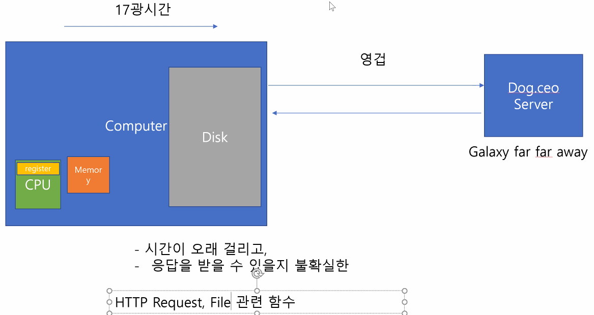
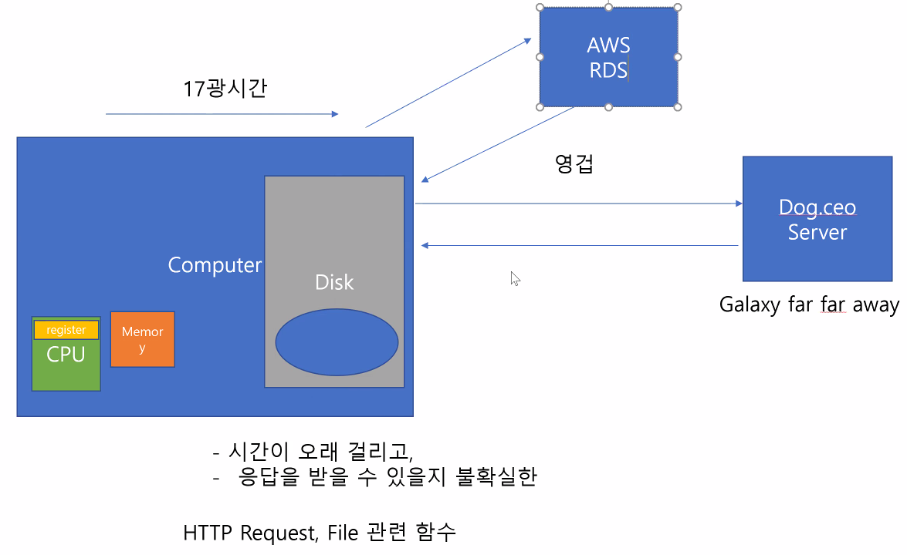

# JS - 비동기

- Computer
  - CPU( register  )
  - Memory
  - Disk




- django setting 에서 시크릿키 숨기고, 디버그랑 DB 관련 내용 숨기는 이유 (decouple)




**:cupid: 옛날 코드 ( 콜백 지옥 )**

```js
setTimeout(1000, function() {})
const xhr = new XMLHttpRequest()
xhr.send(function() {}) // send()가 완료된 다음에 실행하고싶은 함수는 안에 콜백함수 넣기
```


 **:cupid:ES6 이후 addEventListener**

- `this -> event.target`

```js
  // 예전코드 (관습)
  const dogButton = document.querySelector('#dog')
  dogButton.addEventListener('click', function(event) {
    this. // dogButton, event.target, 불려진 객체, 수동적
  })

  // 최근코드 ( ES6 이후 )
  dogButton.addEventListener('click', (event) => {
    event.target
  })
```


**:cupid: TypeScript**

> 엄격하게 맞춰진 규칙에 의해서 언어 작성.
>
> 입사하면 기업에서 많이 쓰게됨

이걸 사용해서 코드를 짜게되면 자동으로 javascript 로 바꾸어줌


**:cupid: 좋아요 기능 구현**

- 하트가 눌러졌을 때,
  - Ajax (브라우저가 보내는 HTTP Request) 을 통해
    데이터 조작 URL에 요청을 보내어,
  - 받은 응답의 데이터를 바탕으로,
    하트만 HTML 속성값 변경