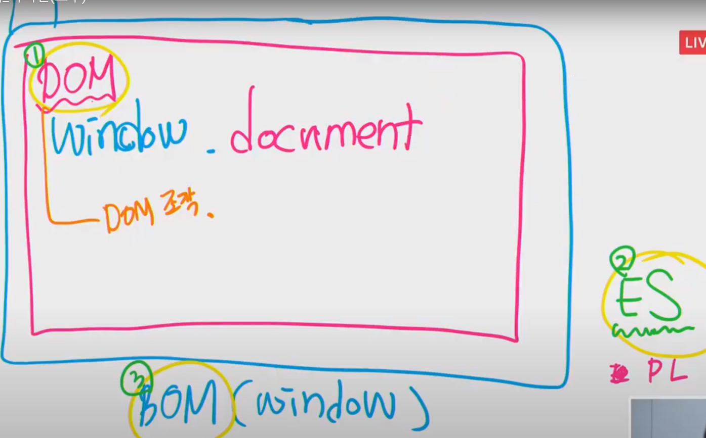
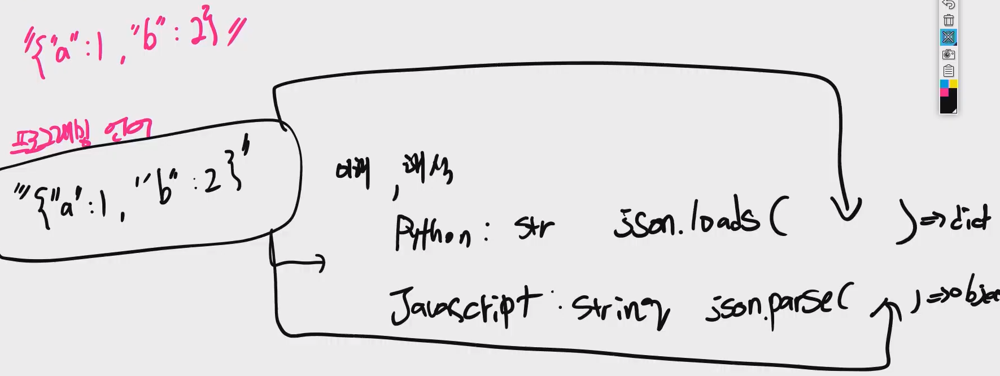

## javascript

> - VScode 에서 js 파일 실행시키기
>   - `pip install node`
>   - node [파일명]


- BOM ( browser object model ) **window**
  - DOM ( Documnet object model ) **Document**




- Vanilla JS ( 브라우저 )
  - BOM / **DOM**


- Node JS ( 서버 )
  - **ES**


- 코드 연습
  - 자바스크립트 스타일 가이드 컨벤션
    - [에어비앤비 자바스크립트 스타일 가이드](https://github.com/tipjs/javascript-style-guide)

```html
<!DOCTYPE html>
<html lang="en">
<head>
  <meta charset="UTF-8">
  <meta name="viewport" content="width=device-width, initial-scale=1.0">
  <title>Document</title>
</head>
<body>
  <!-- Vanilla JS -->
  <script>
    // let, const
    // let : 재 할당이 가능하다. ( 변수 )
    let a = 1
    a = 1

    // const : 재 할당이 불가능하다. !== 값이 바뀌지 않는다. ... = 할당 연산자 못온다.
    const b = 1
    b = 'a' // Error

    const c = [1,2,3]
    c = 3 // Error 재할당
    c.push(4) // c = [1,2,3,4]
      
    // 스타일 가이드 잘 맞출것.
    function(){}
    function () {}
      
    // Naming Convention 꼭 지키자.
    // const add_one_to_number ( bad )
    // addOneToNumber ( good )
  </script>
</body>
</html>
```


## :one: 개념/문법

- 변수
  - `let`
    - 재 할당이 가능하다.
  - `const`
    - 재 할당이 불가능하다.


- 네이밍 규칙

  ```javascript
  Naming Convention 꼭 지키자.
  const add_one_to_number ( bad )
  addOneToNumber ( good )
  ```


- **함수는 1급 객체**
  1. 변수에 저장할 수 있다.
  2. 함수의 리턴값이 될 수 있다.
  3. 함수의 인자가 될 수 있다.


- 자바스크립트 스타일 가이드
  - [에어비앤비 자바스크립트 스타일 가이드](https://github.com/tipjs/javascript-style-guide)


- **DOM & HTML**
  - DOM 조작은 html 이 아니라 object 를 조작 하는것이다...
  - `DOM !== HTML`
  - `DOM`
    - HTML 을 Broswer 가 해석해낸 결과물 (object) 이다.
  - **Json 은 Object 이다 ? X**
    - `json 은 표기법을 아주 잘 지킨 String 일뿐.. 그냥 문자열이다.`




## :two: Parse (이해 / 해석)

> 데이터 -> 파싱 -> 컴퓨터가 이해할 수 있는 자료구조


**Parsing** 

- 컴퓨터가 이해할 수 있게 끔 그저 문자인 String 을 Dict 와 같은 자료구조로 바꾸게 된다.
  - 그래야 그 이후에 작업들을 할 수 있게 됨.


- **세상 모든 Data 는 String 이다.**
  - 컴퓨터가 해석해내는 과정 `Parsing` 을 거쳐야만 자료구조 (dict, object) 가 되게 된다.
  - 그래야만 그 자료를 컴퓨터가 이용할 수 있게 된다.


## :three: 문법

> ㅇㅇ


```javascript
document.head // 자바스크립트에서 키값에 접근하는 방법
// python : documnet['head'] 파이썬에서 키 값에 접근하는 방법
```


- 주어를 잡는 방법
  - 노드 / 셀렉터 / 태그 를 찾는 방법

```js
// 가장 자주 쓰이게 될 예정
document.querySelector('h1')

// 크롬 개발자도구 - 검사 - copy - selector
document.querySelectorAll('body > h1')

```


```js
const liTag = document.querySelector('body > h1')
liTag.innerHTML // Hello world

liTag.classList // ['my', 'new', 'class', 'here']
liTag.classList.add('hihi') // ['my', 'new', 'class', 'here', 'hihi']

## 수정
liTag.innerText = "B"
liTag.innerHTML // B

## 생성

```


- 새로운 언어를 학습하는 방법

  - 컴퓨터 명령

    - 저장 : 무엇을(자료형), 어디에(자료구조), 어떻게(=)

    - 계산 : 조작, 조건, 반복

      - S+V (데이터+동작(함수)) => 클래스, 객체
      - 기존 비교 언어(가장 자신있는 언어)와 비교

      

  - 했던 거를 새로운 언어로 (프로젝트)

  - 문제푼다.


- 숫자

```js
const num1 = 123
const num2 = -2.38
const a = NaN
const b = Infinity
const c = -Infinity
```


- 글자
  - 합체 (Concatenation) : `+`
  - 수술 (Interpolation) : ` 

```js
const firstName = 'jaegu'
const lastName = "Kang"
const middleName = 'raegu'

const fullName = firstName + lastName
const greeting = `Hello ${meddleName}`
```


- Boolean 
  - true ( JS 에서는 소문자 )
  - false
  - 뭐가 참에 가깝고, 뭐가 거짓에 가깝냐


1. Truthy

   - Falsy 가 아닌 모든 값들

   

2. Falsy

   > 없거나, 정의되지 않거나

   - `null`
   - `undefined`

   

## :four: 자료구조

> 어떻게 저장하고, 조작하는지 ( CRUD )
>
> CRUD => 메서드 파악

- Array (`list`) 
- Object (`dict`)


## :five: 함수

- 선언식(statement) **파이썬에서 많이 쓰임**

  ```js
  function add(num1, num2) {
      return num1 + num2
  }
  
  // def add(num1, num2):
  //     return num1 + num2
  // add(1, 2)
  ```

  

- **표현식(expression) 자바스크립트에서는 표현식이 많이 쓰인다.**

  ```js
  const sub = function(num1, num2) {
      return num1 - num2
  }
  
  // sub = lambda 입력값: 출력값
  ```

  

- **Arrow Function // ES6+ 에서 도입됨**

  ```js
  // 3. Arrow Function
  const arrow = function(name) {
      return `hello ${name}`
  }
  
  // Arrow Function
  const arrow = (name) => {
      return `hello ${name}`
  }
  
  const arrow = name => {
      return `hello ${name}`
  }
  
  // 인자 1개
  // return이 존재 & expression
  const arrow = name => `hello ${name}`
  ```

  - (클래스) 메소드(OOP) 함수가 아닌 곳에서만
    - 클래스 정의에서는 arrow 함수 사용 X
    - `this, arguments, super, new.target` 바인딩 X
    - 생성자로 사용 X
    - 이벤트 리스너 콜백 함수 X


## :six: OOP

> class를 잠시 잊어두세요..( Prototypal Inheritance )

```js
// 객체 오브젝트를 만든다. {} 중괄호
const unani92 = {
    name: '유나니',
    birth: '1992',
    greeting() {
        return `안녕하십니까 ${this.name}입니다.` // python 에서는 self 였지만 JS 에서는 this
    }
    // greeting: function() {
    //     return `안녕하십니까 정윤환입니다.`
    // }
}


// 4개 다 되는 코드
// JS 는 클래스 없이 객체를 만들 수 있다. ( 파이썬은 클래스 없이 객체 못 만든다. )
console.log(unani92.name)
console.log(unani92.birth)
console.log(unani92.greeting())
unani92.money = 5000
console.log(unani92.money)


// JS 에서 class 쓴다는 것.. -> 동일한 구조를 갖춘 아이들을 찍어내기 위함
class Person {
    constructor(name, birth) { // JS 에서의 생성자
        this.name = name
        this.birth = birth
    }
    greeting() {
        return `안녕하십니까. ${this.name}`
    }
}

const unani = new Person('정윤환', 1992)
const hangrae = new Person('조항래', 1995)

console.log(unani.name)
console.log(unani.greeting())

console.log(hangrae.name)
console.log(hangrae.greeting())


/*
파이썬 버전

class Person:
    def __init__(self, name, birth):
        self.name = name
        self.birth = birth

    def greeting(self):
        return f'안녕하십니까 {self.name}입니다.'

unani = Person('unani', 1992)
*/
```


