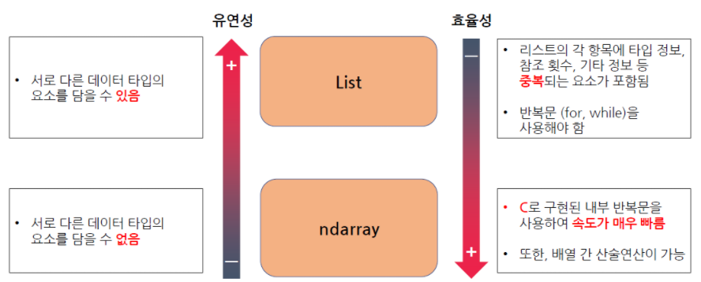

# Numpy에 대한 이해

##### Numpy의 자료형

- ndArray


## 1. ndArray

### 1-1. ndArray 란?

본 장에서는 numpy의 주요 자료형인 `ndArray` 의 특성을 파이썬의 기초 자료형인 `리스트`와 비교함으로써 이해해보도록 하겠습니다. 더 나아가, `ndArray` 를 생성하는 두 가지 방법을 자세히 학습하겠습니다.


### 1-2. ndArray의 연산

`ndArray`는 **수학에서의 벡터와 매칭되는 자료형**입니다. 본 장에서는 이러한 특성을 가진 <u>ndArray의 산술 연산과 비교 연산</u>을 중심으로 학습하겠습니다. 구체적으로 요소 기반의 연산을 가능하게 하는 유니버셜 함수, 유니버설 함수를 효율화하는 **브로드 캐스팅**, 그리고 <u>특정 조건을 만족하는 요소만 가져오기 위한 비교 연산</u>에 대해 학습하겠습니다.


### 1-3. ndArray 인덱싱과 슬라이싱

리스트와 비교하였을 때, ndArray는 다양한 종류의 **인덱싱과 슬라이싱 방법**을 지원합니다. 본 장에서는 기초 인덱싱, 슬라이싱, 팬시 인덱싱, 결합 인덱싱 등 다양한 **인덱싱과 슬라이싱**방법을 학습하겠습니다. 또한 **sort함수**를 사용하여 <u>데이터를 효과적으로 정렬하는 방법</u>에 대해 학습하겠습니다.


- 인덱싱
  - 기초 인덱싱
  - 팬시 인덱싱
  - 결합 인덱싱
- 슬라이싱
  - 슬라이싱
- 정렬
  - sort


## 2. List 와 ndArray

`ndArray` 는 **numpy에서 사용하는 배열 자료형**으로 <u>파이썬의 배열 자료형인 리스트와 매우 유사</u>합니다. 

그러나 `유연성`과 `효율성` 측면에서 두 자료형은 크게 차이가 납니다.




`ndArray`는 **서로 다른 타입의 요소를 담을 수 없다는 점에서 리스트보다 유연하지 못하지만,** 

<u>배열간 산술 연산이 가능하고 C로 구현되었기에 리스트보다 훨씬 효율</u>적입니다.


## 3. ndArray의 생성 (1/2)

##### 리스트로부터의 생성

numpy의 array라는 함수를 사용하여 리스트를 ndArray로 형변환하는 방식으로 ndArray를 생성할 수 있습니다.


```python
import numpy as np

A = np.array([1, 4, 2, 5, 3])
B = np.array([3.14, 4, 2, 3])
```


`ndArray`는 같은 타입의 자료형만 요소를 받기에, 어떠한 자료형으로 구성되었는지를 `.dtype` 을 사용하여 확인할 수 있습니다.


```python
A.dtype # int32
B.dtype # float64
```


대표적인 타입으로는 **bool, int8, int16, int32, int64, float16, float32, float64, object**등이 있습니다.

**숫자가 클수록 상위 자료형**입니다. 만약, ndArray 를 만들기 위해 사용된 리스트에 다른 타입의 자료형이 포함되어 있다면 상위 자료형으로 통일됩니다.


array 함수를 사용했을 때 **dtype**키워드를 사용하면 ndArray의 데이터 타입을 정의할 수 있습니다.

```python
import numpy as np

A = np.array([1, 4, 2, 5, 3], dtype = 'float32')
B = np.array([3,14, 4, 2, 3], dtype = 'int16')
```


### 3.1 실습

숫자 `1, 2, 5, 0, 3, 0` 이 순서대로 들어있는 리스트를 array함수를 이용하여 ndArray로 변환하고 **자료형을 지정한 후 출력**해 보겠습니다.


아래의 코드를 실행하여 ndArray를 생성할 때 `float32` 와 `bool` 자료형으로 지정한 후, 
ndArray가 각 각 어떻게 생성되었는 지 확인해 봅시다.

```python
import numpy as np

A = [1, 2, 5, 0, 3, 0]

print(np.array(A)) # [1 2 5 0 3 0]
print(np.array(A, dtype = 'float32')) # [1. 2. 5. 0. 3. 0.]
print(np.array(A, dtype = 'bool')) # [ True True True False True False]
```


## 4. ndArray의 생성(2/2)

##### 함수를 이용한 생성


- numpy에서 다양한 구조의 배열을 생성할 수 있는 함수가 있습니다.

- `np.zeros(크기) / np.ones(크기)`  : **0혹은 1로만 구성된 ndArray를 생성하는 함수** 입니다.

```python
import numpy as np

np.zeros((3, 2)) # array( [ [0, 0], [0, 0], [0, 0] ] )
np.ones((1)) # array([1])
```


- `np.arange(시작 숫자, 끝 숫자, 증가폭)` : **시작 숫자부터 증가 폭만큼 더 해 가면서 끝 숫자까지 채운 ndArray를 생성합니다.**

```python
import numpy as np

np.arange(1, 10, 2) # array([1, 3, 5, 7, 9])
```


- `np.linspace(시작 숫자, 끝 숫자, 개수)` : **시작 숫자부터 끝 숫자까지 일정한 간격을 가진 개수개의 값으로 채워진 ndArray를 생성**합니다.

```python
import numpy as np

np.linspace(1, 10, 5) # [1., 3.25, 5.5, 7.75, 10.]
```


- `np.random.random(크기)` : **0과 1사이의 난수를 요소로 갖는 ndArray를 생성**합니다.

```python
import numpy as np

np.random.random((2, 2))
# array([[0.28153419, 0.74320413], [0.70067815, 0.2822612]])
```


## 5. 정리

ndArray 생성

- 리스트로부터 생성

  - ```python
    import numpy as np
    
    A = [1, 2, 5, 0, 3, 0]
    
    print(np.array(A)) # [1 2 5 0 3 0]
    print(np.array(A, dtype = 'float32')) # [1. 2. 5. 0. 3. 0.]
    print(np.array(A, dtype = 'bool')) # [ True True True False True False]
    ```

    

- 함수로부터의 생성

  - **zeors, ones, arange, linspace, random.random**

  - ```python
    import numpy as np
    
    np.zeros((3, 2)) # array( [ [0, 0], [0, 0], [0, 0] ] )
    np.ones((1)) # array([1])
    
    ######################################################
    import numpy as np
    
    np.arange(1, 10, 2) # array([1, 3, 5, 7, 9])
    
    ######################################################
    import numpy as np
    
    np.linspace(1, 10, 5) # [1., 3.25, 5.5, 7.75, 10.]
    
    ######################################################
    import numpy as np
    
    np.random.random((2, 2))
    # array([[0.28153419, 0.74320413], [0.70067815, 0.2822612]])
    ```

    

