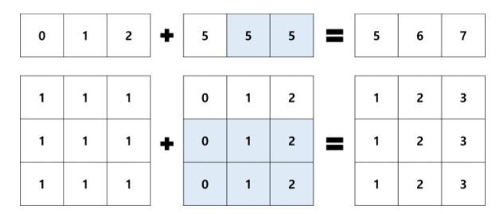

## ndArray 연산

> 파이썬은 C 와 Java 등의 프로그래밍 언어와 비교하였을 때, 수 많은 작은 연산이 반복되는 상황에 사용하기에 적절한 언어는 아닙니다. 그래서 대규모의 배열 연산에 for문과 while문 등의 반복문을 사용하는 것은 **매우 비효율적** 입니다.


## 1. 유니버셜 함수

`Numpy의 유니버셜 함수` 는 ndArray에 대해 <u>반복된 연산을 빠르게 수행하는 것을 목적으로 하는 함수</u>입니다.

유니버셜 함수는 파이썬의 기본 산술 연산자를 사용하기 때문에, 함수 이름을 알고 있지 않아도 됩니다.

```python
import numpy as np

x = np.arange(4)
y = np.linspace(1, 10, 4)

print(x) # [0, 1, 2, 3]
print(y) # [1, 4, 7, 10]

print(x + y) # [1, 5, 9, 13]
print(x - y) # [-1, -3, -5, -7]
print(x * y) # [0, 4, 14, 30]
print(x / y) # [0, 0.25, 0.28671429, 0.3]
```


### 실습

두 개의 ndArray 간 연산을 수행하는 실습을 진행해보도록 하겠습니다.

```python
import numpy as np
x = np.array([1, 2, 3, 4, 5])
y = np.array([0, 1, 0, 1, 0])

print(x + y)
print(x - y)
print(x * y)
print(x / y)
print(x ** y)
```


## 2. 브로드캐스팅

`브로드캐스팅` 이란 다른 크기의 배열 간 연산을 위해, 작은 차원의 배열을 복제함으로써 큰 차원의 배열과 작은 차원의 배열의 크기를 맞추는 **일련의 규칙 집합**을 의미합니다.

```python
import numpy as np
x = np.array([0, 1, 2])
print(x + 5) # [5, 6, 7]

A = np.ones((3, 3)) # [[1, 1, 1], [1, 1, 1], [1, 1, 1]]
print(A + x) # [[1, 2, 3], [1, 2, 3], [1, 2, 3]]
```


위의 코드에서 x는 크기가 3인 배열이며, A는 크기가 (3, 3)인 배열이므로,

x 와 상수 5의 연산과 A와 x간 연산이 불가능할 것이라 생각할 수 있습니다.

실제로 x와 A를 ndArray가 아닌 list 로 정의했다면 연산이 되지 않고 에러가 발생하게 됩니다.

그러나 아래 그림과 같이 **브로드캐스팅** 덕분에 연산이 수행되는 것을 확인할 수 있는데, 여기서 색칠된 요소는 복제된 요소를 의미합니다.




> 브로드캐스팅 적용 결과로 배열 구조가 실제로 바뀌는 것은 아니며, 연산이 끝나는대로 원래 구조대로 돌아오게 됩니다.


### 실습

##### 표준화

Numpy의 함수를 사용하여 10개의 난수로 구성된 배열의 평균과 표준편차를 구하고, 유니버셜함수와 브로드캐스팅을 사용하여 배열을 **표준화(standardization)** 하는 코드입니다.

```python
import numpy as np

X = np.random.random(10)
print('생성된 배열=', X)

X_mean = X.mean()
print('X평균=', X_mean)

X_std = X.std()
print('X표준편차=', X_std)

X_standardization = (X - X_mean) / X_std # 여기서 유니버셜과 브로드캐스팅이 이루어진다.
print('표준화된 배열=', X_standardization)
```


## 3. 비교 연산

널리 쓰이는 `비교 연산`은 다음과 같습니다.

| 비교연산자 |          설명          |
| :--------: | :--------------------: |
|   x < y    |    x가 y보다 작다.     |
|   x > y    |    x가 y보다 크다.     |
|   x == y   |     x와 y가 같다.      |
|   x != y   |   x와 y가 같지 않다.   |
|   x >= y   | x가 y보다 크거나 같다. |
|   x <= y   | x가 y보다 작거나 같다. |
|   x in A   |    x가 A에 속한다.     |
| x not in A | x가 A에 속하지 않는다. |

**비교 연산의 결과는 항상 bool 타입 입니다.**


numpy에서는 **ndArray와 ndArray간 비교 연산을 지원**합니다. 이는 유니버셜 함수의 개념과 같습니다.

```python
import numpy as np

A = np.array([1, 2, 3, 4, 5])
B = np.array([3, 2, 5, 4, 1])

print( A== B ) # array([False, True, False, True, False])
```

___


브로드캐스팅의 개념과 유사하게, numpy에서는 ndArray와 단일 스칼라와의 비교 연산도 지원합니다.

```python
import numpy as np

A = np.array([1, 2, 3, 4, 5])
print(A == 2) # array([False, True, False, False, False])
```


### 실습

#### 비교 연산 실습과 활용

본 실습에서는 비교 연산 및 그 결과를 활용하는 방법을 실습해보겠습니다.

```python
import numpy as np

A = np.array([1,2,3,4,5])

print('A의 요소중 2보다 크거나 같음을 판별=', A >= 2) # [False True True True True]
print('A의 요소중 2보다 크거나 같은것은 몇개?=', sum(A >= 2)) # True 가 4개라서 4
print('A의 요소중 2보다 크거나 같은것만 리스트=', A[A >= 2])

A[A >= 2] = A[False, True, True, True, True] = [2, 3, 4, 5]
```

