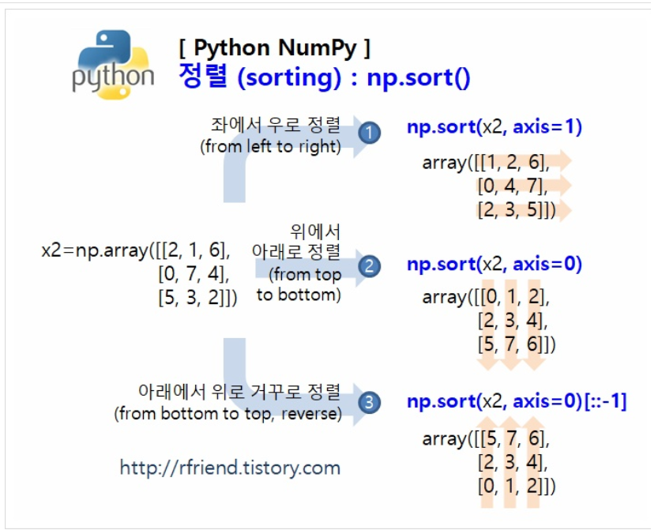

# ndArray 정렬

- `sort 함수`를 이용하여 ndArray를 정렬할 수 있습니다.

```python
import numpy as np

a = np.array([4, 1, 2, 5, 0])
np.sort(a) # [0, 1, 2, 4, 5]
```


- Sort 함수에는 `axis 인수` 가 있어서, **행을 기준 정렬 (axis = 0), 열 기준 정렬 (axis = 1) 을 할 수 있습니다.**

```python
import numpy as np
A = np.array([
    [1, 2, 0],
    [-4, 3, 1],
    [5, 4, 2]
])

# 행 기준 정렬
np.sort(A, axis = 0) # [[-4, 2, 0], [1, 3, 1], [5, 4, 2]]
# 열 기준 정렬
np.sort(A, axis = 1) # [[0, 1, 2], [-4, 1, 3], [2, 4, 5]]
```


- 다만 sort함수에는 **내림차순으로 정렬하기 위한 인수**가 없습니다. 따라서 <u>내림차순으로 정렬하곶 ㅏ하는 배열에 -1을 곱하고 정렬 결과에 다시 -1을 곱하는 방식을 사용</u>해야 합니다.

```python
import numpy as np
a = np.array([4, 1, 2, 5, 0])
-np.sort(-a) # [5, 4, 2, 1, 0]

## 이게 더 많이 쓰임 ##
a = np.array([4, 1, 2, 5, 0])
np.sort(a)[::-1] # [5 4 2 1 0]
```


[참고자료](https://rfriend.tistory.com/357)

