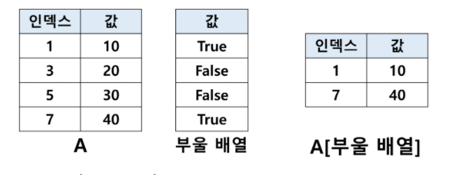

# 데이터 인덱싱 & 슬라이싱


## 1. DataFrame에서 열 선택

DataFrame은 **두 개 이상의 Series로 구성된 자료형**이며, **하나의 Series는 열의 역할을 하는 것**


- DataFrame에서 <u>열을 선택</u>

  - ```python
    df['컬럼명']
    ```

  - 이렇게 선택된 열의 자료형은 Series

  - 컬럼명은 반드시 '', "" 로 감싸야 합니다.


`df.컬럼명` 으로 더 간단하게 컬럼을 선택할 수도 있지만, <u>컬럼명이 다른 함수와 이름이 겹치는 경우에 부를 수 없다는 점에서 추천하지 않는다. X</u>


- **아직 존재하지 않는 컬럼명을 선언**해주는 방식으로 새로운 열을 만들 수 있다.

```python
import pandas as pd
df = pd.DataFrame(
	{
        '인구수(만명)': [67.8, 59.4, 54.3, 53.6],
        '면적(km^2)': [33.88, 41.4, 40, 35.44]
    },
    index = ['송파구', '강서구', '강남구', '노원구']
)

print(df['인구수(만명)'])
# 송파구: 67.8, 강서구: 59.4, 강남구: 54.3, 노원구: 53.6

df['인구밀도']  = df['인구수(만명)'] / df['면적(km^2)'] * 10000
print(df['인구밀도'])
# 송파구: 20011, 강서구: 14347, 강남구: 13575, 노원구: 15124
```


## 1-1. 실습

**DataFrame에서 컬럼을 선택하는 방법 이용** 

생성된 DataFrame에서 **두 개의 컬럼을 선택하고, 이를 연산하여 새로운 컬럼 생성 실습**


> 실습을 위해 서울시의 특정 지역의 인구수와 면적이 들어있는 DataFrame을 먼저 생성합니다.
>
> 생성된 DF의 인구수 컬럼과 면적 컬럼을 선택하여 연산한 후, 인구밀도 컬럼을 생성합니다.

```python
import pandas as pd
df = pd.DataFrame(
	{
		'인구수(만명)':[67.8, 59.4, 54.3, 53.6],
		'면적(km^2)': [33.88, 41.4, 40, 35.44]
	},
	index = ['송파구', '강서구', '강남구', '노원구']
)

df['인구밀도'] = df['인구수(만명)'] / df['면적(km^2)'] * 10000

print(df.to_html())
# print(df)
```


## 2. 인덱서 loc & iloc

Series와 DataFrame은 `명시적인 인덱스` 와 `암묵적인 인덱스` 가 있습니다. 

명시적인 인덱스란 **실제로 정의된 인덱스를 의미**

암묵적인 인덱스란 **따로 정의하지 않더라도 정의되는 일종의 위치 인덱스**

| 암묵적인덱스 | 명시적 인덱스 |  값  |
| :----------: | :-----------: | :--: |
|      0       |       1       |  10  |
|      1       |       3       |  20  |
|      2       |       5       |  30  |
|      3       |       7       |  40  |


[여기서 잠깐]

```
Q. 위에서 표시된 A라는 Series가 있을 때, A[1]은 10을 나타내는 것일까요? 아니면 20을 나타내는 것일까요?

A. 명시적 인덱스가 암묵적 인덱스에 우선하기 때문에, 정답은 10 이지만,
   충분히 혼동될 수 있어서 명시적 인덱스를 참조하는 것인지, 암묵적 인덱스를 참조하는 것인지를 명시해주는
   인덱서가 필요합니다.
  
```


- 명시적 인덱서
  - loc 함수
- 암묵적 인덱서
  - iloc 함수

```python
import pandas as pd
A = pd.Series([10, 20, 30, 40], index = [1, 3, 5, 7])

print(A.loc[1]) # 10
print(A.iloc[1]) # 20
```


## 2-2. loc & iloc 활용

##### 명시적 인덱서와 암묵적 인덱서 활용하기

```python
# 명시적 인덱서와 암묵적 인덱서 차이 확인하기

import pandas as pd
A = pd.Series([10, 20, 30, 40], index = [1, 3, 5, 7])

print(A.loc[1]) # 10
print(A.iloc[1]) # 20
```


## 3. 마스크를 이용한 인덱싱

- Numpy의 ndArray와 마찬가지로, Series나 DataFrame에 대해 **부울 배열이 인덱스로 사용되면**,
  부울 배열에서 True와 대응되는 Series나 DataFrame에 대한 값만 가져옵니다.



```python
import pandas as pd
A = pd.Series([10, 20, 30, 40], index = [1, 3, 5, 7])
print(A[[True, False, False, True]])
```


- <u>비교 연산의 결과는 항상 부울 배열</u>이므로, 특정 조건을 만족하는 값이나 행만 가져올 수 있는데, 
  이를 **마스크를 이용한 인덱싱**이라고 부릅니다.

```python
import pandas as pd
series = pd.Series(
    [67.8, 59.4, 54.3, 53.6, 50.2, 48.2, 46.0, 44.2],
    index = ['송파구', '강서구', '강남구', '노원구', '관악구', '은평구', '양천구', '성북구']
)

print(series >= 50) # 송파구: True, 강서구: True, ..., 성북구: False
print(Series[series >= 50]) # 송파구: 67.8, 강서구: 59.4, 강남구: 54.3, 노원구:53.6, 관악구: 50.2
```


numpy에 포함된 부울 배열간 연산 함수

- logical_and
- logical_or

사용하면 훨씬 다양한 조건을 활용할 수 있습니다.


## 3-1 마스크 인덱싱 실습

- 마스크를 이용한 인덱싱 `DataFrame`에서 <u>특정 조건을 만족하는 행의 인덱스를 가져오는 실습</u>

```python
# 아래의 코드는 생성된 데이터 프레임에서
# col1 컬럼의 값이 col2컬럼의 값보다 '크거나 같은 행'의 index 가져오기
# col1 컬럼의 값과 col2컬럼의 값이 `같은 행`의 index 가져오기

import pandas as pd
df = pd.DataFrame(
	{
        'col1': [3, 2, 3, 4, 1],
        'col2': [3, 4, 2, 1, 4]
    },
    index = ['a', 'b', 'c', 'd', 'e']
)

print(df[df['col1'] >= df['col2']].index)
print(df[df['col1'] == df['col2']].index)
```


[여기서 잠깐]

> 파이썬에서는 가장 안쪽에 있는 괄호에 대해 먼저 연산합니다. 따라서 어느 괄호가 먼저 닫혔는지를 확인해야만 코드의 실행 결과를 정확히 예상할 수 있습니다.
>
>
>  `df[df['col1'] >= df['col2']].index` 라는 구문에서
>
> 안쪽의 괄호인 `df['col1'] >= df['col2']` 부분이 먼저 실행되고,
>
> (col1 컬럼의 값이 col2 컬럼의 값보다 큰 행인지 여부를 True/False로 반환하는 연산)
>
> 그 결과로 **리턴된 True,False의 값에 따라 True인 index만을 가져오게 되는 것**입니다.

