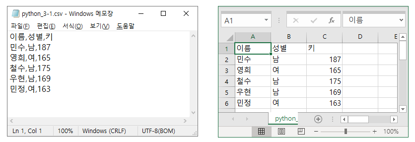

# 데이터 불러오기


## 1. 데이터 파일 불러오기(1/2)

- 파일에서 불러오기
  - Pandas는 `현실에 존재하는 데이터파일` (예를 들면 .xls파일, .csv파일)들을 <u>불러와서 사용</u>할 수 있습니다.
  - 본 장에서는 PC에서 존재하는 `csv파일` 과 `xls`파일을 불러와 사용하는 방법 학습


- CSV 파일 불러오기
  - `read_csv()`

```python
import pandas as pd
df = pd.read_csv('data.csv', engine = 'python') # 데이터에 한글 포함된경우 명시
```


- xlsx, xls 파일 불러오기
  - `read_excel()`

```python
import pandas as pd
df = pd.read_excel('data.xlsx', sheetname = 'Sheet1') # 시트명
```


[여기서 잠깐]

- 파일을 불러올때는 pc상의 `파일의 경로를 포함하여 파일명 입력` 해야 합니다.
- 예시)
  - `df = pd.read_csv('c://exam/data.csv', engine = 'python')`


## 2. 데이터 파일 불러오기(2/2)

- 인터넷에서 불러오기

  - <u>인터넷 상에 있는 데이터</u> 또한 `read_함수` 를 이용하여 불러올 수 있습니다.

  - <u>아래의 URL은 실습을 위해 미리 준비해둔 CSV파일</u> 입니다.

    - http://www.innocoding.co.kr/python_3-1.csv
    - 파일을 다운로드하여, 메모장이나 엑셀로 파일을 열어보면, 아래와 같은 데이터가 들어있음

    


- 데이터 출력하기

```python
import pandas as pd
df = pd.read_csv('http://www.innocoding.co.kr/python_3-1.csv')

print(df)
```


**:cupid: CSV (comma separated values)**

- 몇 가지 필드를 쉼표(,) 로 구분한 텍스트 데이터 및 텍스트 파일
- 확장자 .csv
- 스트레드시트 나 데이터베이스 소프트웨어에서 많이 사용됨

