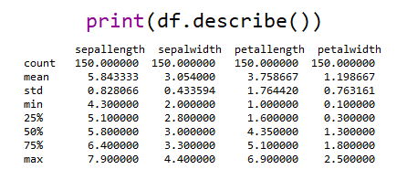

## 데이터 확인 함수

- 데이터의 대략적인 부분을 확인하는 함수
  - shape
  - head()
  - tail()


- shape
  - 함수가 아니라서 () 를 사용하지 않는다.
  - <u>DF의 행과 열의 개수</u> 알 수 있음

```python
df.shape

## (행, 렬)
```


- head()
  - 데이터프레임의 **위에서부터 다섯개의 행 까지를 출력**

```python
df.head()
```


- tail()
  - 데이터프레임의 **아래에서부터 다섯개의 행 까지를 출력**

```python
df.tail()
```


## 데이터 통계량 확인하기

> Pandas의 `Series 와 DataFrame` 은 **통계량을 계산할 수 있는 다양한 함수를 지원**함
>
> - 평균계산
>   - mean()
> - 분산계산
>   - var()
> - 최소값 계산
>   - min()
> - 최대값 계산
>   - max()
> - 기초통계량 계산
>   - describe()


```python
import pandas as pd
df = pd.read_csv('https://datahub.io/machine-learning/iris/r/iris.csv')

print('평균\n', df.mean(), '\n')
print('분산\n', df.var(), '\n')
print('최소값\n', df.min(), '\n')
print('최대값\n', df.max(), '\n')
```


- `describe()`
  - count - 결측 제외한 요소 개수
  - mean - 평균
  - std - 표준편차
  - min - 최소값
  - 25% - 1사분위수
  - 50% - 중위수
  - 75% - 3사분위수
  - max - 최대값




- `corr()`
  - 열별 상관계수 출력


