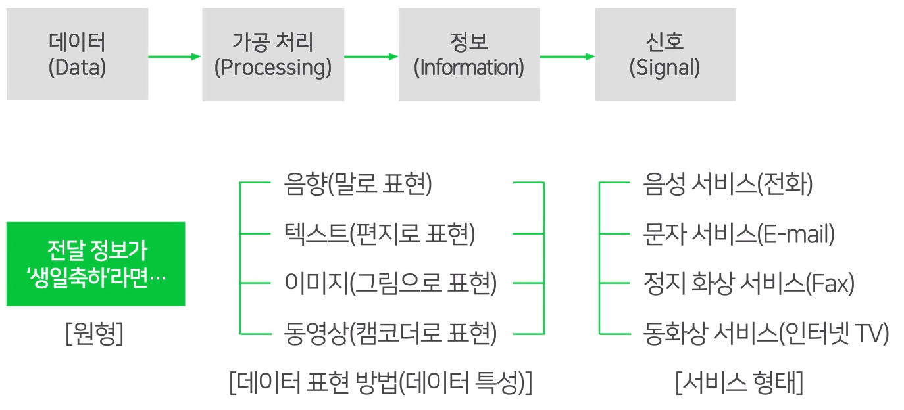
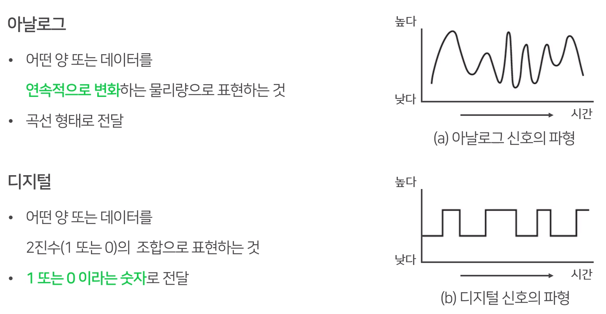
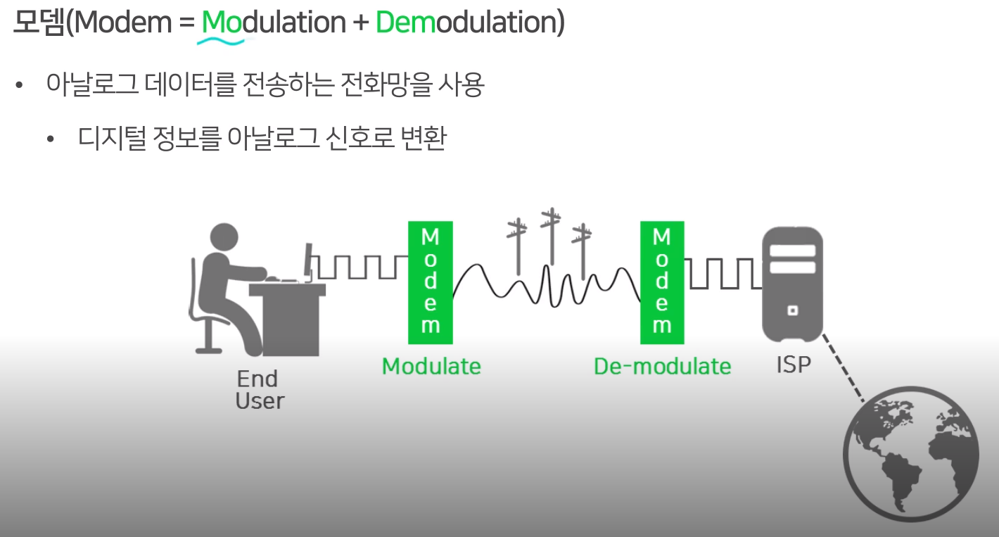
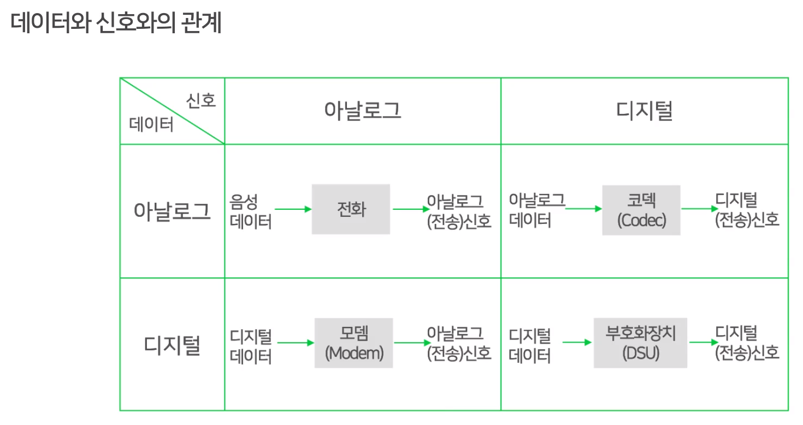

# 데이터와 신호

## 학습 내용

- 아날로그 데이터, 디지털 데이터
- 아날로그 신호, 디지털 신호
- 데이터와 신호와의 관계

**데이터 및 서비스**

반드시 신호로 변환하는 과정이 필요하다.

#### 정보(데이터)를 상대방에게 보내기 위해서는?

- 전송 매체를 통해 정보를 전자기 신호(Sigmal)의 형태로 변환해야 함
- 신호
  - 아날로그 데이터
  - 디지털 데이터 (이산적으료 표현됨)

1. 아날로그 데이터를 아날로그 신호로 전달
   - 전화기 (유선 전화망)
2. 디지털 데이터를 아날로그 신호로 전달
   - 모뎀

3. 아날로그 데이터를 디지털 신호로 전달
   - 코덱(Codec)
4. 디지털 데이터를 디지털 신호로 전달

## 정리표

- 데이터와 신호
  - 데이터 : 정보
  - **신호** : 데이터가 전달될 때, 다양한 데이터의 형태에 따라 전달해주는 서비스의 형태도 다릅니다.
    이때, 이러한 서비스를 통해 최종적으로 전달되는 형태를 `신호`라고 합니다.
- 아날로그와 디지털
  - 아날로그 : 데이터를 연속된 값의 변화로 표현한 것입니다.
  - 디지털 : 숫자로 데이터를 표현한 것

아날로그 데이터는 연속된 값의 변화로 표현된 데이터(정보)라고 할 수 있고, 

디지털 신호는 디지털 데이터가 전달되는 서비스의 형태라는 것을 알 수 있습니다. 

