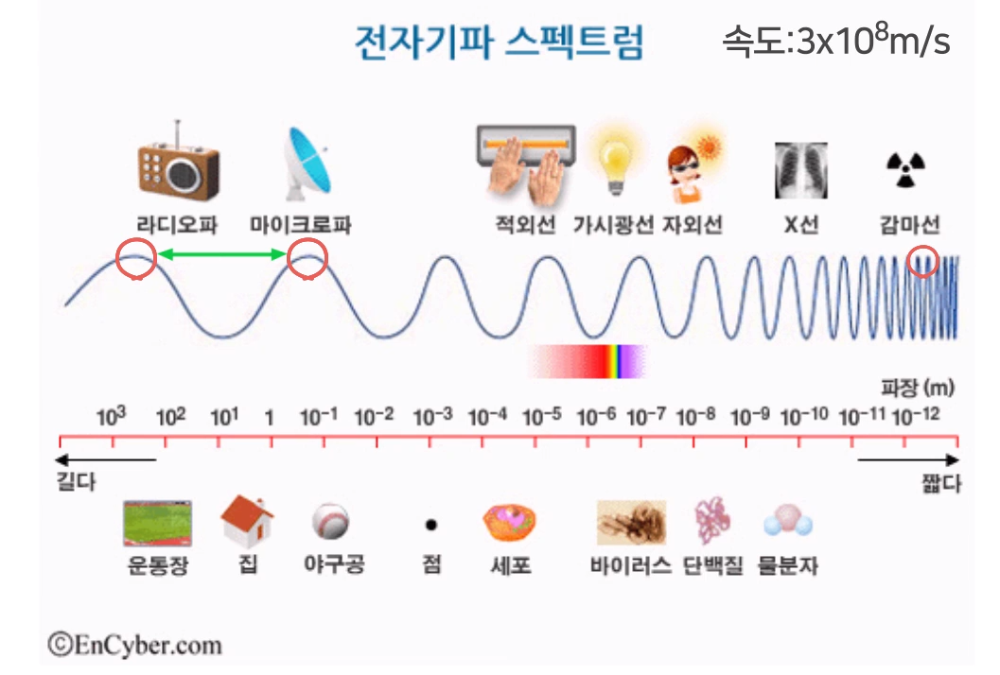
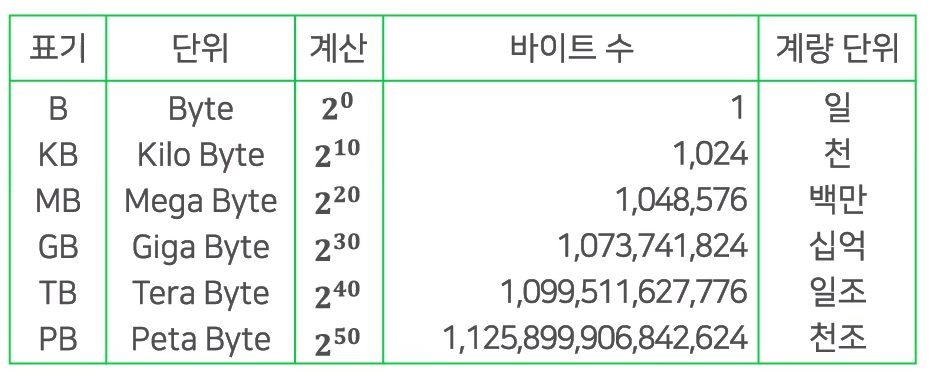
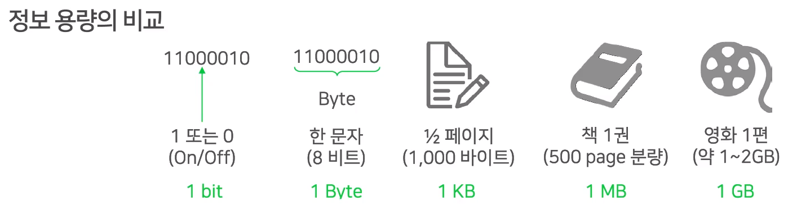
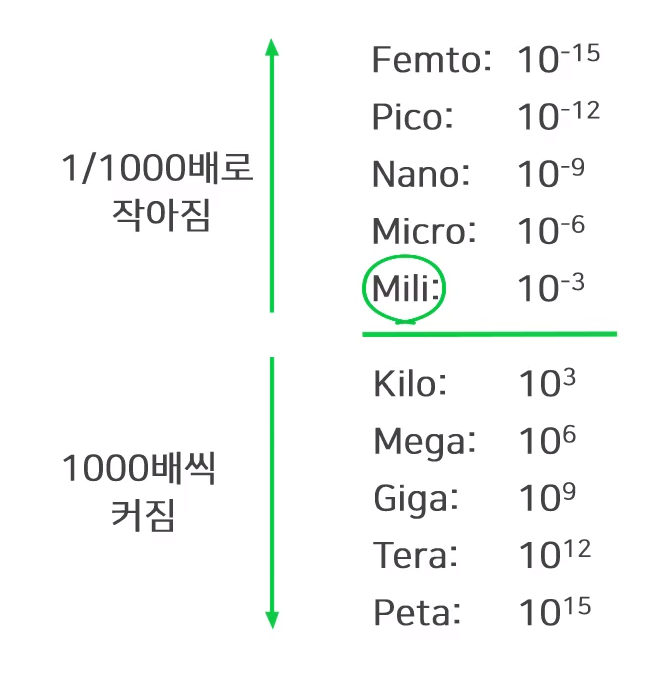

# 전자기파

> 전자파가 어떤 것인지 알아보자.

## 학습내용

- 전자기파
- 주파수
- 저장단위

## 전자기파

> 전자기파에 신호를 실어서 보낸다.

- 빛의 속도 = 전자기파 속도
  - 빛도 전자기파의 일부이다.
  - 1초에 지구 7바퀴 반.

- 주파수 (Frequency)
  - 같은 모양의 파동이 **1초에 몇번 반복되는지**를 나타냄
  - 단위
    - Hz (헤르츠)

## 저장단위의 크기

> 8bit = 1byte ( 2^8 = 256가지의 서로다른 정보 표현 가능 )

## 정리

#### 전자기장 vs 전자기파

- 전자기장 = 전기장 + 자기장
  - 전기장과 자기장이 서로를 유도해나가며 생겨나는데, 이 둘을 합쳐서 전자기장이라고 합니다.
- 전자기파
  - 전기장과 자기장의 변화에 의해서 생성되는 파동을 말합니다.

#### 주파수와 헤르츠

- 주파수(Frequency)
  - 1초동안 동일한 파장이 반복되는 횟수
- 헤르츠
  - 주파수의 단위
- 주파수 vs 파장
  - 일정한 단위 시간동안 동일한 파장이 반복 될 때 주파수가 늘어나므로 파장의 길이가 길면 주파수는 낮고,
    파장의 길이가 짧으면 주파수가 높아집니다. 이 때 **주파수와 파장은 서로 반비례** 관계에 있다