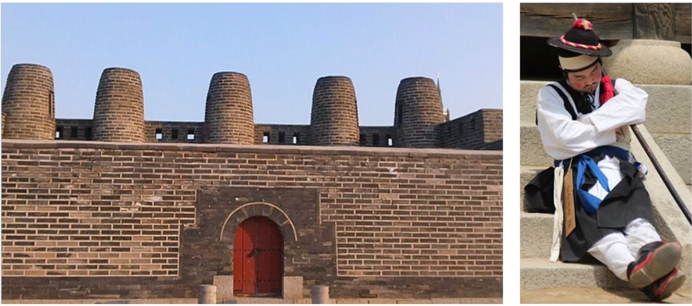

# 프로토콜이란?

## 1. 학습목표

지난 챕터의 첫 번째 강의에서 우리는 통신의 세 가지 요소를 배웠습니다.

1. **정보원** : 통신을 하려고 하는 송/수신자
2. **통신매체** : 통신을 하는 정보원 사이의 연결 통로
3. **프로토콜** : 통신을 가능하게 하는 공통된 언어 및 형식

이번 시간에는 세 번째 요소인 프로토콜에 대해 알아 볼 예정인데,
이 프로토콜이 어떤 것인지, 어떻게 통신을 가능하게 하는 것인지 배워보도록 하겠습니다.

## 2. 학습 내용

- 프로토콜의 3요소
- 통신 프로토콜의 기능

## 3. 학습하기

### 3-1 프로토콜 개념

- 통신회선을 이용하여 컴퓨터와 컴퓨터,
  컴퓨터와 단말기끼리 데이터를 주고받을 경우의 상호약속
- 통신을 원하는 두 개체 간에 무엇을, 어떻게, 언제 통신할 것인가를 서로 약속하여
  통신상의 오류를 피하도록 하기 위한 통신 규약

### 3-2 프로토콜의 3요소

- `구문(Syntax)`
  - 데이터 블록의 **형식**
    - 각 산에 동일한 개수의 봉화대를 세운다.
- `의미(Semantics)`
  - 상호작용, 오류 제어 등을 위한 제어정보
    - 각 봉화대의 연기의 상태로 각각의 의미를 부여
- `동기(Timing)`
  - 속도, 순서 등을 간호 간에 맞춤
    - 정보를 제때 제시간에 전달해야함 (적시성)

### 3-3 통신 프로토콜의 기능

- 동기제어( Timing 제어, Synchronization )
- 분리와 재결합( 패킷 분해, 조립 )
- **흐름 제어( Flow Control )**
  - 받는 측에서 받을 수 있는 정보의 양만큼만 보내는측에서 보내게 조절
- 순서 제어( 도착한 패킷의 순서 )
- 주소 지정( IP Address )
- 오류( Error ) 제어
  - 보낸 데이터가 목적지까지 손실없이 갔는 지
- 경로 제어
  - 라우팅 ( 패킷이 보내는 측에서 받는 측까지 여러 경로로 간다. 그 중 어떤 경로가 좋은 경로인 지 )
- 캡슐화( Encapsulation )
  - 패킷 : 작은 데이터 조각
  - 제어 정보도 같이 붙여서 보낸다.
  - 

## 4. 정리

#### 프로토콜의 특성

##### 1. 직접/간접

- 직접 방식(Direct Protocol) : 직접 정보를 교환하는 방식
- 간접 방식(Indirect Protocol) : 교환망이나 다른 네트워크를 통해 간접적으로 정보를 교환하는 방식

##### 2. 단일체/구조적

- 단일체(Monolithic) : 하나의 프로토콜에서 모든 통신 작업이 처리되는 것
- 구조적(Structured) : 여러 층에 각각 다른 작업을 하게 하여 프로토콜을 이루는 계층에서 통신이 처리되는 것

##### 3. 대칭/비대칭

- 대칭(Symmetric) : 서로 상호 대응되는 송/수신체 사이에서 통신이 이루어지는 것
- 비대칭(Asymmetirc) : 서로 상호 대응되는 송/수신체가 아닌, 특정한 곳에서만 통신을 개시할 수 있는 권한을 부여하여 통신이 이루어지는 것

##### 4. 표준/비표준

- 표준(Standard) : 모든 컴퓨터에서 사용 가능한 프로토콜을 의미
- 비표준(Nonstandard) : 특정한 컴퓨터, 특정한 통신에서 사용 가능한 프로토콜을 의미