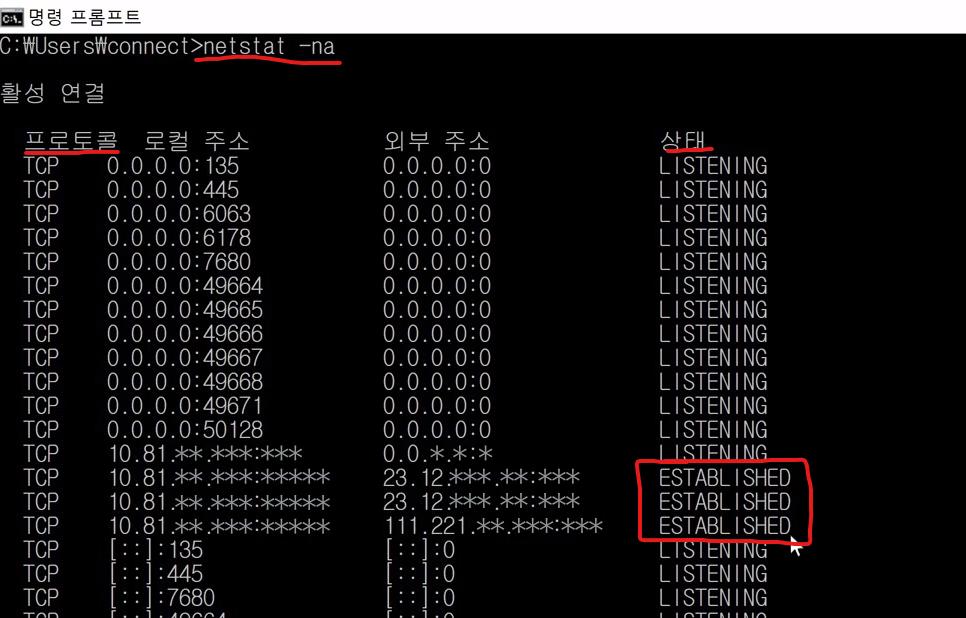

# TCP vs UDP


## 1. 학습 목표

지난 시간 우리는 TCP/IP 프로토콜에 대해 학습했었습니다.
이번 시간에는 TCP와 함께 많이 쓰이는 UDP에 대해 배워 볼 예정인데, 그 둘은 어떤 차이점이 있는지, 각각의 특징은 무엇인지 알아보도록 하겠습니다.

그리고 또, 실습 화면을 보며 우리 컴퓨터의 TCP, UDP를 확인해보도록 하겠습니다.


## 2. 학습 내용

- TCP 프로토콜의 정의
- UDP 프로토콜의 정의
- (실습) TCP 와 UDP 확인하기


## 3. 학습하기

### 3-1. TCP와 UDP


수송계층에서 가장 대표적인 두 개의 프로토콜

- TCP
- UDP


#### TCP(Transmission Control Protocol) 프로토콜

- 연결지향성 서비스 (Connection oriented)
- 대부분의 응용에서 사용하는 수송 계층 프로토콜
- 응용(application)간에 **신뢰성 있는 연결**을 제공
- 전송 여부 체크, 중복제거 등을 보장
- 데이터에 오류가 있는지 체크
- 정확하게 빠짐없이 체크없이 데이터를 보낼때 사용한다. (금융과 같은 중요 데이터)


#### UDP(User Datagram Protocol) 프로토콜

- 비연결성 서비스(Connectionless service)
- 불특정 다수에게 데이터 전송 가능
- 전송 여부, 중복제거 등을 보장하지 않음
- 단순, 최소의 메커니즘을 통해 상대방에게 데이터 전송 서비스의 **신뢰성이 낮음**
- **빠른 전송 지원**
- Best Effort 서비스
- 데이터에 오류가 있는지 체크
- 별로 중요하지 않은 데이터를 보낼 때 사용 (전송 됬는지, 누락이 있는 지, 중복이 있는지 체크안한다.)
- **ex) 인터넷 전화(VoIP : voice on ip) , 스트리밍서비스 - (다운받은만큼 보면서 동시에 다운받는 것)**


### 3-2. CMD

- TCP, UDP 확인하는법

 ```shell
$ netstat -na
 ```




상태

- Listening
  - 대기상태, 커넥션을 맺기위한 대기상태
- Estableished
  - 연결이 맺어진상태, 데이터를 주고받을 수 있는 상태가 된 것


## 4. 강의 정리

#### UDP 프로토콜

- UDP(User Datagram Protocol)
  - 인터넷에서 정보를 주고받을 때, 한쪽에서 일방적으로 보내는 방식의 프로토콜을 의미합니다.
- cmd(명령 프롬프트)
  - 운영 체제의 명령 줄 해석기를 의미하며, 위의 강의에서와 같이 ip, TCP, UDP 등을 확인할 수 있습니다.