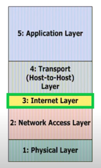
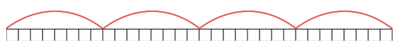

# IP주소

## 1. 학습 목표

앞의 챕터에서 우리는 TCP/IP 의 TCP에 대해, 더불어 UDP에 대해 배웠습니다.
이번 시간에는 IP를 배워 볼 예정인데요, 흔히 인터넷을 사용 할 때 `ip주소` 라는 단어를 많이 들어보셨을 겁니다. 그렇다면 왜 인터넷을 사용 할 때 이 ip주소가 필요한 지, 그리고 어떤 일을 하는지 알아보겠습니다.

## 2. 학습 내용

- IP 계층의 정의
- IP 주소의 정의
- IPv4 와 IPv6 의 정의

## 3. 학습 하기

### 3-1 IP 주소

**IP (Internet Protocol) 계층**

- 서로 다른 네트워크간 <u>통신이 가능하도록 지원</u>
- IP계층에서 데이터에 IP주소를 붙임
- IP 주소를 바탕으로 패킷이 목적지에 정확히 도달할 수 있도록 함

TCP/IP 5계층 중에 3계층인 인터넷층에 속한다.

- IP 주소 vs 도메인 네임 (DNS: Domain Name Server)
- Domain Name Service
  - 사람이 사용하는 도메인 이름을 IP주소로 바꿔주는 인터넷 서비스
  - 사람이 이해하는 인터넷 주소(도메인 네임)를 서버나 라우터가 아는 IP주소로 변환해 줌
  - 인터넷을 사용하기 위한 필수적인 요소

### 3-2 IPv4 와 IPv6

#### IPv4 주소

- IPv4 주소
- 주소의 범위는 32비트(cmd에서 ipconfig -all 로 확인)
- 이론적으로 42억 9496만 7296개의 IP가 존재
- 0~255 사이의 십진수 네 개로 표현 (8비트를 십진수로 표현)
  - 예) 203.255.176.75 (0.0.0.0 ~ 255.255.255.255)
- 전세계적으로 유일하게 구별
- <u>주소 부족 문제 발생</u>

#### IPv6 주소

- 인터넷의 <u>주소 고갈 문제를 해결</u>하고 인터넷에 확장성과 데이터 보안을 강화하기 위해 IPv6가 제안됨
- 128비트의 IP 주소 사용
- 2^128^개인 약 3.4x10^38^개
  (340,282,366,920,938,463,463,374,607,431,768,211,456개)
- 여러 가지 새로운 기능을 제공하는 동시에 기존 IPv4와의 호환성을 최대로 하는 방향으로 설계됨
- 16진수로 표현됨
- IoT 사물인터넷 모든 사물에 컴퓨터를 붙여 서로 통신을 가능하게 하고자 함

## 4. 학습 정리

**IPv4 와 IPv6**

- IPv4 (**I**nternet **P**rotocol **V**ersion **4**)
- IPv6 (**I**nternet **P**rotocol **V**ersion **6**) : 무제한 인터넷 주소라고도 불리웁니다.

