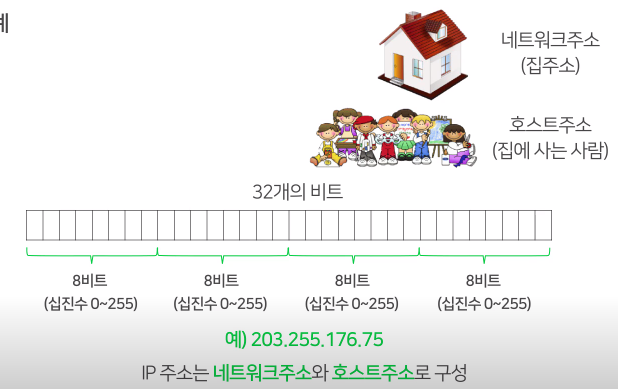
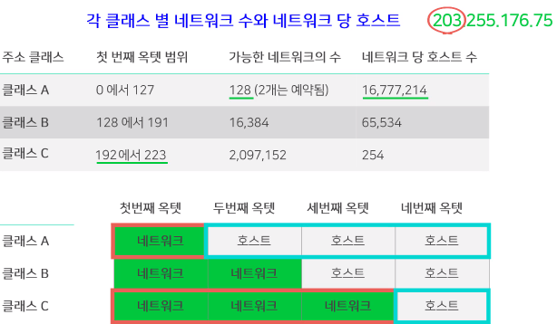

# IP 주소 체계

## 1. 학습 목표

지금까지 IP주소에 대해, 또 IP주소의 두 가지 종류인 IPv4 와 IPv6에 대해 배웠습니다.
이번 시간에는 IP 주소 분류가 어떻게 이루어지는지, 
그리고 실습 화면을 통해 우리가 실생활에서 쓰는 IP는 어떠한 것인지 알아보도록 하겠습니다.

## 2. 학습 내용

- IPv4 주소 체계
- IP 주소 구성 요소

## 3. 학습 내용

### 3.1 IPv4 주소 체계

 

## 4. 학습 정리

#### IP주소의 구성 요소

- **IP주소 ** = 네트워크 주소 + 호스트 주소

#### 옥텟

- **옥텟(Octet)** : 컴퓨팅에서 8개의 비트가 한데 모인 것을 의미합니다.