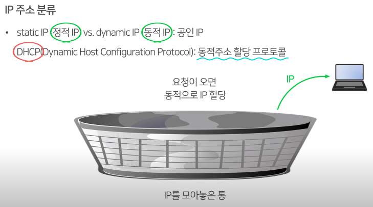
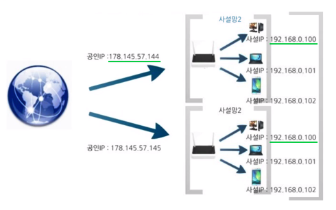

# IP 주소 분류

## 1. 학습 목표

지금까지 IP주소에 대해, 또 IP 주소의 두 가지 종류인 IPv4 와 IPv6 에 대해 배웠습니다.
이번 시간에는 IP 주소 분류가 어떻게 이루어지는지,
그리고 실습 화면을 통해 우리가 실생활에서 쓰는 IP는 어떠한 것인지 알아보도록 하겠습니다.

## 2. 학습 내용

- IPv4 주소 분류
- DHCP
- (실습) 내 컴퓨터의 IP주소를 알아보기

## 3. 학습

### 3-1. IPv4 주소 분류

- public IP (공인 IP) vs private IP (사설 IP) => `공유기가 할당해주는 가짜 IP`

## 4. 학습 정리

#### Static IP vs. Dynamic IP (정적IP, 동적IP)

- Static IP : 정적ip
- Dynamic IP : 동적ip
- **DHCP (Dynamic Host Configuration Protocol)** : 한 곳에 사용하지 않는 IP주소를 모아두고, IP요청이 올 때마다 할당해주는 것을 의미합니다.

#### Public IP vs. Private IP

- public IP : 공인 ip
- private IP : 사설 ip, 주소 부족문제를 해결하기 위해 사용된, **인터넷 공유기가 할당해주는 주소를 의미**합니다.

 내 컴퓨터의 **IP 주소는?**

- 인터넷에서 IP 주소 조회해보기 (외부에서 보는 나의 IP)
- `ipconfig -all` cmd 입력
  - 두 주소가 같다면? => 공인 IP 주소
  - 두 주소가 다르다면? => 사설 IP 주소

[내 IP주소 확인하기](https://findip.kr/)

