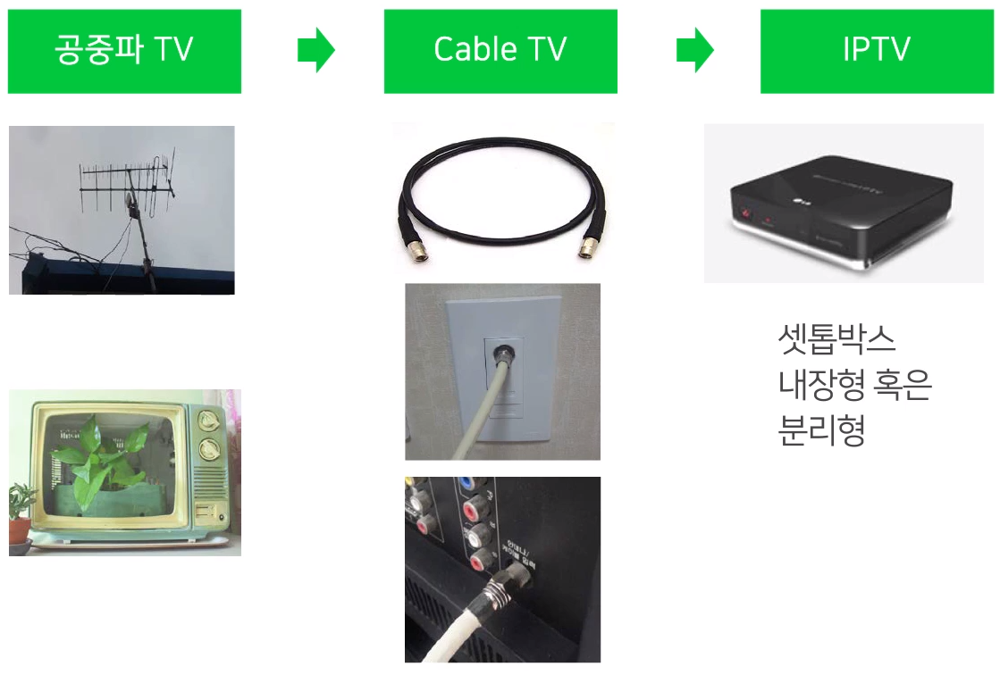
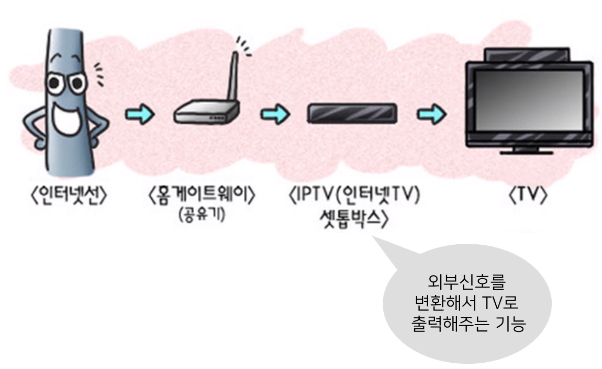
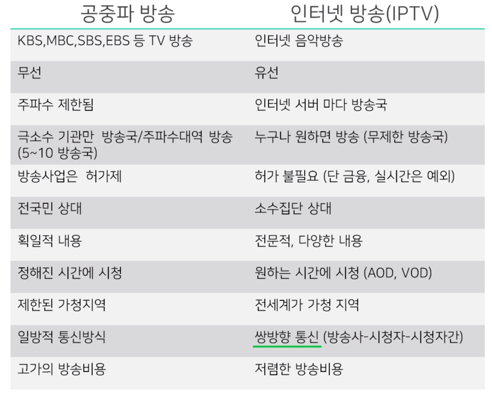

# 인터넷 TV

## 1. 학습 목표

지금까지 우리는 양방향 통신에서의 인터넷의 사용에 대해 배웠습니다.
이러한 인터넷은 TV 방송에서도 사용이 되는데,
아시다시피 TV방송은 단방향 통신의 가장 대표적인 예입니다.
이제부터 인터넷이 단방향 통신인 TV 방송을 할 수 있는지 알아보도록 하겠습니다.

## 2. 학습 내용

- 인터넷의 정의
- 인터넷 방송(IPTV) 의 정의
- 공중파 방송과 인터넷 방송 비교

## 3. 학습

### 3-1.  Internet

- 인터넷은 컴퓨터로 연결하여 **TCP/IP** 라는 통신 프로토콜을 이용해 정보를 주고받는 컴퓨터 네트워크
- 20세기 10대 발명중 하나 `인터넷`

### 3-2. 인터넷 방송

