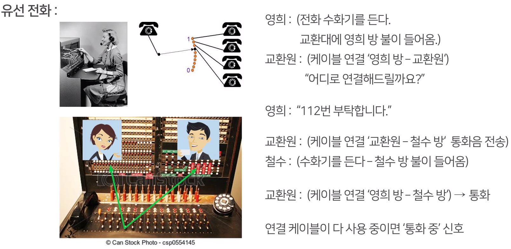
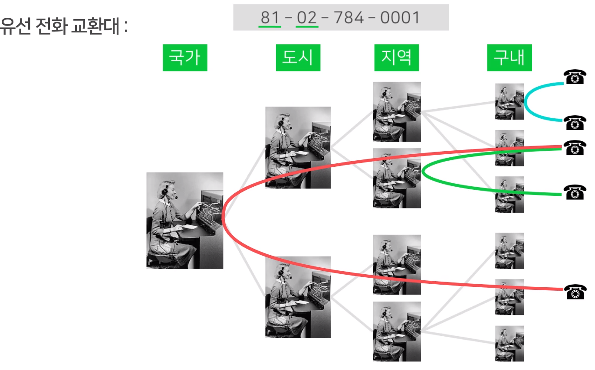
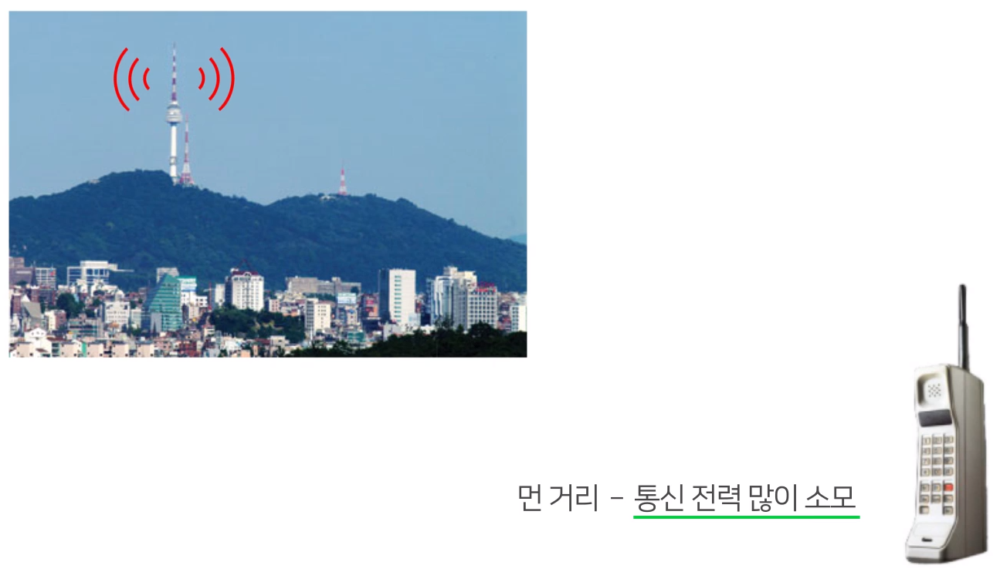
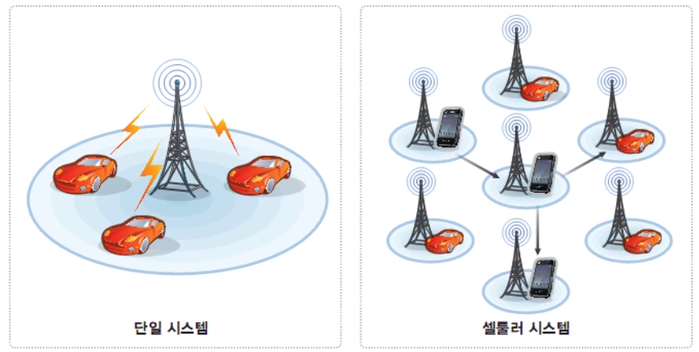

# 유선통신 & 무선통신

## 1. 학습 목표

이번 강의에서는 전화 통신에 대해 배워 볼 예정입니다.
전화 통신은 유선 통신과 무선 통신으로 분류가 될 수 있는데요.
유선 통신은 어떤 원리로 작동을 하는지, 무선 통신은 어떤 원리로 작동을 하는지 그 차이와 특징을 알아보도록 하겠습니다.

## 2. 학습 내용

- 유선 통신의 원리
- 무선 통신의 원리

## 3. 학습

### 3-1. 유선 통신

 

### 3-2. 무선 통신(이동 통신)

 

#### 셀룰러(Cellular) 통신

- 한 지역의 가입자들을 `셀` 이라 부르는 <u>동일 중심 주파수</u>를 사용하는 통화 존으로 구분
- 각 존의 중심에 기지국을 설치하여, 이 셀에 소속된 가입자는 이 셀의 기지국을 통해서 다른 셀이나 지역에 있는 가입자와 통화하도록 하는 방식

