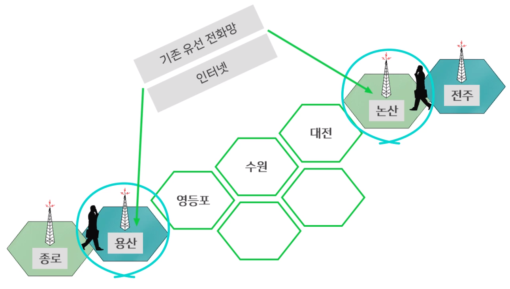
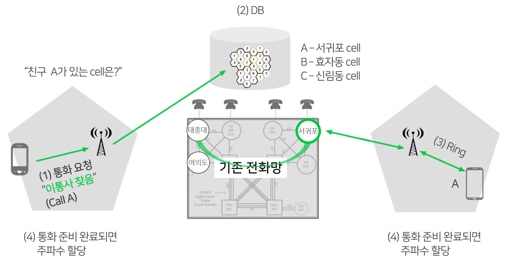

# 셀룰러 통신

## 1. 학습 목표

지난 시간 우리는 유선 통신과 무선 통신의 차이점에 대해 배워보았습니다.
무선 통신에는 여러 종류가 있는데요.

이번시간에는 그 중 **셀룰러 통신**의 원리와 자세한 과정에 대해 배워보도록 하겠습니다.

## 2. 학습 내용

- 이동통신의 원리
- 셀룰러 통신의 과정

## 3. 학습

### 3-1. 이동통신

이동통신 : 무선을 이용하여

- 한 지역의 가입자들을 셀이라 부르는 동일 중심 주파수를 사용하는 통화 존으로 구분
- 각 존의 중심에 기지국을 설치하여, 이 셀에 소속된 가입자는 이 셀의 기지국을 통해서 다른 셀이나 지역에 있는 가입자와 통화하도록 하는 방식

### 3-2. 기지국 - 소형 안테나

##### Cell : 기지국이 커버하는 영역

- 어느 가입자가 어느 Cell에 있나?
- Cell 간 이동
  - 전파 세기 측정
  - **Handoff** - DB 갱신
    - 셀 간 이동할때 기지국에 전파를 계속보내서 세기를 측정해야 함.
    - 통화 품질을 좌우하는 기술

### 3-3. 셀룰러 통신 과정

**(5) 셀 간 이동 시 - Hand off**

(6) 해외 여행 - Roaming

## 4. 정리

DB(Data Base) : 어느 주제와 관련되어 있는 데이터(정보)들을 정리해놓은 집합